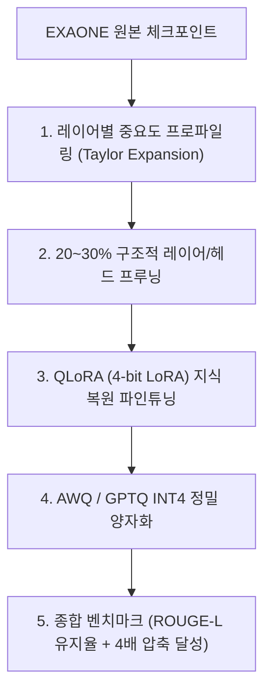

> [!abstract] 핵심 요약
> **EXAONE 경량화 해커톤**은 원본 모델의 언어 이해 및 생성 품질(Accuracy/ROUGE)을 유지하면서, 모델 크기(Parameter/VRAM)와 추론 속도(Latency)를 극대화하는 멀티태스크 최적화 챌린지이다.
> 성공적인 전략은 **구조적 프루닝으로 중복 레이어를 제거**한 후, **QLoRA 미세조정**으로 손실된 지식을 복원하고, **W4A16 가중치 양자화**를 결합하여 압축 점수와 성능 점수의 복합 가중합을 극대화하는 것이다.

---

## 1. 해커톤 종합 점수 평가 공식 및 최적화 워크플로우

$$\text{Final Score} = \alpha \cdot \text{Accuracy Score (ROUGE-L / BLEU)} + \beta \cdot \text{Compression Ratio} + \gamma \cdot \text{Speedup Factor}$$



---

## 2. 추론 지연시간 2대 핵심 지표

| 지연시간 지표 | 측정 구간 | 주요 병목 요인 | 최적화 기법 |
| :-- | :-- | :-- | :-- |
| **TTFT (Time to First Token)** | 프롬프트 입력 $\to$ 첫 번째 토큰 생성 | **연산 대역폭 (Compute Bound)** (프롬프트 전체 행렬 곱) | FlashAttention-2, Prefill 청킹 |
| **TPOT (Time per Output Token)** | 각 토큰 생성 간격 시간 | **메모리 대역폭 (Memory Bound)** (가중치 및 KV 캐시 로드) | 가중치 양자화 (INT4), PagedAttention |

---

## 3. 실시간 해커톤 종합 점수 및 랭킹 시뮬레이터

```html preview
<div style="font-family:system-ui,-apple-system,sans-serif;padding:20px;background:var(--card);color:var(--card-foreground);border:1px solid var(--border);border-radius:var(--radius)">
  <div style="font-size:16px;font-weight:700;margin-bottom:14px;color:var(--primary);display:flex;align-items:center;gap:8px">
    <span>🏆 EXAONE 경량화 해커톤 종합 성적 산출기</span>
  </div>

  <div style="display:grid;grid-template-columns:1fr 1fr;gap:12px;margin-bottom:14px">
    <div>
      <label style="font-size:11px;color:var(--muted-foreground)">ROUGE-L 성능 유지율 (%):</label>
      <input id="inRouge" type="number" value="96" min="50" max="100" style="width:100%;padding:4px;background:var(--background);color:var(--foreground);border:1px solid var(--border);border-radius:var(--radius);font-weight:700" />
    </div>
    <div>
      <label style="font-size:11px;color:var(--muted-foreground)">모델 압축 배율 (예: 4배 압축 = 4.0):</label>
      <input id="inCompress" type="number" value="3.5" min="1.0" max="8.0" step="0.1" style="width:100%;padding:4px;background:var(--background);color:var(--foreground);border:1px solid var(--border);border-radius:var(--radius);font-weight:700" />
    </div>
  </div>

  <div style="display:grid;grid-template-columns:1fr 1fr;gap:12px;margin-bottom:12px">
    <div style="padding:10px;background:var(--background);border:1px solid var(--border);border-radius:var(--radius);text-align:center">
      <div style="font-size:10px;color:var(--muted-foreground)">종합 최종 점수 (100점 만점 기준)</div>
      <div id="finalScoreOut" style="font-family:monospace;font-size:20px;font-weight:800;color:var(--primary);margin-top:2px">91.5 점</div>
    </div>
    <div style="padding:10px;background:var(--background);border:1px solid var(--border);border-radius:var(--radius);text-align:center">
      <div style="font-size:10px;color:var(--muted-foreground)">예상 순위권 등급</div>
      <div id="rankTierOut" style="font-family:monospace;font-size:15px;font-weight:800;color:var(--primary);margin-top:4px">🥇 최상위권 (Top 5%)</div>
    </div>
  </div>

  <script>
    function updateHackathon() {
      var rouge = parseFloat(document.getElementById('inRouge').value) || 90;
      var comp = parseFloat(document.getElementById('inCompress').value) || 2;
      var score = (rouge * 0.6) + ((comp / 4.0) * 40);
      if (score > 100) score = 100;

      document.getElementById('finalScoreOut').textContent = score.toFixed(1) + " 점";
      var t = document.getElementById('rankTierOut');
      if (score >= 90) {
        t.textContent = "🥇 최상위권 (Top 5%)";
        t.style.color = "var(--primary)";
      } else if (score >= 80) {
        t.textContent = "🥈 본선 진출권 (Top 20%)";
        t.style.color = "var(--chart-1)";
      } else {
        t.textContent = "🥉 개선 필요 (추가 압축/복원 필요)";
        t.style.color = "var(--destructive,#ef4444)";
      }
    }

    document.getElementById('inRouge').addEventListener('input', updateHackathon);
    document.getElementById('inCompress').addEventListener('input', updateHackathon);
    updateHackathon();
  </script>
</div>
```
