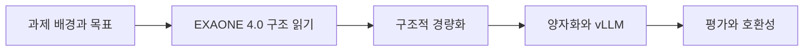

# 06. EXAONE 경량화 해커톤 — 분석·압축·추론·평가

> [!abstract] 한 줄 요약
> EXAONE 4.0을 On-device 환경에 맞게 줄이면서 정확도를 보존하는 해커톤 과제의 구조·경량화 도구·vLLM 추론·평가 지표를 작업 순서로 정리한다.

---

## 강의 흐름



<Tabs>
  <Tab label="핵심 개념">
- **구조 분석** — 모델 checkpoint·config·safetensors에서 모듈 shape와 precision을 읽어 압축 전 기준선을 만든다.
- **Hybrid Attention** — Local window로 비용을 줄이고 Global attention으로 장거리 정보와 정확도 손실을 보완한다.
- **평가 삼각형** — 정확도(태스크), 메모리(파일 크기), 추론(엔진·GPU)의 세 축을 함께 본다.
  </Tab>
  <Tab label="적용 순서">
1. 원본 모델의 구조·정확도·메모리 기준선을 기록한다.
2. 압축 scheme과 제외 모듈을 명시한다.
3. vLLM에서 실제 엔진·GPU 조합으로 추론한다.
4. 동일 태스크·파일 크기·호환 API로 결과를 비교한다.
  </Tab>
  <Tab label="점검 질문">
- config.json과 safetensors에서 각각 어떤 정보를 얻는가?
- Local/Global Attention 비율이 KV-cache와 정확도에 미치는 영향은 무엇인가?
- 정확도만 좋아도 메모리·엔진 호환성이 나쁘면 왜 실패하는가?
  </Tab>
</Tabs>

---

## 단계별 정리

### 과제 배경과 목표

- 2.4B 랩탑 모델과 1.2B 스마트폰 모델보다 더 작고 빠른 모델 수요가 과제 배경이다.
- 파라미터 수만 줄이면 메모리·속도는 좋아져도 정확도가 크게 열화될 수 있다.
- 분석→경량화→추론 엔진→평가의 파이프라인이 제시된다.

### EXAONE 4.0 구조 읽기

- 허깅페이스 checkpoint와 config.json에서 모델 구조 정보를 확인한다.
- Technical Report는 32B와 1.2B의 Attention Type·tie word embedding 차이를 설명한다.
- 모듈별 shape·precision으로 파라미터 수와 저장 용량을 계산한다.

### 구조적 경량화

- 32B는 3:1 비율의 Local Sliding Window Attention과 Global Attention을 hybrid로 적용한다.
- Local Attention은 연산량과 KV-cache memory를 줄이고 Global Attention은 정확도 열화를 보완한다.
- QK-Reorder-LN은 LayerNorm 위치와 Query·Key projection을 바꿔 소량의 연산으로 성능을 높인다.

### 양자화와 vLLM

- LLM Compressor의 ignore·scheme·targets로 양자화 모듈과 precision을 지정한다.
- 지원되지 않는 양자화 기법은 vLLM에서 동작하도록 코드를 구현해야 한다.
- vLLM은 GPU 아키텍처별 지원 범위와 다양한 quantization 모델 추론을 제공한다.

### 평가와 호환성

- lm-evaluation-harness로 GSM8K 등 태스크 정확도를 비교한다.
- 최종 safetensors 파일 크기로 메모리를 측정한다.
- OpenAI Compatible Server 형태로 추론 엔진을 호출하면 평가 프레임워크와 일관된 인터페이스를 유지할 수 있다.

| 단계 | 원본에서 관찰할 신호 | 학습 산출물 |
| --- | --- | --- |
| 분석 | checkpoint·config·safetensors | 구조·shape·precision 기준선 |
| 압축 | LLM Compressor ignore/scheme/targets | 정밀도·모듈 선택 |
| 서빙 | vLLM·GPU 아키텍처 | latency·throughput·호환성 |
| 평가 | lm-evaluation-harness·파일 크기 | accuracy·memory |

> [!warning] 읽을 때의 주의점
> 해커톤 평가에서는 동일한 태스크·환경·측정 절차를 지켜야 한다. 특정 GPU나 설정에서의 결과를 모든 장치의 성능으로 일반화하지 않는다.

---

## 인터랙티브: 강의 단계 탐색

아래 슬라이더를 움직여 단계별 핵심 질문을 확인합니다. 범위와 단계명은 이 PDF의 강의 목차를 그대로 반영했습니다.

```html preview
<div style="font-family:system-ui,sans-serif;padding:20px;color:var(--foreground)">
<label for="a8hack" style="font-size:14px;font-weight:600">해커톤 단계</label>
<div id="a8hack-out" style="font-size:24px;font-weight:700;color:var(--chart-1);margin:6px 0"></div>
<input id="a8hack" type="range" min="0" max="4" step="1" value="0" style="width:100%;accent-color:var(--primary)" />
<p id="a8hack-hint" style="font-size:13px;color:var(--muted-foreground);margin-top:8px"></p>
<script>
var control = document.getElementById('a8hack');
var out = document.getElementById('a8hack-out');
var hint = document.getElementById('a8hack-hint');
var labels = ["과제 배경과 목표","EXAONE 4.0 구조 읽기","구조적 경량화","양자화와 vLLM","평가와 호환성"];
var hints = ["작게 만들되 정확도를 지키는 문제를 정의합니다.","config와 safetensors에서 구조·shape·precision을 찾습니다.","Hybrid Attention과 QK-Reorder-LN을 비용 관점에서 봅니다.","LLM Compressor 설정을 추론 엔진과 연결합니다.","정확도와 메모리, API 운영 가능성을 함께 확인합니다."];
function renderStage() {
  var index = Number(control.value);
  out.textContent = labels[index];
  hint.textContent = hints[index];
}
control.addEventListener('input', renderStage);
renderStage();
</script>
</div>
```

<details>
  <summary>복습 체크리스트</summary>

- [ ] EXAONE 4.0 분석에서 config와 safetensors의 역할을 구분할 수 있다.
- [ ] 압축 설정과 vLLM 추론 설정을 재현 가능한 형태로 기록할 수 있다.
- [ ] accuracy·memory·엔진 호환성을 함께 평가할 수 있다.

</details>
