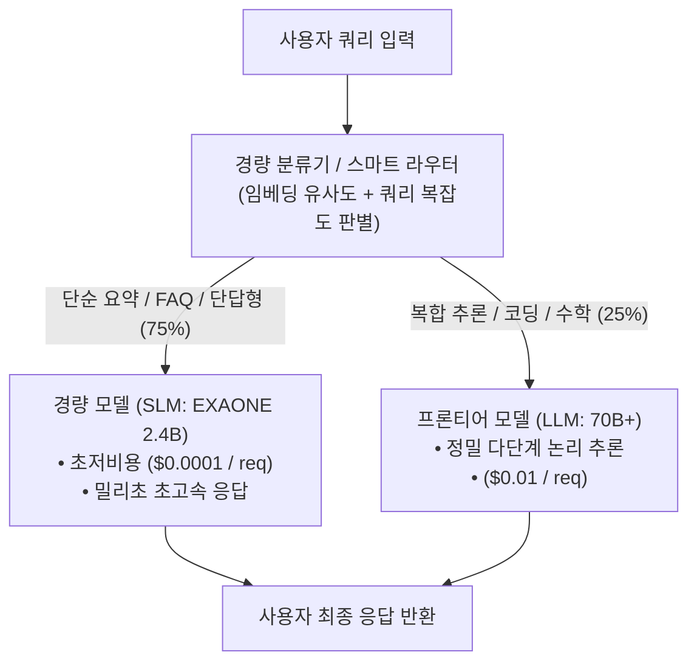

> [!abstract] 핵심 요약
> 모든 사용자 요청을 최고 사양의 거대 모델(예: 70B+)로 처리하는 것은 극심한 비용 낭비이다.
> 쿼리의 70% 이상을 차지하는 단순 질문은 저비용 **소형 모델(SLM, 3B~7B)**로 즉시 처리하고 복합 추론 질문만 상위 모델로 전달하는 **스마트 라우팅(Smart Routing)**을 통해 전체 추론 인프라 비용을 80% 이상 절감할 수 있다.

---

## 1. 스마트 라우터(Smart Router) 기반 계층적 LLM 서빙 구조



---

## 2. LLM 서빙 비용 절감 3대 핵심 엔지니어링

| 최적화 기법 | 동작 메커니즘 | 지연시간 개선 | 비용 절감율 |
| :-- | :-- | :--: | :--: |
| **스마트 캐스케이드 라우팅** | 질문 난이도에 맞춰 소형/대형 모델 차등 분기 | $2\times \sim 3\times$ 가속 | **$70\% \sim 85\%$ 절감** |
| **프롬프트 프리픽스 캐싱** | 반복되는 시스템 프롬프트/문서의 KV 캐시 재사용 | TTFT $5\times$ 단축 | **$50\%$ 절감** |
| **Speculative Decoding** | 초경량 모델이 $K$개 토큰 동시 생성 후 타깃 모델 1회 검증 | TPOT $2\times \sim 2.5\times$ 가속 | GPU 시간 50% 절감 |

---

## 3. 실시간 스마트 라우팅 도입에 따른 서빙 비용 절감 시뮬레이터

```html preview
<div style="font-family:system-ui,-apple-system,sans-serif;padding:20px;background:var(--card);color:var(--card-foreground);border:1px solid var(--border);border-radius:var(--radius)">
  <div style="font-size:16px;font-weight:700;margin-bottom:14px;color:var(--primary);display:flex;align-items:center;gap:8px">
    <span>💰 스마트 라우터 도입 시 월간 인프라 비용 절감 계산기</span>
  </div>

  <div style="display:grid;grid-template-columns:1fr 1fr;gap:12px;margin-bottom:14px">
    <div>
      <label style="font-size:11px;color:var(--muted-foreground)">월간 총 API 호출 수 (만 건):</label>
      <input id="inMonthlyReqs" type="number" value="100" min="10" max="1000" style="width:100%;padding:4px;background:var(--background);color:var(--foreground);border:1px solid var(--border);border-radius:var(--radius);font-weight:700" />
    </div>
    <div>
      <label style="font-size:11px;color:var(--muted-foreground)">소형 모델(SLM) 라우팅 비율 (%):</label>
      <input id="inSlmRatio" type="number" value="80" min="0" max="100" style="width:100%;padding:4px;background:var(--background);color:var(--foreground);border:1px solid var(--border);border-radius:var(--radius);font-weight:700" />
    </div>
  </div>

  <div style="display:grid;grid-template-columns:1fr 1fr;gap:12px;margin-bottom:12px">
    <div style="padding:10px;background:var(--background);border:1px solid var(--border);border-radius:var(--radius);text-align:center">
      <div style="font-size:10px;color:var(--muted-foreground)">기존 대형 모델 단독 비용 (월)</div>
      <div id="costOldOut" style="font-family:monospace;font-size:18px;font-weight:800;color:var(--destructive,#ef4444);margin-top:2px">1,000 만 원</div>
    </div>
    <div style="padding:10px;background:var(--background);border:1px solid var(--border);border-radius:var(--radius);text-align:center">
      <div style="font-size:10px;color:var(--muted-foreground)">스마트 라우팅 적용 후 비용 (월)</div>
      <div id="costNewOut" style="font-family:monospace;font-size:18px;font-weight:800;color:var(--primary);margin-top:2px">280 만 원 (72% 절감)</div>
    </div>
  </div>

  <script>
    function updateRoutingCost() {
      var reqs = parseFloat(document.getElementById('inMonthlyReqs').value) || 100;
      var slmRatio = (parseFloat(document.getElementById('inSlmRatio').value) || 80) / 100;
      var llmCostPer10k = 10;
      var slmCostPer10k = 1;

      var oldCost = reqs * llmCostPer10k;
      var newCost = (reqs * slmRatio * slmCostPer10k) + (reqs * (1 - slmRatio) * llmCostPer10k);
      var saved = ((oldCost - newCost) / oldCost) * 100;

      document.getElementById('costOldOut').textContent = Math.round(oldCost).toLocaleString() + " 만 원";
      document.getElementById('costNewOut').textContent = Math.round(newCost).toLocaleString() + " 만 원 (" + Math.round(saved) + "% 절감)";
    }

    document.getElementById('inMonthlyReqs').addEventListener('input', updateRoutingCost);
    document.getElementById('inSlmRatio').addEventListener('input', updateRoutingCost);
    updateRoutingCost();
  </script>
</div>
```
