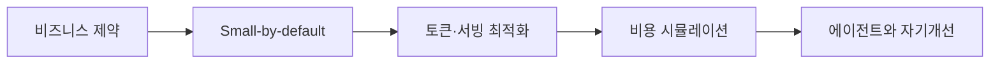

# 07. Lightweight LLM — 비용·서빙·스마트 라우팅

> [!abstract] 한 줄 요약
> 경량 LLM을 비즈니스 비용과 사용자 지연시간의 문제로 보고, 작은 모델·캐시·vLLM·speculative decoding·라우팅을 묶은 효율 스택을 정리한다.

---

## 강의 흐름



<Tabs>
  <Tab label="핵심 개념">
- **효율 스택** — 모델 선택·서빙 엔진·토큰 전략을 함께 최적화해야 비용과 latency를 줄일 수 있다는 관점이다.
- **라우팅** — 쉬운 요청을 SLM/on-device로, 복잡한 추론을 LLM/cloud로 보내 SLO와 비용을 동시에 맞춘다.
- **KV-cache** — 과거 토큰의 단기 기억으로 재계산을 줄이지만 컨텍스트가 길어질수록 메모리 병목이 된다.
  </Tab>
  <Tab label="적용 순서">
1. 트래픽을 쉬운 요청·복잡한 요청·스파이크로 분해한다.
2. 작은 모델·캐시·batching·quantization 후보를 고른다.
3. API·self-host·hybrid의 단위 비용과 SLO를 계산한다.
4. 라우터와 로그를 통해 품질·비용을 계속 재학습한다.
  </Tab>
  <Tab label="점검 질문">
- SLM이 60~90%의 쉬운 질의를 담당할 때 어떤 안전장치가 필요한가?
- 캐시 적중률과 GPU utilization이 단위 비용을 어떻게 바꾸는가?
- 모델을 키우는 대신 서빙·토큰 전략을 먼저 바꿔야 하는 경우는 언제인가?
  </Tab>
</Tabs>

---

## 단계별 정리

### 비즈니스 제약

- LLM 채택이 넓어질수록 토큰 비용과 GPU 자원 제약이 병목이 된다.
- 작은 모델·오픈 모델·on-device 배포는 비용·에너지·프라이버시를 함께 개선할 수 있다.
- 단위 요청 비용, latency, throughput, SLO를 모델 크기보다 먼저 측정한다.

### Small-by-default

- SLM은 제한된 자원에서 실행·미세조정이 쉽고 빠르며 교육·제품화에 유리하다.
- 온디바이스와 효율적 클라우드를 조합해 자주 발생하고 위험이 낮은 작업을 로컬로 보낸다.
- 어려운 질의만 큰 모델로 escalation하는 라우터를 둔다.

### 토큰·서빙 최적화

- 프롬프트 캐싱·짧은 컨텍스트·JSON 스키마로 토큰을 줄인다.
- vLLM PagedAttention·continuous batching은 KV-cache 낭비를 줄이고 QPS를 높인다.
- speculative/drafting은 작은 모델이 초안을 만들고 큰 모델이 검증해 decoding 단계를 줄인다.

### 비용 시뮬레이션

- 강의 예시는 500 input+250 output 토큰에서 GPT-4.1과 mini의 요청 비용·월 비용을 비교한다.
- self-host는 GPU-hour와 utilization이 핵심이며 유휴 GPU가 이점을 상쇄한다.
- 낮은 변동·고용량은 self-host, 스파이크·전문 모델은 API, 둘을 섞는 hybrid가 선택지다.

### 에이전트와 자기개선

- 의도 파싱·추출·tool calling 같은 반복 하위 작업은 SLM에 적합하다.
- 에이전트 로그의 프롬프트·도구 호출·성공/실패 신호가 특화 학습 데이터가 된다.
- 효율성은 모델×서빙×토큰 전략의 곱으로 보고 비용 KPI를 반복 계측한다.

| 단계 | 원본에서 관찰할 신호 | 학습 산출물 |
| --- | --- | --- |
| 경제 | token·GPU-hour·SLO | 요청당 비용·월 비용 |
| 모델 | SLM·LLM·distillation | 품질·latency·프라이버시 |
| 서빙 | PagedAttention·batching·drafting | QPS·KV 메모리 |
| 운영 | router·로그·KPI | 자기개선·escalation |

> [!warning] 읽을 때의 주의점
> 슬라이드의 가격·비율·시장 전망은 강의가 인용한 특정 시점의 예시다. 실제 도입 전에는 현재 가격표와 하드웨어 측정을 다시 확인해야 한다.

---

## 인터랙티브: 강의 단계 탐색

아래 슬라이더를 움직여 단계별 핵심 질문을 확인합니다. 범위와 단계명은 이 PDF의 강의 목차를 그대로 반영했습니다.

```html preview
<div style="font-family:system-ui,sans-serif;padding:20px;color:var(--foreground)">
<label for="a8lightweight" style="font-size:14px;font-weight:600">효율화 단계</label>
<div id="a8lightweight-out" style="font-size:24px;font-weight:700;color:var(--chart-1);margin:6px 0"></div>
<input id="a8lightweight" type="range" min="0" max="4" step="1" value="0" style="width:100%;accent-color:var(--primary)" />
<p id="a8lightweight-hint" style="font-size:13px;color:var(--muted-foreground);margin-top:8px"></p>
<script>
var control = document.getElementById('a8lightweight');
var out = document.getElementById('a8lightweight-out');
var hint = document.getElementById('a8lightweight-hint');
var labels = ["비즈니스 제약","Small-by-default","토큰·서빙 최적화","비용 시뮬레이션","에이전트와 자기개선"];
var hints = ["비용·지연·처리량을 의사결정 지표로 봅니다.","쉬운 요청은 작은 모델로 처리하는 원칙입니다.","캐싱과 엔진이 모델 선택만큼 중요함을 확인합니다.","API·self-host·hybrid의 트래픽 구간을 비교합니다.","작은 모델이 에이전트 하위 작업과 데이터를 맡는 흐름입니다."];
function renderStage() {
  var index = Number(control.value);
  out.textContent = labels[index];
  hint.textContent = hints[index];
}
control.addEventListener('input', renderStage);
renderStage();
</script>
</div>
```

<details>
  <summary>복습 체크리스트</summary>

- [ ] 모델·서빙·토큰 전략을 하나의 효율 스택으로 설명할 수 있다.
- [ ] API·self-host·hybrid 선택을 트래픽 특성과 연결할 수 있다.
- [ ] 에이전트 로그를 SLM 학습 데이터로 전환하는 루프를 그릴 수 있다.

</details>
