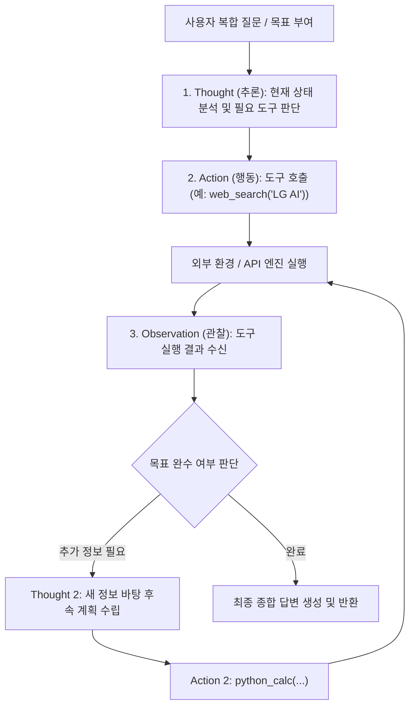

> [!abstract] 핵심 요약
> **Transformer**는 순차적 RNN의 한계를 극복하고 $O(1)$ 거리의 병렬 어텐션 연산 $\text{Attention}(Q, K, V) = \text{softmax}\left(\frac{QK^T}{\sqrt{d_k}}\right)V$을 통해 현대 LLM의 기틀을 마련하였다.
> 최근의 LLM은 단순 텍스트 생성을 넘어 웹 검색, Python 인터프리터, 계산기 등 외부 API를 자율 호출하는 **Tool-Use**와 **ReAct(Reasoning + Acting)** 루프를 결합하여 능동적으로 복합 과업을 완수하는 **Agentic AI**로 진화하였다.

---

## 1. ReAct(Thought-Action-Observation) 자율 에이전트 루프



---

## 2. Self-Attention 연산 메커니즘 수식 유도

입력 시퀀스 임베딩 $X \in \mathbb{R}^{n \times d}$에 대해:

$$Q = X W_Q, \quad K = X W_K, \quad V = X W_V$$

$$\text{Attention}(Q, K, V) = \text{softmax}\left(\frac{Q K^T}{\sqrt{d_k}}\right) V$$

| 구성 요소 | 역할 및 차원 | 수식 표현 |
| :-- | :-- | :-- |
| **Query ($Q$)** | 현재 토큰이 다른 토큰에 묻고자 하는 질문 | $Q \in \mathbb{R}^{n \times d_k}$ |
| **Key ($K$)** | 각 토큰이 보유한 고유 식별자/라벨 | $K \in \mathbb{R}^{n \times d_k}$ |
| **Value ($V$)** | 어텐션 가중치에 의해 가중합될 실제 의미 벡터 | $V \in \mathbb{R}^{n \times d_v}$ |
| **스케일링 인자 $\sqrt{d_k}$** | $d_k$ 증가 시 닷프로덕트 폭발로 인한 softmax 기울기 소실 방지 | $\frac{1}{\sqrt{d_k}}$ |

---

## 3. 실시간 ReAct 자율 에이전트 다단계 문제 해결 시뮬레이터

```html preview
<div style="font-family:system-ui,-apple-system,sans-serif;padding:20px;background:var(--card);color:var(--card-foreground);border:1px solid var(--border);border-radius:var(--radius)">
  <div style="font-size:16px;font-weight:700;margin-bottom:14px;color:var(--primary);display:flex;align-items:center;gap:8px">
    <span>🤖 ReAct 에이전트 다단계 추론(Thought-Action) 시뮬레이터</span>
  </div>

  <div style="margin-bottom:12px">
    <label style="font-size:11px;color:var(--muted-foreground)">에이전트에 부여할 복합 질문:</label>
    <div style="font-size:13px;font-weight:700;padding:8px;background:var(--background);border:1px solid var(--border);border-radius:var(--radius)">
      "2026년 한국 기준금리와 2024년 금리의 차이에 100을 곱한 값을 계산해줘."
    </div>
  </div>

  <div style="display:flex;gap:8px;margin-bottom:12px">
    <button id="btnReactStep" style="padding:6px 14px;background:var(--primary);color:#fff;border:none;border-radius:var(--radius);font-weight:700;cursor:pointer">다음 ReAct 단계 실행 ⏩</button>
    <button id="btnReactReset" style="padding:6px 14px;background:var(--secondary);color:var(--foreground);border:1px solid var(--border);border-radius:var(--radius);font-weight:700;cursor:pointer">초기화</button>
  </div>

  <div id="reactTraceLog" style="font-family:monospace;font-size:12px;line-height:1.6;padding:12px;background:var(--background);border:1px solid var(--border);border-radius:var(--radius);min-height:100px">
    [대기 중] '다음 ReAct 단계 실행' 버튼을 눌러 에이전트의 추론 루프를 시작하세요.
  </div>

  <script>
    var step = 0;
    var log = document.getElementById('reactTraceLog');

    var traces = [
      "💭 <strong>[Thought 1]:</strong> 먼저 2026년과 2024년 한국 기준금리 정보를 검색해야 한다.<br/>⚡ <strong>[Action 1]:</strong> <code>search_api('한국 기준금리 2024 vs 2026')</code>",
      "👁️ <strong>[Observation 1]:</strong> 2024년 금리: 3.50%, 2026년 금리: 2.75% 확인 완료.<br/>💭 <strong>[Thought 2]:</strong> 두 수치의 차이를 구하고 100을 곱하는 파이썬 코드를 실행해야 한다.<br/>⚡ <strong>[Action 2]:</strong> <code>python_repl('(3.50 - 2.75) * 100')</code>",
      "👁️ <strong>[Observation 2]:</strong> 파이썬 실행 결과: <code>75.0</code><br/>💭 <strong>[Thought 3]:</strong> 모든 계산이 완료되었으므로 사용자에게 최종 답변을 작성한다.<br/>🎉 <strong>[Final Answer]:</strong> 2024년 기준금리(3.50%)와 2026년 기준금리(2.75%)의 차이는 0.75%p이며, 여기에 100을 곱한 값은 <strong>75.0</strong>입니다."
    ];

    document.getElementById('btnReactStep').onclick = function() {
      if (step < traces.length) {
        if (step === 0) log.innerHTML = "";
        log.innerHTML += "<div style='margin-bottom:8px;padding-bottom:8px;border-bottom:1px dashed var(--border)'>" + traces[step] + "</div>";
        step++;
      }
    };

    document.getElementById('btnReactReset').onclick = function() {
      step = 0;
      log.innerHTML = "[대기 중] '다음 ReAct 단계 실행' 버튼을 눌러 에이전트의 추론 루프를 시작하세요.";
    };
  </script>
</div>
```
