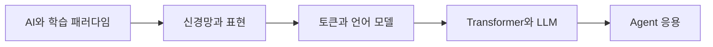

# 08. 딥러닝 자연어처리와 LLM Agent — 기초부터 응용까지

> [!abstract] 한 줄 요약
> 머신러닝·딥러닝의 학습 방식에서 출발해 토큰·임베딩·Transformer·LLM, 검색·도구 사용·에이전트 설계로 이어지는 자연어처리 흐름을 정리한다.

---

## 강의 흐름



<Tabs>
  <Tab label="핵심 개념">
- **피드백 신호** — 학습 유형을 구분하는 기준은 라벨·비라벨 패턴·보상처럼 모델이 받는 피드백의 성격이다.
- **자동회귀** — 현재까지의 토큰으로 다음 한 토큰을 예측하고 이를 반복해 문장을 생성한다.
- **Agent loop** — 계획→도구 호출→관찰→검증을 반복하며 LLM을 시스템 행동에 연결한다.
  </Tab>
  <Tab label="적용 순서">
1. 문제의 라벨·보상·비라벨 조건을 확인한다.
2. 입력 표현과 신경망의 순전파·역전파를 그린다.
3. 토큰화·임베딩·attention으로 언어 모델 흐름을 만든다.
4. 검색·도구·검증 루프로 에이전트를 운영한다.
  </Tab>
  <Tab label="점검 질문">
- 지도학습과 강화학습의 피드백 신호는 어떻게 다른가?
- 토큰화와 임베딩이 각각 해결하는 문제는 무엇인가?
- RAG와 Agent loop가 지식 cutoff·실행 실패를 어떻게 보완하는가?
  </Tab>
</Tabs>

---

## 단계별 정리

### AI와 학습 패러다임

- 머신러닝은 명시적 규칙 대신 데이터·특징·알고리즘으로 경험에서 일반화한다.
- 지도학습은 라벨, 비지도학습은 패턴, 반지도학습은 소량 라벨과 대량 비라벨, 강화학습은 보상 신호를 사용한다.
- 딥러닝은 여러 hidden layer로 더 복잡한 특징을 학습한다.

### 신경망과 표현

- 뉴런은 가중합과 bias를 활성화 함수에 통과시켜 출력을 만든다.
- 이미지는 픽셀 행렬을 벡터로 펼치거나 합성곱 구조로 처리한다.
- 순전파 예측과 손실 기반 역전파가 파라미터를 갱신한다.

### 토큰과 언어 모델

- 토큰화는 텍스트를 vocabulary의 정수 ID로 변환한다.
- 언어 모델은 이전 토큰으로 다음 토큰 확률을 예측하며 자동회귀 생성을 수행한다.
- 임베딩은 토큰 ID를 학습 가능한 벡터로 바꿔 의미 관계를 표현한다.

### Transformer와 LLM

- Self-attention은 문맥 내 토큰 간 관계를 계산하고 positional 정보로 순서를 보완한다.
- 대규모 말뭉치 사전학습 뒤 instruction tuning·human feedback으로 사용 목적에 맞춘다.
- LLM은 생성 모델이지만 사실성·편향·최신성 한계를 가진다.

### Agent 응용

- RAG는 외부 문서를 검색해 지식 cutoff를 보완한다.
- 에이전트는 목표를 작은 작업으로 분해하고 도구 호출 결과를 다시 관찰한다.
- 실행 시 권한·검증·실패 복구를 포함해야 하며 모델 출력만으로 완료를 선언하지 않는다.

| 단계 | 원본에서 관찰할 신호 | 학습 산출물 |
| --- | --- | --- |
| 학습 | 지도·비지도·반지도·강화 | 피드백·데이터 조건 |
| 표현 | 픽셀·벡터·토큰·임베딩 | 입력과 특징 |
| 모델 | attention·자동회귀·alignment | 문맥·생성 |
| 응용 | RAG·도구·계획·검증 | 실행과 책임 |

> [!warning] 읽을 때의 주의점
> 이 노트는 원본 강의의 개념 흐름을 정리한 것이다. 특정 LLM 제품의 최신 기능이나 성능을 보장하는 사용 설명서로 읽지 않는다.

---

## 인터랙티브: 강의 단계 탐색

아래 슬라이더를 움직여 단계별 핵심 질문을 확인합니다. 범위와 단계명은 이 PDF의 강의 목차를 그대로 반영했습니다.

```html preview
<div style="font-family:system-ui,sans-serif;padding:20px;color:var(--foreground)">
<label for="a8deepnlp" style="font-size:14px;font-weight:600">NLP·Agent 단계</label>
<div id="a8deepnlp-out" style="font-size:24px;font-weight:700;color:var(--chart-1);margin:6px 0"></div>
<input id="a8deepnlp" type="range" min="0" max="4" step="1" value="0" style="width:100%;accent-color:var(--primary)" />
<p id="a8deepnlp-hint" style="font-size:13px;color:var(--muted-foreground);margin-top:8px"></p>
<script>
var control = document.getElementById('a8deepnlp');
var out = document.getElementById('a8deepnlp-out');
var hint = document.getElementById('a8deepnlp-hint');
var labels = ["AI와 학습 패러다임","신경망과 표현","토큰과 언어 모델","Transformer와 LLM","Agent 응용"];
var hints = ["지도·비지도·반지도·강화학습의 피드백을 비교합니다.","픽셀·벡터·가중치 갱신을 연결합니다.","문장을 토큰 시퀀스와 확률 분포로 바꿉니다.","attention·pretraining·alignment를 단계화합니다.","검색·도구·계획을 모델 외부 루프에 연결합니다."];
function renderStage() {
  var index = Number(control.value);
  out.textContent = labels[index];
  hint.textContent = hints[index];
}
control.addEventListener('input', renderStage);
renderStage();
</script>
</div>
```

<details>
  <summary>복습 체크리스트</summary>

- [ ] 네 가지 학습 유형을 피드백 신호로 구분할 수 있다.
- [ ] 토큰→임베딩→attention→자동회귀 생성 흐름을 설명할 수 있다.
- [ ] RAG와 Agent loop에 검증·권한·복구를 포함할 수 있다.

</details>
