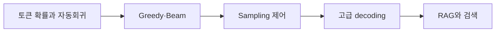

# 09. LLM Decoding — Greedy·Beam·Sampling과 고급 추론

> [!abstract] 한 줄 요약
> 다음 토큰 분포에서 시작해 greedy·beam·sampling, temperature·top-k·top-p, contrastive·speculative decoding과 RAG 검색 흐름을 한 장의 실행 지도에 담는다.

---

## 강의 흐름



<Tabs>
  <Tab label="핵심 개념">
- **decoding objective** — 정확도 하나가 아니라 다양성·사실성·속도·안전 중 과업 목적에 맞춰 다음 토큰 선택을 설계한다.
- **speculative decoding** — 작은 draft 모델의 제안을 큰 모델이 검증해 동일한 결과를 더 적은 순차 단계로 얻는다.
- **RAG** — 검색된 외부 근거를 모델 입력에 결합해 지식 cutoff와 최신성 한계를 보완한다.
  </Tab>
  <Tab label="적용 순서">
1. 다음 토큰 분포와 자동회귀 비용을 정의한다.
2. Greedy·Beam·Sampling 중 기본 전략을 선택한다.
3. temperature·top-k·top-p로 분포를 조절한다.
4. 목적에 따라 diverse·contrastive·speculative를 추가한다.
5. 검색·재순위·생성·근거 검증을 RAG로 묶는다.
  </Tab>
  <Tab label="점검 질문">
- top-k와 top-p는 후보 집합을 어떻게 다르게 정하는가?
- speculative decoding이 결과의 정확성을 유지할 수 있는 조건은 무엇인가?
- RAG에서 검색 품질과 긴 컨텍스트 처리가 함께 중요한 이유는 무엇인가?
  </Tab>
</Tabs>

---

## 단계별 정리

### 토큰 확률과 자동회귀

- 입력 토큰 시퀀스에서 vocabulary 전체의 다음 토큰 확률 분포를 계산한다.
- 자동회귀 생성은 다음 토큰을 붙여 다시 모델에 넣는 순차 추론이다.
- 분포의 합은 1이며 decoding은 이 분포를 어떤 규칙으로 선택할지 결정한다.

### Greedy·Beam

- Greedy는 매 단계 최대 확률 토큰을 고르지만 이후 경로를 놓칠 수 있다.
- Beam search는 여러 후보를 유지해 여러 시점을 동시에 고려한다.
- Beam은 품질 기회를 늘리지만 계산량이 커지고 다양성이 낮아질 수 있다.

### Sampling 제어

- Sampling은 분포에서 무작위로 뽑아 탐색성을 높인다.
- Temperature가 1보다 크면 분포가 평탄해지고 1보다 작으면 날카로워진다.
- Top-k는 후보 개수를 고정하고 top-p는 누적 확률 임계값으로 후보 수를 적응시킨다.

### 고급 decoding

- Diverse beam search는 그룹 간 dissimilarity를 목적 함수에 더해 결과 다양성을 높인다.
- Contrastive decoding은 큰 모델과 작은 모델 또는 문맥 유무의 분포를 대조해 부적절한 출력을 줄인다.
- Speculative decoding은 작은 draft가 여러 토큰을 제안하고 큰 target이 한 번에 검증한다.

### RAG와 검색

- 사전학습 지식에는 cutoff가 있고 새 정보는 fine-tuning만으로 안정적으로 넣기 어렵다.
- Web search·BM25·DPR 같은 retrieval이 관련 문서를 찾아 LLM 입력에 붙인다.
- RAG는 검색 품질·긴 컨텍스트·노이즈·질의 개선을 함께 평가해야 한다.

| 단계 | 원본에서 관찰할 신호 | 학습 산출물 |
| --- | --- | --- |
| 분포 | softmax·자동회귀 | 다음 토큰 확률 |
| 선택 | greedy·beam·sampling | 품질·다양성·비용 |
| 제어 | temperature·top-k·top-p | 후보 집합·무작위성 |
| 확장 | contrastive·speculative·RAG | 사실성·속도·최신성 |

> [!warning] 읽을 때의 주의점
> 원본에는 특정 구현·논문·제품의 결과가 함께 제시된다. decoding 파라미터는 과업·모델·평가 지표에 맞춰 검증해야 하며 보편적인 최적값은 없다.

---

## 인터랙티브: 강의 단계 탐색

아래 슬라이더를 움직여 단계별 핵심 질문을 확인합니다. 범위와 단계명은 이 PDF의 강의 목차를 그대로 반영했습니다.

```html preview
<div style="font-family:system-ui,sans-serif;padding:20px;color:var(--foreground)">
<label for="a8decoding" style="font-size:14px;font-weight:600">Decoding 단계</label>
<div id="a8decoding-out" style="font-size:24px;font-weight:700;color:var(--chart-1);margin:6px 0"></div>
<input id="a8decoding" type="range" min="0" max="4" step="1" value="0" style="width:100%;accent-color:var(--primary)" />
<p id="a8decoding-hint" style="font-size:13px;color:var(--muted-foreground);margin-top:8px"></p>
<script>
var control = document.getElementById('a8decoding');
var out = document.getElementById('a8decoding-out');
var hint = document.getElementById('a8decoding-hint');
var labels = ["토큰 확률과 자동회귀","Greedy·Beam","Sampling 제어","고급 decoding","RAG와 검색"];
var hints = ["한 번에 한 토큰을 예측하는 기본 루프입니다.","탐욕적 선택과 다중 후보를 비교합니다.","temperature·top-k·top-p의 후보 집합을 조절합니다.","다양성·사실성·속도를 목적별로 조절합니다.","지식 cutoff를 검색·재독해로 보완합니다."];
function renderStage() {
  var index = Number(control.value);
  out.textContent = labels[index];
  hint.textContent = hints[index];
}
control.addEventListener('input', renderStage);
renderStage();
</script>
</div>
```

<details>
  <summary>복습 체크리스트</summary>

- [ ] Greedy·Beam·Sampling의 선택 규칙과 비용을 비교할 수 있다.
- [ ] temperature·top-k·top-p의 효과를 예측할 수 있다.
- [ ] speculative decoding과 RAG의 병목·검증 지점을 말할 수 있다.

</details>
