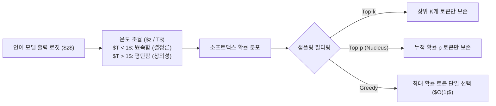

> [!abstract] 핵심 요약
> 거대 언어 모델의 출력 품질은 모델 가중치뿐만 아니라 **디코딩 전략(Decoding Strategy)**에 크게 좌우된다.
> 사실성(Factuality)과 코딩에는 확률이 가장 높은 토큰만 선택하는 **탐욕 탐색(Greedy)**이나 **낮은 Temperature($\approx 0.1$)**가 적합하며, 창의적 작문에는 누적 확률 상위 $p$ 집합 내에서 무작위 샘플링하는 **Top-p Nucleus Sampling**이 표준으로 사용된다. 또한 **추측 디코딩(Speculative Decoding)**은 수학적으로 완전 동일한 확률 분포를 유지하면서 생성 속도를 2배 이상 가속한다.

---

## 1. Top-$p$ (Nucleus) 및 Temperature 변환 수식

로짓 벡터 $z_i$에 온도 $T$를 적용한 확률 분포:

$$P(y_t = w_i \mid y_{<t}) = \frac{\exp(z_i / T)}{\sum_j \exp(z_j / T)}$$

Top-$p$ 핵 집합 $V^{(p)} \subset V$:

$$\sum_{w \in V^{(p)}} P(w \mid y_{<t}) \ge p \quad \text{(확률 내림차순 정렬 최소 부분집합)}$$



---

## 2. 주요 디코딩 기법 비교 매트릭스

| 디코딩 알고리즘 | 결정론적 여부 | 연산 복잡도 | 텍스트 특성 | 추천 활용 분야 |
| :-- | :--: | :--: | :-- | :-- |
| **Greedy Search** | ✅ 결정론적 | $O(1)$ | 일관성 높음, 반복 루프 발생 위험 | SQL 생성, 정밀 계산, 요약 |
| **Beam Search** | ✅ 결정론적 | $O(B)$ | 전역 탐색으로 문장 완결성 우수 | 기계 번역, 음성 인식 (ASR) |
| **Top-$k$ Sampling** | ❌ 확률적 | $O(k)$ | 고정된 개수 내 다양성 확보 | 일반 대화, 챗봇 |
| **Top-$p$ (Nucleus)** | ❌ 확률적 | 동적 | 맥락에 따라 후보군 크기 자동 조절 | 창의적 글쓰기, 스토리텔링 ⭐ |
| **Speculative Decoding** | 동적 (타깃 일치) | 가속화 | 타깃 모델과 수학적으로 **완전 동일** | 실시간 초고속 LLM 서빙 🚀 |

---

## 3. 실시간 디코딩 파라미터(Temperature & Top-p) 조율기

```html preview
<div style="font-family:system-ui,-apple-system,sans-serif;padding:20px;background:var(--card);color:var(--card-foreground);border:1px solid var(--border);border-radius:var(--radius)">
  <div style="font-size:16px;font-weight:700;margin-bottom:14px;color:var(--primary);display:flex;align-items:center;gap:8px">
    <span>🎛️ LLM 디코딩 파라미터(Temperature & Top-p) 실시간 조율기</span>
  </div>

  <div style="display:grid;grid-template-columns:1fr 1fr;gap:12px;margin-bottom:14px">
    <div>
      <label style="font-size:11px;color:var(--muted-foreground)">Temperature (온도: <span id="tempVal">0.7</span>):</label>
      <input id="inTemp" type="range" min="0.0" max="1.5" step="0.1" value="0.7" style="width:100%" />
    </div>
    <div>
      <label style="font-size:11px;color:var(--muted-foreground)">Top-p Nucleus (누적 확률: <span id="toppVal">0.9</span>):</label>
      <input id="inTopp" type="range" min="0.1" max="1.0" step="0.05" value="0.9" style="width:100%" />
    </div>
  </div>

  <div style="padding:12px;background:var(--background);border:1px solid var(--border);border-radius:var(--radius)">
    <div style="font-size:11px;font-weight:700;color:var(--muted-foreground);margin-bottom:4px">설정된 디코딩 특성 및 적합한 태스크</div>
    <div id="decodingDescOut" style="font-size:13px;line-height:1.6;color:var(--foreground)">
      <strong style="color:var(--primary)">균형 모드 (Balanced):</strong> 적절한 창의성과 문맥 일관성을 유지하는 범용 대화형 챗봇 표준 설정입니다.
    </div>
  </div>

  <script>
    function updateDecoding() {
      var t = parseFloat(document.getElementById('inTemp').value);
      var p = parseFloat(document.getElementById('inTopp').value);
      document.getElementById('tempVal').textContent = t.toFixed(1);
      document.getElementById('toppVal').textContent = p.toFixed(2);

      var out = document.getElementById('decodingDescOut');
      if (t <= 0.2) {
        out.innerHTML = "<strong style='color:var(--primary)'>🎯 정밀 결정론 모드 (Low Temperature):</strong><br/>• 확률 최상위 토큰에 집중되어 환각을 억제하고 논리적 일관성 극대화<br/>• 추천 태스크: 파이썬 코딩, 수학 문제 풀이, JSON 정형 데이터 추출";
      } else if (t >= 1.0) {
        out.innerHTML = "<strong style='color:var(--destructive,#ef4444)'>🎨 고창의성 모드 (High Temperature):</strong><br/>• 확률이 낮은 참신한 단어가 선택될 확률이 증가하여 어휘가 풍부해짐<br/>• 주의: 지나치게 높을 경우 문맥 이탈 및 비문 발생 가능<br/>• 추천 태스크: 마케팅 카피라이팅, 소설 창작, 브레인스토밍";
      } else {
        out.innerHTML = "<strong style='color:var(--chart-1)'>⚖️ 균형 모드 (Standard Balanced):</strong><br/>• 적절한 다양성과 맥락 일관성을 동시에 유지하는 일반 범용 설정<br/>• 추천 태스크: 고객 상담 챗봇, 문서 요약, 이메일 초안 작성";
      }
    }

    document.getElementById('inTemp').addEventListener('input', updateDecoding);
    document.getElementById('inTopp').addEventListener('input', updateDecoding);
    updateDecoding();
  </script>
</div>
```
