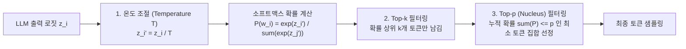
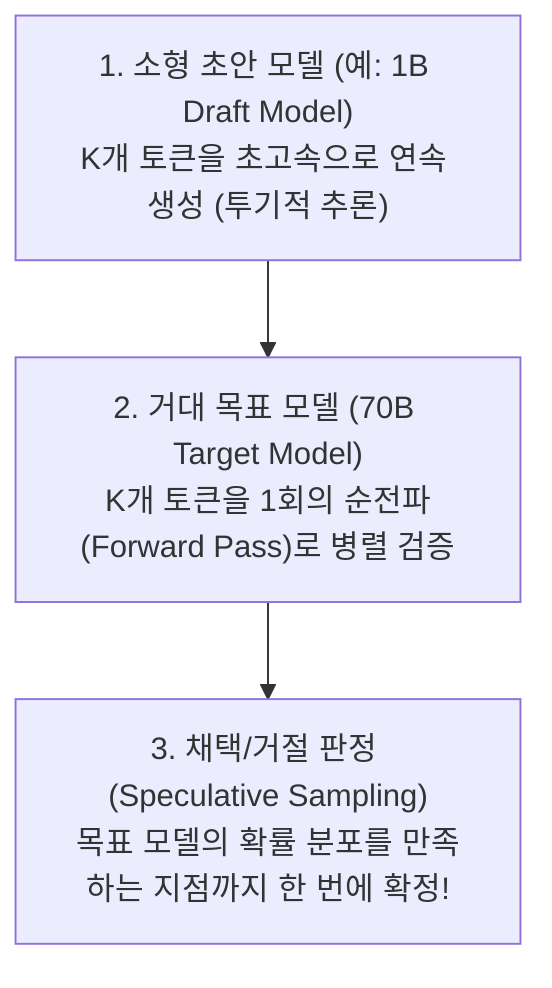

> [!abstract] 핵심 요약
> LLM은 매 스텝마다 어휘 사전 전체에 대한 로짓(Logit) 확률 분포를 출력하며, **어떤 디코딩 전략(Decoding Strategy)을 선택하느냐에 따라 환각(Hallucination), 반복(Repetition), 창의성(Creativity)**이 극명하게 갈린다.
> **온도($T$), Top-$k$, Top-$p$**의 확률 분포 조작 수식과, 병렬 검증을 통해 생성 지연 시간을 획기적으로 단축하는 **투기적 디코딩(Speculative Decoding)**을 체계적으로 규명한다.

---

## 1. 확률적 샘플링의 3대 수학적 제어 파라미터



### 1.1. 온도(Temperature $T$) 스케일링 수식
$$P(w_i \mid w_{<t}) = \frac{\exp(z_i / T)}{\sum_j \exp(z_j / T)}$$
- **$T \to 0$**: 로짓 간의 격차가 무한대로 증폭되어 **가장 확률이 높은 토큰 1개만 선택 (Greedy Search와 동일, 사실적 답변 및 코딩에 최적)**.
- **$T > 1.0$**: 확률 분포가 균등(Uniform)하게 평탄화되어 **저확률의 참신한 어휘가 선택됨 (창의적 글쓰기, 환각 증가)**.

---

## 2. 투기적 디코딩 (Speculative Decoding)의 원리

거대 목표 모델 $M_{\text{target}}$(예: 70B)의 토큰당 생성 지연(Latency)은 메모리 읽기 대역폭에 묶여 있다.



- **수학적 무손실 보장**: 거절 샘플링(Rejection Sampling) 규칙을 통해 **목표 모델 단독 생성과 100% 동일한 확률 분포**를 수학적으로 보장하면서 속도만 2~3배 향상.

---

## 3. 실시간 디코딩 온도(Temperature) & Top-p 시뮬레이터

```html preview
<div style="font-family:system-ui,-apple-system,sans-serif;padding:20px;background:var(--card);color:var(--card-foreground);border:1px solid var(--border);border-radius:var(--radius)">
  <div style="font-size:16px;font-weight:700;margin-bottom:12px;color:var(--primary)">
    ⚡ LLM 디코딩 파라미터(Temperature & Top-p) 확률 변형기
  </div>

  <div style="display:grid;grid-template-columns:1fr 1fr;gap:10px;margin-bottom:12px">
    <div>
      <label style="font-size:11px;color:var(--muted-foreground)">온도 Temperature T (0.1 ~ 2.0):</label>
      <input id="inDecTemp" type="range" min="0.1" max="2.0" step="0.1" value="0.7" style="width:100%" />
      <div id="outDecTempVal" style="font-weight:700;color:var(--primary);font-size:12px">T = 0.7</div>
    </div>
    <div>
      <label style="font-size:11px;color:var(--muted-foreground)">Top-p (Nucleus p, 0.5 ~ 1.0):</label>
      <input id="inDecTopP" type="range" min="0.5" max="1.0" step="0.05" value="0.9" style="width:100%" />
      <div id="outDecTopPVal" style="font-weight:700;color:var(--primary);font-size:12px">p = 0.90</div>
    </div>
  </div>

  <div style="padding:12px;background:var(--background);border:1px solid var(--border);border-radius:var(--radius)">
    <div style="font-size:11px;color:var(--muted-foreground)">후보 토큰 확률 분포 변화:</div>
    <div id="outTokenProbs" style="font-family:monospace;font-size:12px;margin-top:6px;line-height:1.6"></div>
  </div>

  <script>
    var baseLogits = [
      { t: "대한민국", z: 4.5 },
      { t: "서울", z: 3.8 },
      { t: "한국", z: 3.2 },
      { t: "아시아", z: 1.5 },
      { t: "우주", z: 0.2 }
    ];

    function calcDecProbs() {
      var T = parseFloat(document.getElementById('inDecTemp').value);
      var P = parseFloat(document.getElementById('inDecTopP').value);
      document.getElementById('outDecTempVal').textContent = "T = " + T.toFixed(1);
      document.getElementById('outDecTopPVal').textContent = "p = " + P.toFixed(2);

      var expSum = 0;
      var scaled = baseLogits.map(function(item) {
        var e = Math.exp(item.z / T);
        expSum += e;
        return { t: item.t, e: e };
      });

      var probs = scaled.map(function(item) {
        return { t: item.t, p: item.e / expSum };
      });

      // Filter by top-p
      var cum = 0;
      var outHtml = "";
      for (var i = 0; i < probs.length; i++) {
        var it = probs[i];
        cum += it.p;
        var inNucleus = cum <= P || (cum - it.p < P);
        var badge = inNucleus ? "<span style='color:var(--primary);font-weight:800'>[선택 후보]</span>" : "<span style='color:var(--muted-foreground)'>[차단됨]</span>";
        outHtml += "<div style='display:flex;justify-content:space-between'><span>" + it.t + ": " + (it.p * 100).toFixed(1) + "%</span>" + badge + "</div>";
      }

      document.getElementById('outTokenProbs').innerHTML = outHtml;
    }

    document.getElementById('inDecTemp').addEventListener('input', calcDecProbs);
    document.getElementById('inDecTopP').addEventListener('input', calcDecProbs);
    calcDecProbs();
  </script>
</div>
