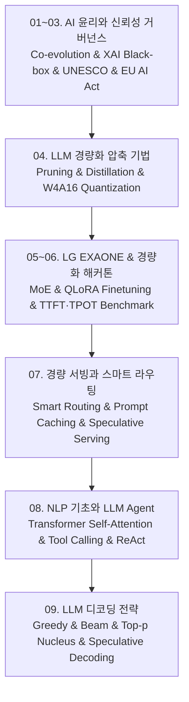

# 📚 LG Aimers 8기 — 거대 언어 모델(LLM) 경량화 및 Agentic AI 엔지니어링 전체 로드맵

인공지능 윤리와 신뢰성 거버넌스(기술결정론 비판, XAI 설명가능성, EU AI Act 위험 분류 체계), 거대 언어 모델(LLM)의 핵심 경량화 압축 알고리즘(구조화/비구조화 Pruning, Knowledge Distillation, W8A8/W4A16 AWQ·GPTQ Quantization), LG AI연구원의 글로벌 오픈소스 파운데이션 모델 EXAONE 3.0 아키텍처 및 해커톤 최적화 파이프라인(QLoRA, 지연시간 TTFT/TPOT 튜닝), 초경량 모델 서빙과 비용 최적화(스마트 라우터, 프롬프트 캐싱), Transformer Self-Attention 및 자율 행동(Tool-Use, ReAct) LLM Agent, 그리고 정밀 생성 제어 디코딩(Greedy, Beam, Top-p, Speculative Decoding)까지 체계적으로 다룹니다.

---

## 🗺️ 강의 목차 (Curriculum Overview)

---

## 📑 개별 정리 문서 목록

1. [01. AI 윤리 — AI 시대, 미래는 오지 않는다](file:///Users/um-yunsang/work/edu/LGAimer/LG%20Aimers%208%EA%B8%B0/notes/01.%20AI%20%EC%9C%A4%EB%A6%AC%20%E2%80%94%20AI%20%EC%8B%9C%EB%8C%80,%20%EB%AF%B8%EB%9E%98%EB%8A%94%20%EC%98%A4%EC%A7%80%20%EC%95%8A%EB%8A%94%EB%8B%A4.md)
   - 기술결정론 비판, 기술과 사회의 공진화, 가치 지향적 설계(Value-Sensitive Design), 대화형 기술 수용 분석기
2. [02. AI 윤리 — 낯선 지능과 함께 살아가기](file:///Users/um-yunsang/work/edu/LGAimer/LG%20Aimers%208%EA%B8%B0/notes/02.%20AI%20%EC%9C%A4%EB%A6%AC%20%E2%80%94%20%EB%82%AF%EC%84%A0%20%EC%A7%80%EB%8A%A5%EA%B3%BC%20%ED%95%A8%EA%BB%98%20%EC%82%B4%EC%95%84%EA%B0%80%EA%B8%B0.md)
   - 연결주의 신경망의 블랙박스 불투명성, 알고리즘 편향 증폭, XAI 설명가능성(SHAP/LIME), 대화형 SHAP 분석기
3. [03. AI 윤리 — 원칙에서 행동으로](file:///Users/um-yunsang/work/edu/LGAimer/LG%20Aimers%208%EA%B8%B0/notes/03.%20AI%20%EC%9C%A4%EB%A6%AC%20%E2%80%94%20%EC%9B%90%EC%B9%99%EC%97%90%EC%84%9C%20%ED%96%89%EB%8F%99%EC%9C%BC%EB%A1%9C.md)
   - 유네스코 4대 가치와 10대 원칙, EU AI Act 위험 기반 4단계 분류 체계, 레드팀 검증, 대화형 위험 등급 판별기
4. [04. LLM 경량화 — Pruning·Distillation·Quantization](file:///Users/um-yunsang/work/edu/LGAimer/LG%20Aimers%208%EA%B8%B0/notes/04.%20LLM%20%EA%B2%BD%EB%9F%89%ED%99%94%20%E2%80%94%20Pruning%C2%B7Distillation%C2%B7Quantization.md)
   - 메모리 바운드 병목, 구조적 가지치기, 지식 증류, AWQ/GPTQ INT4 양자화 공식, 대화형 VRAM 계산기
5. [05. EXAONE — 전문가 AI와 Agentic AI](file:///Users/um-yunsang/work/edu/LGAimer/LG%20Aimers%208%EA%B8%B0/notes/05.%20EXAONE%20%E2%80%94%20%EC%A0%84%EB%AC%B8%EA%B0%80%20AI%EC%99%80%20Agentic%20AI.md)
   - LG EXAONE 파운데이션 모델 아키텍처, 전문 도메인 큐레이션, On-Device 라인업, 대화형 모델 추천기
6. [06. EXAONE 경량화 해커톤 — 분석·압축·추론·평가](file:///Users/um-yunsang/work/edu/LGAimer/LG%20Aimers%208%EA%B8%B0/notes/06.%20EXAONE%20%EA%B2%BD%EB%9F%89%ED%99%94%20%ED%95%B4%EC%BB%A4%ED%86%A4%20%E2%80%94%20%EB%B6%84%EC%84%9D%C2%B7%EC%95%95%EC%B6%95%C2%B7%EC%B6%94%EB%A1%A0%C2%B7%ED%8F%89%EA%B0%80.md)
   - 해커톤 최적화 파이프라인, QLoRA 미세조정, TTFT/TPOT 지연시간 튜닝, 대화형 해커톤 종합 점수 산출기
7. [07. Lightweight LLM — 비용·서빙·스마트 라우팅](file:///Users/um-yunsang/work/edu/LGAimer/LG%20Aimers%208%EA%B8%B0/notes/07.%20Lightweight%20LLM%20%E2%80%94%20%EB%B9%84%EC%9 contemporary%C2%B7%EC%84%9C%EB%B9%99%C2%B7%EC%8A%A4%EB%A7%88%ED%8A%B8%20%EB%9D%BC%EC%9A%B0%ED%8C%85.md)
   - 스마트 캐스케이드 라우터, 프롬프트 프리픽스 캐싱, 대화형 추론 비용 절감 계산기
8. [08. 딥러닝 자연어처리와 LLM Agent — 기초부터 응용까지](file:///Users/um-yunsang/work/edu/LGAimer/LG%20Aimers%208%EA%B8%B0/notes/08.%20%EB%94%A5%EB%9F%AC%EB%8B%9D%20%EC%9E%90%EC%97%B0%EC%96%B4%EC%B2%98%EB%A6%AC%EC%99%80%20LLM%20Agent%20%E2%80%94%20%EA%B8%B0%EC%B4%88%EB%B6%80%ED%84%B0%20%EC%9D%91%EC%9A%A9%EA%B9%8C%EC%A7%80.md)
   - Transformer Self-Attention 수식 유도, Tool Calling, ReAct 자율 에이전트 루프 시뮬레이터
9. [09. LLM Decoding — Greedy·Beam·Sampling과 고급 추론](file:///Users/um-yunsang/work/edu/LGAimer/LG%20Aimers%208%EA%B8%B0/notes/09.%20LLM%20Decoding%20%E2%80%94%20Greedy%C2%B7Beam%C2%B7Sampling%EA%B3%BC%20%EA%B3%A0%EA%B8%89%20%EC%B6%94%EB%A1%A0.md)
   - Greedy, Beam Search, Temperature, Top-k/Top-p Nucleus, Speculative Decoding 가속기
