# LG Aimers 9기 강의 흐름 지도

> [!abstract] 읽기 순서
> LG Aimers 9기의 강의자료 PDF를 파일명·주제·슬라이드 쪽수 기준으로 배열했습니다. 번호가 붙은 노트는 이 순서를 따라 원본 개념과 실습·정책 맥락을 연결합니다.

---

## 강의 흐름 지도

```mermaid
flowchart LR
  P1["01 Mathematics for ML"]
  P2["02 지도학습"]
  P1 --> P2
  P3["03 딥러닝 자연어처리와 LLM Agent"]
  P2 --> P3
  P4["04 Optimization & DFL"]
  P3 --> P4
  P5["05 Time-Series Analysis"]
  P4 --> P5
  P6["06 Tabular ML 01 · Introduction"]
  P5 --> P6
  P7["07 Tabular ML 02 · Classical"]
  P6 --> P7
  P8["08 Tabular ML 03 · Deep"]
  P7 --> P8
  P9["09 Tabular ML 04 · Representation"]
  P8 --> P9
  P10["10 Tabular ML 05 · LLM"]
  P9 --> P10
  P11["11 Tabular ML 06 · TabPFN"]
  P10 --> P11
  P12["12 LLM Decoding"]
  P11 --> P12
```



<Tabs>
  <Tab label="파일 순서">파일명과 강의 장·절을 먼저 읽고 해당 번호 노트로 이동합니다.</Tab>
  <Tab label="중복·기수">같은 제목의 8기·9기 자료는 기수별 원본을 분리해 읽으며 내용을 합치지 않습니다.</Tab>
  <Tab label="검증">쪽수는 탐색 단서입니다. 정의·수식·사례·수치는 각 원본 PDF에서 다시 확인합니다.</Tab>
</Tabs>

---

## 원본 강의자료 목록

| 순서 | 원본 PDF | 쪽수 | 학습 초점 |
| --- | --- | ---: | --- |
| 01 | 『Mathematics for ML』 강의자료 Download.pdf | 82 | 행렬 불변량·고유 구조·분해 |
| 02 | 『지도학습』 강의자료 다운로드.pdf | 156 | 함수 근사·손실·일반화 |
| 03 | 『딥러닝 자연어처리 기초와 LLM Agent』 강의자료 Download.pdf | 204 | AI·DL·NLP·Agent 기초 |
| 04 | Optimization and Decision-Focused Learning - Time-Series Analysis/이용재 교수 1 2 3강- Opt & DFL.pdf | 71 | 볼록 최적화·모델링·의사결정 |
| 05 | Optimization and Decision-Focused Learning - Time-Series Analysis/이용재 교수 4 5 6강- Time Series.pdf | 87 | 시간 의존성·예측·사례 |
| 06 | Tabular ML - From Classical Models to Foundation Models/01_Introduction_to_Tabular_ML.pdf | 36 | 표 구조·과업·파이프라인 |
| 07 | Tabular ML - From Classical Models to Foundation Models/02_Classical_ML_for_Tabular_Data.pdf | 53 | 선형·kNN·트리·앙상블 |
| 08 | Tabular ML - From Classical Models to Foundation Models/03_Deep_Architectures_for_Tabular_Data.pdf | 48 | MLP·embedding·retrieval |
| 09 | Tabular ML - From Classical Models to Foundation Models/04_Tabular_Representation_Learning.pdf | 38 | SSL·대조·잠재 증강 |
| 10 | Tabular ML - From Classical Models to Foundation Models/05_LLMs_with_Tabular_Data.pdf | 49 | 직렬화·LIFT·TabLLM·TABLET |
| 11 | Tabular ML - From Classical Models to Foundation Models/06_A_New_Paradigm_TabPFN.pdf | 41 | PFN·TabPFN v1/v2·적용 조건 |
| 12 | 『LLM Application & Evaluation』 강의자료 Download.pdf | 196 | Decoding·고급 생성·RAG |

## 인터랙티브: 원본 단계 선택

```html preview
<div style="font-family:system-ui,sans-serif;padding:20px;color:var(--foreground)">
<label for="aimers9-flow" style="font-size:14px;font-weight:600">원본 강의자료 단계</label>
<div id="aimers9-flow-out" style="font-size:24px;font-weight:700;color:var(--chart-1);margin:6px 0"></div>
<input id="aimers9-flow" type="range" min="0" max="11" step="1" value="0" style="width:100%;accent-color:var(--primary)" />
<p id="aimers9-flow-hint" style="font-size:13px;color:var(--muted-foreground)">슬라이더를 움직여 각 원본의 학습 초점을 확인하세요.</p>
<script>
var c=document.getElementById('aimers9-flow');
var o=document.getElementById('aimers9-flow-out');
var h=document.getElementById('aimers9-flow-hint');
var labels=["Mathematics for ML","지도학습","딥러닝 자연어처리와 LLM Agent","Optimization & DFL","Time-Series Analysis","Tabular ML 01 · Introduction","Tabular ML 02 · Classical","Tabular ML 03 · Deep","Tabular ML 04 · Representation","Tabular ML 05 · LLM","Tabular ML 06 · TabPFN","LLM Decoding"];
var hints=["행렬 불변량·고유 구조·분해","함수 근사·손실·일반화","AI·DL·NLP·Agent 기초","볼록 최적화·모델링·의사결정","시간 의존성·예측·사례","표 구조·과업·파이프라인","선형·kNN·트리·앙상블","MLP·embedding·retrieval","SSL·대조·잠재 증강","직렬화·LIFT·TabLLM·TABLET","PFN·TabPFN v1/v2·적용 조건","Decoding·고급 생성·RAG"];
function draw(){var i=Number(c.value);o.textContent=labels[i];h.textContent=hints[i];}
c.addEventListener('input',draw);draw();
</script>
</div>
```

> [!warning] 원본 범위
> 강의자료 PDF와 자격증·행사 문서는 구분했습니다. 여기에는 실제 수업용 강의자료만 포함했고, 인증서·해커톤 증빙 PDF는 강의 노트의 근거로 사용하지 않았습니다.
