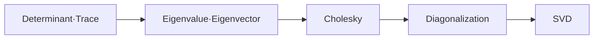

# 01. Mathematics for ML — 행렬 분해의 지도

> [!abstract] 한 줄 요약
> determinant·trace에서 eigen 구조, Cholesky, diagonalization, SVD로 이동하며 행렬을 요약하고 계산을 단순화하는 수학적 도구를 정리한다.

---

## 강의 흐름



<Tabs>
  <Tab label="핵심 개념">
- **요약 불변량** — determinant와 trace는 행렬 전체를 가역성·대각합 같은 계산 가능한 값으로 요약한다.
- **고유 구조** — 고유값·고유벡터는 선형 변환에서 방향이 유지되는 축을 찾아 대각화와 거듭제곱을 가능하게 한다.
- **분해** — Cholesky·diagonalization·SVD는 문제의 구조와 조건에 맞춰 계산을 작은 연산으로 나눈다.
  </Tab>
  <Tab label="적용 순서">
1. 행렬이 정방·대칭·양의 정부호인지 확인한다.
2. determinant·trace로 기본 성질을 계산한다.
3. 고유값·고유벡터와 대각화 가능성을 판정한다.
4. 조건에 맞는 Cholesky 또는 SVD를 선택한다.
  </Tab>
  <Tab label="점검 질문">
- determinant가 0일 때 역행렬과 고유값 계산에 어떤 일이 생기는가?
- 대칭 행렬에서 직교 대각화가 중요한 이유는 무엇인가?
- SVD가 비정방 행렬과 저랭크 근사에 유리한 이유는 무엇인가?
  </Tab>
</Tabs>

---

## 단계별 정리

### Determinant·Trace

- 2×2 역행렬 존재 조건에서 determinant를 정의하고 여인수 전개로 일반화한다.
- det(AB)=det(A)det(B), 전치·역행렬·유사변환에 대한 성질을 정리한다.
- trace는 대각 원소의 합이며 선형성과 단위행렬에 대한 성질을 가진다.

### Eigenvalue·Eigenvector

- 고유값 λ와 고유벡터 x는 Ax=λx를 만족하는 쌍이다.
- 특성다항식 det(A−λI)=0의 근을 찾아 고유값을 얻는다.
- 서로 다른 n개의 고유값은 선형독립 고유벡터를 만들지만 역은 항상 성립하지 않는다.

### Cholesky

- 대칭 양의 정부호 A는 A=LLᵀ로 분해된다.
- L은 양의 대각을 가진 하삼각행렬이며 분해가 유일하다.
- 최소제곱·확률 모델 계산에서 안정적인 선형 시스템 해법으로 활용된다.

### Diagonalization

- A=PDP⁻¹로 대각화하면 Aᵏ=PDᵏP⁻¹로 계산할 수 있다.
- 대각 원소가 고유값이므로 determinant·거듭제곱·함수 계산이 쉬워진다.
- 실수 대칭 행렬은 직교 대각화 가능하며 spectral theorem이 조건을 보장한다.

### SVD

- Singular Value Decomposition은 정방·비정방 행렬 모두에 적용되는 분해 도구다.
- 특이값은 데이터의 주요 방향과 크기를 알려 주며 저랭크 근사로 이어진다.
- 강의 로드맵의 마지막에서 앞선 determinant·eigen 개념을 일반 행렬로 확장한다.

| 단계 | 원본에서 관찰할 신호 | 학습 산출물 |
| --- | --- | --- |
| 요약 | determinant·trace | 가역성·대각합 |
| 축 | eigenvalue·eigenvector | 불변 방향·기저 |
| 조건 | Cholesky | 대칭·양의 정부호 |
| 계산 | diagonalization·SVD | 거듭제곱·근사·압축 |

> [!warning] 읽을 때의 주의점
> 분해 가능성은 행렬의 조건에 의존한다. 모든 행렬이 같은 방식으로 Cholesky나 대각화를 가질 것이라고 가정하지 않는다.

---

## 인터랙티브: 강의 단계 탐색

아래 슬라이더를 움직여 단계별 핵심 질문을 확인합니다. 범위와 단계명은 이 PDF의 강의 목차를 그대로 반영했습니다.

```html preview
<div style="font-family:system-ui,sans-serif;padding:20px;color:var(--foreground)">
<label for="a9matrix" style="font-size:14px;font-weight:600">Matrix Decomposition 단계</label>
<div id="a9matrix-out" style="font-size:24px;font-weight:700;color:var(--chart-1);margin:6px 0"></div>
<input id="a9matrix" type="range" min="0" max="4" step="1" value="0" style="width:100%;accent-color:var(--primary)" />
<p id="a9matrix-hint" style="font-size:13px;color:var(--muted-foreground);margin-top:8px"></p>
<script>
var control = document.getElementById('a9matrix');
var out = document.getElementById('a9matrix-out');
var hint = document.getElementById('a9matrix-hint');
var labels = ["Determinant·Trace","Eigenvalue·Eigenvector","Cholesky","Diagonalization","SVD"];
var hints = ["가역성·대각합을 행렬 요약값으로 봅니다.","Ax=λx 관계와 characteristic polynomial을 계산합니다.","대칭 양의 정부호 행렬을 삼각 행렬로 분해합니다.","고유기저에서 거듭제곱을 단순화합니다.","임의 행렬을 회전·스케일·회전으로 분해합니다."];
function renderStage() {
  var index = Number(control.value);
  out.textContent = labels[index];
  hint.textContent = hints[index];
}
control.addEventListener('input', renderStage);
renderStage();
</script>
</div>
```

<details>
  <summary>복습 체크리스트</summary>

- [ ] determinant·trace의 정의와 기본 성질을 말할 수 있다.
- [ ] eigenvalue·eigenvector로 대각화 조건을 판단할 수 있다.
- [ ] Cholesky·SVD를 행렬 조건과 계산 목적에 맞춰 선택할 수 있다.

</details>
