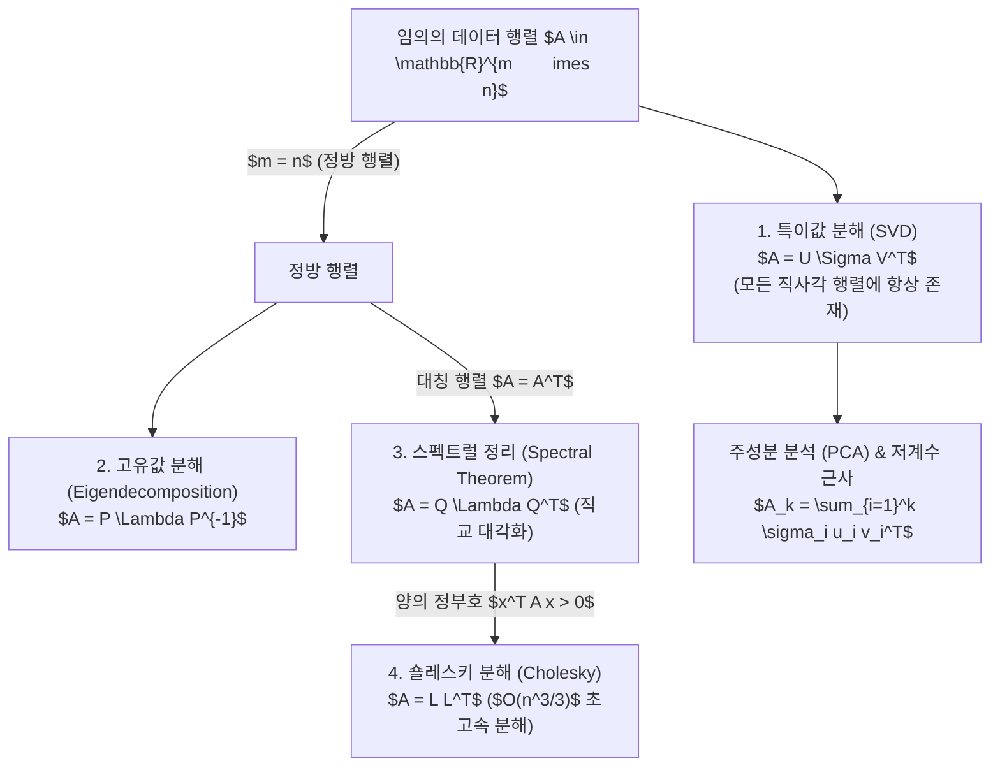

> [!abstract] 핵심 요약
> 고차원 데이터 공간에서 데이터의 본질적 구조를 추출하고 차원을 축소하는 핵심 도구는 **행렬 분해(Matrix Decomposition)**이다.
> 정방 대칭 행렬의 **고유값 분해($A = Q \Lambda Q^T$)**는 분산이 극대화되는 주축을 찾으며, 임의의 $m 	imes n$ 직사각 데이터 행렬에 적용되는 **특이값 분해($A = U \Sigma V^T$)**는 최적의 $k$-차원 부분공간으로의 저계수 투영(PCA / Truncated SVD)을 완벽하게 보장한다.

---

## 1. 행렬 분해 패밀리 계층 구조



---

## 2. 핵심 수학 공식 유도

### (1) 특이값 분해 (SVD)
$$A = U \Sigma V^T = \sum_{i=1}^r \sigma_i u_i v_i^T$$
여기서 $U \in \mathbb{R}^{m 	imes m}$는 $A A^T$의 정규직교 고유벡터, $V \in \mathbb{R}^{n 	imes n}$는 $A^T A$의 정규직교 고유벡터, $\sigma_1 \ge \sigma_2 \ge \dots \ge \sigma_r > 0$는 $A^T A$ 고유값의 제곱근이다.

### (2) 에카르트-영-미르스키 정리 (Eckart-Young-Mirsky Theorem)
계수 $k < r$인 모든 행렬 $B$ 중에서 Frobenius 노름 기준 $A$에 대한 최적의 근사는 Truncated SVD 행렬 $A_k$이다:
$$\min_{	ext{rank}(B)=k} \|A - B\|_F = \|A - A_k\|_F = \sqrt{\sum_{i=k+1}^r \sigma_i^2}$$

---

## 3. 실시간 2D 선형 변환 및 고유벡터 시뮬레이터

```html preview
<div style="font-family:system-ui,-apple-system,sans-serif;padding:20px;background:var(--card);color:var(--card-foreground);border:1px solid var(--border);border-radius:var(--radius)">
  <div style="font-size:16px;font-weight:700;margin-bottom:14px;color:var(--primary);display:flex;align-items:center;gap:8px">
    <span>📐 2D 행렬 선형 변환 및 특이값/고유값 분석기</span>
  </div>

  <div style="display:grid;grid-template-columns:1fr 1fr;gap:12px;margin-bottom:14px">
    <div>
      <label style="font-size:11px;color:var(--muted-foreground)">행렬 원소 $a_{11}$ (X축 스케일링):</label>
      <input id="inA11" type="number" value="2.0" step="0.5" style="width:100%;padding:4px;background:var(--background);color:var(--foreground);border:1px solid var(--border);border-radius:var(--radius);font-weight:700" />
    </div>
    <div>
      <label style="font-size:11px;color:var(--muted-foreground)">행렬 원소 $a_{22}$ (Y축 스케일링):</label>
      <input id="inA22" type="number" value="1.5" step="0.5" style="width:100%;padding:4px;background:var(--background);color:var(--foreground);border:1px solid var(--border);border-radius:var(--radius);font-weight:700" />
    </div>
  </div>

  <div style="display:grid;grid-template-columns:1fr 1fr;gap:12px;margin-bottom:12px">
    <div style="padding:10px;background:var(--background);border:1px solid var(--border);border-radius:var(--radius);text-align:center">
      <div style="font-size:10px;color:var(--muted-foreground)">행렬식 (면적 변환 배율 det(A))</div>
      <div id="detOut" style="font-family:monospace;font-size:18px;font-weight:800;color:var(--primary);margin-top:2px">3.00</div>
    </div>
    <div style="padding:10px;background:var(--background);border:1px solid var(--border);border-radius:var(--radius);text-align:center">
      <div style="font-size:10px;color:var(--muted-foreground)">대각합 (Trace tr(A))</div>
      <div id="traceOut" style="font-family:monospace;font-size:18px;font-weight:800;color:var(--chart-1);margin-top:2px">3.50</div>
    </div>
  </div>

  <script>
    function updateMatrix() {
      var a11 = parseFloat(document.getElementById('inA11').value) || 1;
      var a22 = parseFloat(document.getElementById('inA22').value) || 1;
      var det = a11 * a22;
      var tr = a11 + a22;
      document.getElementById('detOut').textContent = det.toFixed(2);
      document.getElementById('traceOut').textContent = tr.toFixed(2);
    }
    document.getElementById('inA11').addEventListener('input', updateMatrix);
    document.getElementById('inA22').addEventListener('input', updateMatrix);
  </script>
</div>
```
