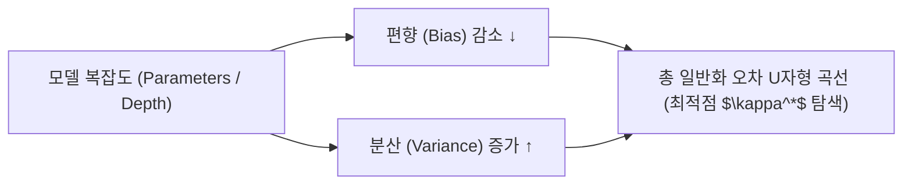

> [!abstract] 핵심 요약
> 지도학습의 궁극적인 목표는 훈련 데이터 오차의 최소화가 아니라 미지의 테스트 데이터에 대한 **일반화 오차(Generalization Error)**의 최소화이다.
> 모델의 복잡도가 증가할수록 **편향(Bias)**은 감소하지만 **분산(Variance)**은 급격히 증가하므로, **L1/L2 정규화(Weight Decay)**와 **교차 검증**을 통해 최적의 모델 용량(Model Capacity) 균형점을 도출해야 한다.

---

## 1. 기대 일반화 오차의 편향-분산 분해 수식

$$\mathbb{E}[(y - \hat{f}(x))^2] = 	ext{Bias}[\hat{f}(x)]^2 + 	ext{Var}[\hat{f}(x)] + \sigma^2$$

- $	ext{Bias}[\hat{f}(x)]^2 = (\mathbb{E}[\hat{f}(x)] - f(x))^2$ : 모델 표현력의 한계로 인한 구조적 오차
- $	ext{Var}[\hat{f}(x)] = \mathbb{E}[(\hat{f}(x) - \mathbb{E}[\hat{f}(x)])^2]$ : 특정 훈련 데이터셋 변동에 민감하게 반응하는 변동성
- $\sigma^2$ : 데이터 자체에 내재된 환원 불가능한 노이즈(Irreducible Error)



---

## 2. L1 (Lasso) vs L2 (Ridge) 정규화 비교

| 정규화 기법 | 페널티 항 | 최적화 제약 영역 형태 | 파라미터 해의 특성 | 주 용도 |
| :-- | :--: | :--: | :-- | :-- |
| **L1 (Lasso)** | $\lambda \sum_{j} |w_j|$ | 마름모꼴 (Diamond / L1 볼) | 비중요 가중치를 완전 0으로 수렴 (**희소성 Sparse**) | 피처 선택 (Feature Selection) |
| **L2 (Ridge)** | $\lambda \sum_{j} w_j^2$ | 원형 (Circle / L2 볼) | 가중치 크기를 전반적으로 균등 감쇠 (**Weight Decay**) | 다중공선성 방지 및 일반화 |
| **ElasticNet** | $lpha L_1 + (1-lpha) L_2$ | 부드러운 다포체 | 상관관계 높은 피처 그룹을 동시 보존 | 고차원 복합 데이터셋 |

---

## 3. 실시간 모델 복잡도에 따른 편향-분산 시뮬레이터

```html preview
<div style="font-family:system-ui,-apple-system,sans-serif;padding:20px;background:var(--card);color:var(--card-foreground);border:1px solid var(--border);border-radius:var(--radius)">
  <div style="font-size:16px;font-weight:700;margin-bottom:14px;color:var(--primary);display:flex;align-items:center;gap:8px">
    <span>📈 모델 복잡도(다항 차수)별 편향-분산 오차 분석기</span>
  </div>

  <div style="margin-bottom:14px">
    <label style="font-size:11px;color:var(--muted-foreground)">모델 복잡도 수준 (Degree / Depth):</label>
    <select id="selModelCap" style="width:100%;padding:6px;background:var(--background);color:var(--foreground);border:1px solid var(--border);border-radius:var(--radius);font-weight:700">
      <option value="under">1. 과소적합 (1차 선형 모델 - High Bias, Low Variance)</option>
      <option value="opt">2. 최적 일반화 (3차 다항식 + L2 정규화 - Optimal Balance)</option>
      <option value="over">3. 과적합 (15차 고차 다항식 - Low Bias, High Variance)</option>
    </select>
  </div>

  <div style="padding:12px;background:var(--background);border:1px solid var(--border);border-radius:var(--radius)">
    <div style="font-size:11px;font-weight:700;color:var(--muted-foreground);margin-bottom:4px">오차 분해 상태 및 처방</div>
    <div id="biasVarDescOut" style="font-size:13px;line-height:1.6;color:var(--foreground)">
      <strong style="color:var(--primary)">최적 일반화 상태:</strong> 훈련 오차와 테스트 오차의 간극이 최소화되며 일반화 성능이 극대화됩니다.
    </div>
  </div>

  <script>
    document.getElementById('selModelCap').onchange = function() {
      var val = this.value;
      var out = document.getElementById('biasVarDescOut');
      if (val === 'under') {
        out.innerHTML = "<strong style='color:var(--chart-1)'>⚠️ 과소적합 (Underfitting):</strong><br/>• 훈련 오차: 높음 (High) | 테스트 오차: 높음 (High)<br/>• 원인: 모델의 표현력이 데이터의 비선형성을 담아내지 못함<br/>• 처방: 모델 복잡도 증가, 비선형 피처 추가";
      } else if (val === 'over') {
        out.innerHTML = "<strong style='color:var(--destructive,#ef4444)'>⚠️ 과적합 (Overfitting):</strong><br/>• 훈련 오차: 0에 근접 (Low Bias) | 테스트 오차: 폭발적 증가 (High Variance)<br/>• 원인: 훈련 데이터의 노이즈까지 과도하게 암기<br/>• 처방: L1/L2 정규화 적용, 데이터 증강, 드롭아웃";
      } else {
        out.innerHTML = "<strong style='color:var(--primary)'>⭐ 최적 일반화 (Optimal Sweet Spot):</strong><br/>• 훈련 오차와 테스트 오차의 균형 달성<br/>• 총 기대 오차(Bias^2 + Variance)가 최솟값을 기록";
      }
    };
  </script>
</div>
```
