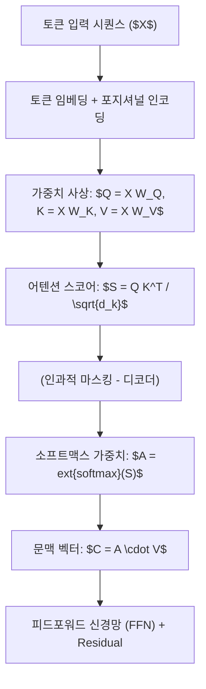
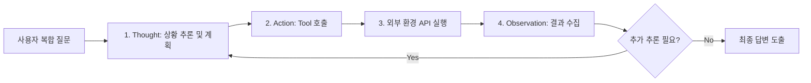

> [!abstract] 핵심 요약
> 자연어처리는 단어의 통계적 분포를 연속 벡터 공간에 매핑하는 임베딩에서 출발하여, 문맥 전체를 $O(1)$ 경로로 가중합하는 **Transformer Self-Attention**을 통해 비약적으로 발전하였다.
> 최근의 생성형 LLM은 단순 텍스트 완성을 넘어 계산기, 웹 검색, 코드 실행기를 자율적으로 호출하는 **ReAct(Reasoning + Acting) Agent**로 진화하여 복합 비즈니스 문제를 해결한다.

---

## 1. Transformer Self-Attention 파이프라인

$$	ext{Attention}(Q, K, V) = 	ext{softmax}\left(rac{Q K^T}{\sqrt{d_k}}
ight) V$$



---

## 2. LLM 에이전트 ReAct 아키텍처 흐름



---

## 3. 실시간 Self-Attention 유사도 스코어 계산기

```html preview
<div style="font-family:system-ui,-apple-system,sans-serif;padding:20px;background:var(--card);color:var(--card-foreground);border:1px solid var(--border);border-radius:var(--radius)">
  <div style="font-size:16px;font-weight:700;margin-bottom:14px;color:var(--primary);display:flex;align-items:center;gap:8px">
    <span>🧠 Self-Attention 내적 유사도 및 Softmax 계산기</span>
  </div>

  <div style="display:grid;grid-template-columns:1fr 1fr;gap:12px;margin-bottom:14px">
    <div>
      <label style="font-size:11px;color:var(--muted-foreground)">토큰 A와의 $Q \cdot K^T$ 유사도:</label>
      <input id="inDotA" type="number" value="4.0" step="0.5" style="width:100%;padding:4px;background:var(--background);color:var(--foreground);border:1px solid var(--border);border-radius:var(--radius);font-weight:700" />
    </div>
    <div>
      <label style="font-size:11px;color:var(--muted-foreground)">토큰 B와의 $Q \cdot K^T$ 유사도:</label>
      <input id="inDotB" type="number" value="1.0" step="0.5" style="width:100%;padding:4px;background:var(--background);color:var(--foreground);border:1px solid var(--border);border-radius:var(--radius);font-weight:700" />
    </div>
  </div>

  <div style="display:grid;grid-template-columns:1fr 1fr;gap:12px;margin-bottom:12px">
    <div style="padding:10px;background:var(--background);border:1px solid var(--border);border-radius:var(--radius);text-align:center">
      <div style="font-size:10px;color:var(--muted-foreground)">토큰 A 어텐션 가중치 (Softmax)</div>
      <div id="attAOut" style="font-family:monospace;font-size:18px;font-weight:800;color:var(--primary);margin-top:2px">95.3%</div>
    </div>
    <div style="padding:10px;background:var(--background);border:1px solid var(--border);border-radius:var(--radius);text-align:center">
      <div style="font-size:10px;color:var(--muted-foreground)">토큰 B 어텐션 가중치 (Softmax)</div>
      <div id="attBOut" style="font-family:monospace;font-size:18px;font-weight:800;color:var(--chart-1);margin-top:2px">4.7%</div>
    </div>
  </div>

  <script>
    function updateAtt() {
      var a = parseFloat(document.getElementById('inDotA').value) || 0;
      var b = parseFloat(document.getElementById('inDotB').value) || 0;
      var expA = Math.exp(a);
      var expB = Math.exp(b);
      var sum = expA + expB;
      var probA = (expA / sum) * 100;
      var probB = (expB / sum) * 100;
      document.getElementById('attAOut').textContent = probA.toFixed(1) + "%";
      document.getElementById('attBOut').textContent = probB.toFixed(1) + "%";
    }
    document.getElementById('inDotA').addEventListener('input', updateAtt);
    document.getElementById('inDotB').addEventListener('input', updateAtt);
  </script>
</div>
```
