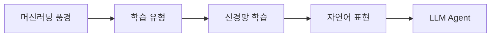

> [!abstract] 한 줄 요약
> 머신러닝의 학습 유형에서 신경망·이미지 표현·역전파를 거쳐 NLP와 LLM Agent로 넘어가는 기초 강의의 개념 연결을 정리한다.

---

## 강의 흐름



<Tabs>
  <Tab label="핵심 개념">
- **Task–Performance–Experience** — 머신러닝 문제를 과업 T, 성능 P, 경험 E의 세 요소로 정의한다.
- **역전파** — 출력 손실의 영향이 각 가중치로 전달되어 파라미터를 갱신하는 학습 절차다.
- **Agent** — LLM 출력에 검색·도구·계획·검증 루프를 추가해 환경과 상호작용하는 시스템이다.
  </Tab>
  <Tab label="적용 순서">
1. 문제의 T·P·E와 label 조건을 정의한다.
2. 입력 수치화와 신경망 순전파를 설계한다.
3. 손실·역전파로 파라미터를 학습한다.
4. LLM을 검색·도구·검증 루프에 연결한다.
  </Tab>
  <Tab label="점검 질문">
- T·P·E를 명시하면 머신러닝 문제 설계가 어떻게 선명해지는가?
- fully-connected 입력에서 이미지 구조가 사라지는 이유는 무엇인가?
- LLM Agent에 검증과 실패 복구가 필요한 이유는 무엇인가?
  </Tab>
</Tabs>

---

## 단계별 정리

### 머신러닝 풍경

- 머신러닝은 명시적 지시 없이 데이터·특징·알고리즘으로 일반화한다.
- MNIST 분류 예시에서 Task·Performance measure·Experience를 구분한다.
- 딥러닝은 여러 hidden layer로 특징과 함수의 복잡도를 확장한다.

### 학습 유형

- 지도학습은 ground truth label, 반지도학습은 소량 label과 대량 unlabeled를 사용한다.
- 비지도학습은 데이터에서 패턴·클러스터를 찾고 강화학습은 환경 상호작용과 reward를 사용한다.
- 과적합은 지도학습 전반에서 주의할 위험으로 제시된다.

### 신경망 학습

- 뉴런은 이전 층의 weighted inputs와 bias를 활성화 함수에 통과시킨다.
- 정방향으로 예측을 만들고 정답과의 차이에서 파라미터를 자동 조정한다.
- 이미지는 픽셀의 수치 행렬이며 fully-connected 입력에서는 벡터로 펼쳐진다.

### 자연어 표현

- 언어 입력도 수치 표현으로 바뀌어야 신경망이 계산할 수 있다.
- 토큰 순서와 문맥은 단어 의미·예측에 영향을 주는 구조다.
- attention 기반 모델은 시퀀스 내 관계를 직접 참조한다.

### LLM Agent

- LLM은 언어 패턴을 학습해 생성하지만 최신 지식과 실행 책임을 스스로 보장하지 않는다.
- 검색·도구 호출·계획을 외부 모듈로 연결하면 에이전트가 된다.
- 관찰·검증·실패 복구를 포함해야 실제 시스템에서 안전하게 동작한다.

| 단계 | 원본에서 관찰할 신호 | 학습 산출물 |
| --- | --- | --- |
| 정의 | Task·Performance·Experience | 학습 문제 경계 |
| 학습 | label·reward·unlabeled | 피드백 신호 |
| 표현 | 픽셀·토큰·벡터 | 수치화·문맥 |
| 시스템 | LLM·검색·도구 | 행동·검증 |

> [!warning] 읽을 때의 주의점
> 8기와 동일한 제목의 자료라도 기수별 슬라이드 편집과 범위가 다를 수 있다. 이 노트는 9기 원본 PDF의 흐름을 기준으로 한다.

---

## 인터랙티브: 강의 단계 탐색

아래 슬라이더를 움직여 단계별 핵심 질문을 확인합니다. 범위와 단계명은 이 PDF의 강의 목차를 그대로 반영했습니다.

```html preview
<div style="font-family:system-ui,sans-serif;padding:20px;color:var(--foreground)">
<label for="a9deepnlp" style="font-size:14px;font-weight:600">AI·NLP 단계</label>
<div id="a9deepnlp-out" style="font-size:24px;font-weight:700;color:var(--chart-1);margin:6px 0"></div>
<input id="a9deepnlp" type="range" min="0" max="4" step="1" value="0" style="width:100%;accent-color:var(--primary)" />
<p id="a9deepnlp-hint" style="font-size:13px;color:var(--muted-foreground);margin-top:8px"></p>
<script>
var control = document.getElementById('a9deepnlp');
var out = document.getElementById('a9deepnlp-out');
var hint = document.getElementById('a9deepnlp-hint');
var labels = ["머신러닝 풍경","학습 유형","신경망 학습","자연어 표현","LLM Agent"];
var hints = ["AI·ML·딥러닝의 포함 관계와 경험 학습을 봅니다.","지도·반지도·비지도·강화학습의 입력과 피드백을 비교합니다.","뉴런·활성화·순전파·역전파를 연결합니다.","텍스트를 토큰·벡터·문맥으로 바꾸는 단계입니다.","생성 모델을 검색·도구·행동 루프에 넣습니다."];
function renderStage() {
  var index = Number(control.value);
  out.textContent = labels[index];
  hint.textContent = hints[index];
}
control.addEventListener('input', renderStage);
renderStage();
</script>
</div>
```

<details>
  <summary>복습 체크리스트</summary>

- [ ] T·P·E로 머신러닝 과업을 정의할 수 있다.
- [ ] 신경망의 순전파·손실·역전파를 연결할 수 있다.
- [ ] LLM Agent의 외부 도구와 검증 루프를 설계할 수 있다.

</details>
