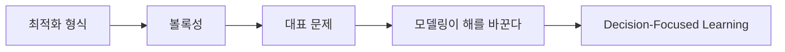

> [!abstract] 한 줄 요약
> 최적화 문제의 수학적 형식에서 볼록성, least-squares·linear programming, 모델링 선택과 decision-focused learning으로 이어지는 강의의 전반부를 정리한다.

---

## 강의 흐름



<Tabs>
  <Tab label="핵심 개념">
- **볼록 최적화** — 목적·제약이 볼록이면 안정적인 알고리즘으로 전역 최적 해를 찾을 수 있는 문제 구조다.
- **모델링 선택** — 같은 현상도 목적 함수와 제약을 어떻게 쓰는지에 따라 해와 계산 난이도가 달라진다.
- **Decision-focused** — 예측 지표만이 아니라 예측을 소비하는 최적화 의사결정의 품질을 학습 목표에 반영한다.
  </Tab>
  <Tab label="적용 순서">
1. 의사결정 변수·목적·제약을 명시한다.
2. 볼록성 여부와 해법 범주를 확인한다.
3. 현실 제약을 추가하고 solver 입력으로 변환한다.
4. 최종 의사결정 손실을 기준으로 예측·최적화를 함께 평가한다.
  </Tab>
  <Tab label="점검 질문">
- 볼록 문제에서 지역 최적과 전역 최적의 관계는 무엇인가?
- 램프 조명 사례에서 목적 함수를 바꾸면 어떤 결과가 달라지는가?
- 예측 정확도와 downstream 결정 품질이 어긋날 수 있는 이유는 무엇인가?
  </Tab>
</Tabs>

---

## 단계별 정리

### 최적화 형식

- 최적화는 제약 아래에서 가장 좋은 해를 찾는 문제이며 변수 x, 목적 f₀, 제약 fᵢ로 쓴다.
- 포트폴리오·수익·면적 같은 사례는 의사결정과 결과의 관계를 수학 모델로 표현한다.
- 일반 최적화는 매우 어렵고 계산 시간이나 해의 보장 사이에서 절충한다.

### 볼록성

- 일반 문제는 여러 봉우리가 있어 시작점에 따라 다른 해에 머물 수 있다.
- 볼록 최적화에서는 목표·제약 함수가 볼록이고 국소 최적이 전역 최적과 일치한다.
- Jensen 부등식이 함수의 볼록성을 판정하는 직관과 형식으로 제시된다.

### 대표 문제

- Least-squares는 ‖Ax−b‖²를 최소화하며 분석해와 신뢰성 높은 알고리즘이 있다.
- Linear programming은 선형 목적·제약을 가지며 일반적으로 닫힌 해 대신 solver를 사용한다.
- 볼록 문제는 신뢰성 있는 알고리즘과 규모에 따른 계산 복잡도를 갖는다.

### 모델링이 해를 바꾼다

- 램프 전력 p와 패치 조도 I의 선형 관계를 모델링한다.
- 균일 전력·least-squares·linear programming·convex formulation은 서로 다른 결과 기준을 만든다.
- 전력 상한·켜진 램프 수 같은 추가 제약은 현실성·계산성의 균형을 요구한다.

### Decision-Focused Learning

- 머신러닝은 결정과 결과의 매핑을 학습하고 최적화는 결정의 결과를 모델링한다.
- Decision-focused 관점은 downstream 최적화 결과를 고려해 예측 모델을 학습하려는 연결이다.
- 예측 오차가 같은 크기여도 최종 의사결정 손실이 다를 수 있음을 질문으로 남긴다.

| 단계 | 원본에서 관찰할 신호 | 학습 산출물 |
| --- | --- | --- |
| 형식 | 변수·목적·제약 | 문제 정의 |
| 구조 | convex·non-convex | 해법 보장 |
| 해법 | least-squares·LP | solver·복잡도 |
| 연결 | DFL | 결정 손실·학습 |

> [!warning] 읽을 때의 주의점
> 최적화의 계산 복잡도와 해법 보장은 문제의 함수·제약 조건에 달려 있다. 예시의 선형 구조를 모든 실무 문제로 확장하지 않는다.

---

## 인터랙티브: 강의 단계 탐색

아래 슬라이더를 움직여 단계별 핵심 질문을 확인합니다. 범위와 단계명은 이 PDF의 강의 목차를 그대로 반영했습니다.

```html preview
<div style="font-family:system-ui,sans-serif;padding:20px;color:var(--foreground)">
<label for="a9opt" style="font-size:14px;font-weight:600">Optimization 단계</label>
<div id="a9opt-out" style="font-size:24px;font-weight:700;color:var(--chart-1);margin:6px 0"></div>
<input id="a9opt" type="range" min="0" max="4" step="1" value="0" style="width:100%;accent-color:var(--primary)" />
<p id="a9opt-hint" style="font-size:13px;color:var(--muted-foreground);margin-top:8px"></p>
<script>
var control = document.getElementById('a9opt');
var out = document.getElementById('a9opt-out');
var hint = document.getElementById('a9opt-hint');
var labels = ["최적화 형식","볼록성","대표 문제","모델링이 해를 바꾼다","Decision-Focused Learning"];
var hints = ["변수·목적·제약을 분리해 문제를 씁니다.","지역적으로 올라가면 전역 최적에 도달하는 구조입니다.","least-squares와 linear programming의 해법을 비교합니다.","램프 조명 사례에서 목적 함수와 제약을 바꿉니다.","예측 정확도에서 의사결정 결과로 목적을 이동합니다."];
function renderStage() {
  var index = Number(control.value);
  out.textContent = labels[index];
  hint.textContent = hints[index];
}
control.addEventListener('input', renderStage);
renderStage();
</script>
</div>
```

<details>
  <summary>복습 체크리스트</summary>

- [ ] 최적화 문제를 변수·목적·제약으로 쓸 수 있다.
- [ ] 볼록성과 해법 보장의 관계를 설명할 수 있다.
- [ ] decision-focused learning이 downstream 손실을 보는 이유를 말할 수 있다.

</details>
