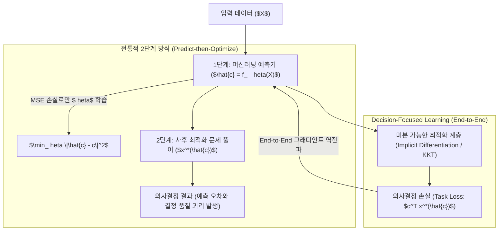

> [!abstract] 핵심 요약
> 볼록 최적화(Convex Optimization)는 모든 국소 최적해(Local Minimum)가 곧 전역 최적해(Global Minimum)임을 보장하는 강력한 수학적 체계이다.
> 부등식 제약조건을 포함하는 일반적인 볼록 최적화 문제에서 **KKT 4대 조건**은 최적해 $x^*$와 쌍대 변수 $\lambda^*, 
u^*$의 필요충분조건이며, 최근에는 예측 모델의 목적함수에 사후 최적화 문제를 미분 가능하게 결합하는 **Decision-Focused Learning(DFL)**으로 확장되고 있다.

---

## 1. 표준 제약 최적화 문제와 KKT 4대 조건

$$\min_{x} f_0(x) \quad 	ext{s.t.} \quad f_i(x) \le 0 \; (i=1,\dots,m), \quad h_j(x) = 0 \; (j=1,\dots,p)$$

라그랑지안 함수:
$$\mathcal{L}(x, \lambda, 
u) = f_0(x) + \sum_{i=1}^m \lambda_i f_i(x) + \sum_{j=1}^p 
u_j h_j(x)$$

### 🏆 KKT 4대 조건

| KKT 조건 | 수식 | 의미 |
| :-- | :-- | :-- |
| **1. 정류 조건 (Stationarity)** | $
abla_x \mathcal{L}(x^*, \lambda^*, 
u^*) = 0$ | 라그랑지안의 그래디언트가 최적점에서 영벡터임 |
| **2. 주 실행 가능성 (Primal Feasibility)** | $f_i(x^*) \le 0, \quad h_j(x^*) = 0$ | 원 문제의 모든 제약 조건을 완벽히 만족함 |
| **3. 쌍대 실행 가능성 (Dual Feasibility)** | $\lambda_i^* \ge 0$ | 부등식 제약 승수는 반드시 0 이상이어야 함 |
| **4. 상호보완 여유성 (Complementary Slackness)** | $\lambda_i^* f_i(x^*) = 0$ | 제약이 비활성($f_i < 0$)이면 $\lambda_i^* = 0$, 제약이 활성 경계($f_i = 0$)일 때만 $\lambda_i^* > 0$ |

---

## 2. 전통적 2단계 예측-최적화 vs Decision-Focused Learning (DFL)



---

## 3. 실시간 KKT 상호보완 여유성(Complementary Slackness) 분석기

```html preview
<div style="font-family:system-ui,-apple-system,sans-serif;padding:20px;background:var(--card);color:var(--card-foreground);border:1px solid var(--border);border-radius:var(--radius)">
  <div style="font-size:16px;font-weight:700;margin-bottom:14px;color:var(--primary);display:flex;align-items:center;gap:8px">
    <span>⚡ KKT 부등식 제약조건 활성화 및 승수 분석기</span>
  </div>

  <div style="margin-bottom:14px">
    <label style="font-size:11px;color:var(--muted-foreground)">최적해 $x^*$에서의 제약함수 $f_1(x^*)$ 위치:</label>
    <select id="selKktConstraint" style="width:100%;padding:6px;background:var(--background);color:var(--foreground);border:1px solid var(--border);border-radius:var(--radius);font-weight:700">
      <option value="boundary">1. 경계 상에 위치 ($f_1(x^*) = 0$ - 활성 제약 Active)</option>
      <option value="interior">2. 내부 엄격 만족 ($f_1(x^*) = -5.0 < 0$ - 비활성 제약 Inactive)</option>
    </select>
  </div>

  <div style="padding:12px;background:var(--background);border:1px solid var(--border);border-radius:var(--radius)">
    <div style="font-size:11px;font-weight:700;color:var(--muted-foreground);margin-bottom:4px">KKT 상호보완 여유성 ($\lambda_1^* f_1(x^*) = 0$) 분석 결과</div>
    <div id="kktDescOut" style="font-size:13px;line-height:1.6;color:var(--foreground)">
      <strong style="color:var(--primary)">활성 제약 (Active Constraint):</strong> $f_1(x^*) = 0$이므로 라그랑주 승수 $\lambda_1^* > 0$ 값을 가질 수 있으며, 목적함수를 강하게 제약하고 있음을 나타냅니다.
    </div>
  </div>

  <script>
    document.getElementById('selKktConstraint').onchange = function() {
      var val = this.value;
      var out = document.getElementById('kktDescOut');
      if (val === 'boundary') {
        out.innerHTML = "<strong style='color:var(--primary)'>⭐ 활성 제약 (Active Boundary):</strong><br/>• $f_1(x^*) = 0$ 이므로 승수 $\lambda_1^* > 0$ 가능<br/>• 제약조건의 경계면이 최적해를 가로막고 있어, 제약을 완화할 경우 목적함수 값이 개선됨";
      } else {
        out.innerHTML = "<strong style='color:var(--chart-1)'>ℹ️ 비활성 제약 (Inactive Interior):</strong><br/>• $f_1(x^*) < 0$ 이므로 상호보완 여유성에 의해 승수 $\lambda_1^* = 0$ 강제<br/>• 해당 제약은 현재 최적해 형성에 아무런 영향을 미치지 않는 잉여 제약임";
      }
    };
  </script>
</div>
```
