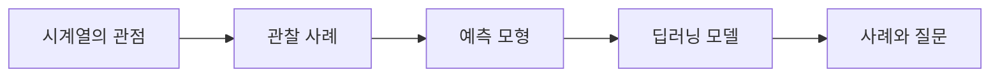

# 05. Time-Series Analysis — 의존성·예측·딥러닝

> [!abstract] 한 줄 요약
> 독립 표본 가정에서 벗어나 시간 순서·자기상관·계절성을 관찰하고, 예측 모형과 딥러닝·사례 분석으로 이어지는 시계열 강의의 전반 흐름을 정리한다.

---

## 강의 흐름



<Tabs>
  <Tab label="핵심 개념">
- **시간 의존성** — 관측 순서가 정보이므로 인접 값·지연 값·계절 주기가 예측에 영향을 준다.
- **정상성** — 시간에 따라 관계의 통계적 성질이 크게 변하지 않아 하나의 예측 관계를 적용할 수 있는 상태로 설명된다.
- **누수 방지** — 미래 정보를 학습·검증에 섞지 않도록 시간 순서대로 분할하고 평가한다.
  </Tab>
  <Tab label="적용 순서">
1. 시간 인덱스와 관측 간격을 확인한다.
2. 추세·변동·계절성·이상치를 시각적으로 탐색한다.
3. 시간 순서 보존 분할과 기준선 예측을 만든다.
4. 딥러닝·통계 모형을 같은 미래 구간에서 비교한다.
  </Tab>
  <Tab label="점검 질문">
- i.i.d. 가정이 시계열에 그대로 적용되기 어려운 이유는 무엇인가?
- 강우량·토끼·판매량 사례에서 각각 어떤 관계를 가설로 세우는가?
- 시간 누수를 막는 검증 분할은 일반 랜덤 분할과 어떻게 다른가?
  </Tab>
</Tabs>

---

## 단계별 정리

### 시계열의 관점

- 시계열은 여러 시점에서 관측된 실험 데이터를 분석하는 분야다.
- 일반 통계 기법의 i.i.d. 독립 가정이 시간 자료에는 그대로 적용되기 어렵다.
- 인접 관측의 관계·추세·계절성·변동이 분석 대상이 된다.

### 관찰 사례

- Los Angeles 연간 강우량은 큰 변동과 1983년의 이례적 고점을 보여준다.
- 연간 토끼 개체 수는 인접한 값이 비슷해 시간적 의존성을 암시한다.
- 월간 오일 필터 판매량은 변동과 계절성 질문을 만든다.

### 예측 모형

- 예측 모형은 과거 관측과 시간 특징에서 미래 값을 산출한다.
- ML/AI 모형은 함수의 성질과 데이터 생성 과정이 맞는지 점검해야 한다.
- 정상성(stationarity)은 거칠게 말해 하나의 입력과 출력 관계가 안정적으로 유지되는 조건으로 소개된다.

### 딥러닝 모델

- 순차 데이터의 장기 의존성·변동을 표현할 수 있는 딥러닝 구조를 비교한다.
- 모델 선택 전 데이터의 시간 분할과 누수 방지가 중요하다.
- 예측 정확도뿐 아니라 계산 비용·해석·운영 시점의 요구를 함께 본다.

### 사례와 질문

- 전년·이듬해 관계가 있는지, 계절성이 존재하는지부터 질문한다.
- 시각적 패턴은 가설을 만들 뿐이며 통계·검증 절차로 확인해야 한다.
- 강의의 마지막은 사례별로 어떤 모형과 평가 지표가 적합한지 결정하는 단계다.

| 단계 | 원본에서 관찰할 신호 | 학습 산출물 |
| --- | --- | --- |
| 정의 | 순서 있는 관측 | i.i.d. 가정 점검 |
| 탐색 | 강우량·개체 수·판매량 | 변동·의존성·계절성 |
| 모형 | 통계·ML·딥러닝 | 미래 예측 |
| 검증 | 시간 분할·사례 질문 | 일반화·운영 |

> [!warning] 읽을 때의 주의점
> 슬라이드의 시각적 사례는 관계성에 대한 탐색 질문을 제시한다. 그래프만 보고 인과관계나 미래 예측력을 확정하지 않는다.

---

## 인터랙티브: 강의 단계 탐색

아래 슬라이더를 움직여 단계별 핵심 질문을 확인합니다. 범위와 단계명은 이 PDF의 강의 목차를 그대로 반영했습니다.

```html preview
<div style="font-family:system-ui,sans-serif;padding:20px;color:var(--foreground)">
<label for="a9timeseries" style="font-size:14px;font-weight:600">시계열 단계</label>
<div id="a9timeseries-out" style="font-size:24px;font-weight:700;color:var(--chart-1);margin:6px 0"></div>
<input id="a9timeseries" type="range" min="0" max="4" step="1" value="0" style="width:100%;accent-color:var(--primary)" />
<p id="a9timeseries-hint" style="font-size:13px;color:var(--muted-foreground);margin-top:8px"></p>
<script>
var control = document.getElementById('a9timeseries');
var out = document.getElementById('a9timeseries-out');
var hint = document.getElementById('a9timeseries-hint');
var labels = ["시계열의 관점","관찰 사례","예측 모형","딥러닝 모델","사례와 질문"];
var hints = ["시간 순서가 통계 가정과 분석을 바꾸는 지점입니다.","강우량·토끼·오일 필터 예시를 비교합니다.","입력 x에서 미래 f(x)를 추정하는 구조입니다.","시계열 특성을 모델 구조와 학습으로 연결합니다.","관계성·계절성·예측 가능성을 데이터에서 검증합니다."];
function renderStage() {
  var index = Number(control.value);
  out.textContent = labels[index];
  hint.textContent = hints[index];
}
control.addEventListener('input', renderStage);
renderStage();
</script>
</div>
```

<details>
  <summary>복습 체크리스트</summary>

- [ ] 시간 의존성과 계절성을 데이터 관찰로 구분할 수 있다.
- [ ] 시계열 검증에서 미래 누수를 피하는 방법을 설명할 수 있다.
- [ ] 사례별 가설과 평가 구간을 설계할 수 있다.

</details>
