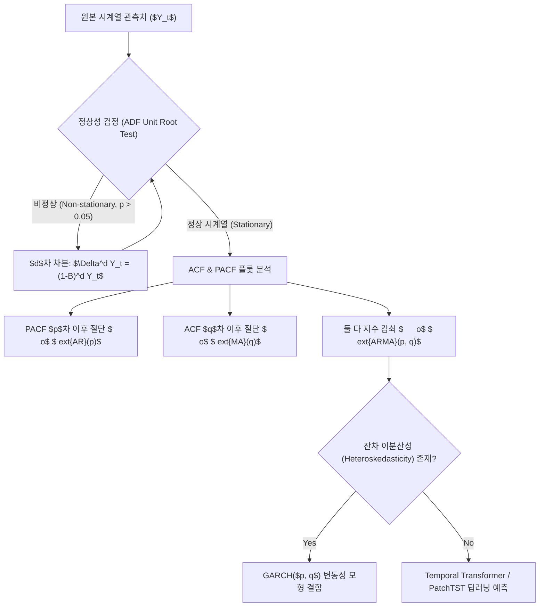

> [!abstract] 핵심 요약
> 시계열 분석의 출발점은 시간에 따른 평균과 자기공분산 구조가 불변인 **약정상성(Weak Stationarity)**의 확보이다.
> 비정상 시계열은 차분(Differencing)을 통해 정상화한 후 **ARIMA($p, d, q$)**나 변동성 모델 **GARCH**로 모델링하며, 장기 시계열 예측에는 패치 단위 어텐션을 수행하는 **PatchTST / Temporal Transformer**가 SOTA 성능을 발휘한다.

---

## 1. 시계열 모델링 파이프라인 및 정상성 판정



---

## 2. ARIMA vs GARCH 핵심 수학 공식

### (1) $	ext{ARIMA}(p, d, q)$ 모형
$$(1 - \sum_{i=1}^p \phi_i B^i) (1 - B)^d Y_t = c + (1 + \sum_{j=1}^q 	heta_j B^j) \epsilon_t$$

### (2) $	ext{GARCH}(1, 1)$ 조건부 분산 모형
$$\sigma_t^2 = \omega + lpha \epsilon_{t-1}^2 + eta \sigma_{t-1}^2 \quad (\omega > 0, \; lpha \ge 0, \; eta \ge 0, \; lpha + eta < 1)$$

---

## 3. 실시간 $	ext{AR}(1)$ 모델의 ACF 지수 감쇠 시뮬레이터

```html preview
<div style="font-family:system-ui,-apple-system,sans-serif;padding:20px;background:var(--card);color:var(--card-foreground);border:1px solid var(--border);border-radius:var(--radius)">
  <div style="font-size:16px;font-weight:700;margin-bottom:14px;color:var(--primary);display:flex;align-items:center;gap:8px">
    <span>📉 AR(1) 자기상관함수(ACF: $
ho_k = \phi^k$) 지수 감쇠기</span>
  </div>

  <div style="margin-bottom:14px">
    <label style="font-size:11px;color:var(--muted-foreground)">자기회귀 계수 $\phi$ (-0.9 ~ +0.9): <span id="phiVal">0.70</span></label>
    <input id="inPhi" type="range" min="-0.9" max="0.9" step="0.05" value="0.70" style="width:100%" />
  </div>

  <div style="display:grid;grid-template-columns:repeat(4, 1fr);gap:8px;margin-bottom:12px">
    <div style="padding:8px;background:var(--background);border:1px solid var(--border);border-radius:var(--radius);text-align:center">
      <div style="font-size:10px;color:var(--muted-foreground)">Lag 1 ($
ho_1$)</div>
      <div id="lag1Out" style="font-family:monospace;font-size:14px;font-weight:800;color:var(--primary)">0.70</div>
    </div>
    <div style="padding:8px;background:var(--background);border:1px solid var(--border);border-radius:var(--radius);text-align:center">
      <div style="font-size:10px;color:var(--muted-foreground)">Lag 2 ($
ho_2$)</div>
      <div id="lag2Out" style="font-family:monospace;font-size:14px;font-weight:800;color:var(--primary)">0.49</div>
    </div>
    <div style="padding:8px;background:var(--background);border:1px solid var(--border);border-radius:var(--radius);text-align:center">
      <div style="font-size:10px;color:var(--muted-foreground)">Lag 3 ($
ho_3$)</div>
      <div id="lag3Out" style="font-family:monospace;font-size:14px;font-weight:800;color:var(--primary)">0.34</div>
    </div>
    <div style="padding:8px;background:var(--background);border:1px solid var(--border);border-radius:var(--radius);text-align:center">
      <div style="font-size:10px;color:var(--muted-foreground)">Lag 4 ($
ho_4$)</div>
      <div id="lag4Out" style="font-family:monospace;font-size:14px;font-weight:800;color:var(--primary)">0.24</div>
    </div>
  </div>

  <script>
    function updateAcf() {
      var phi = parseFloat(document.getElementById('inPhi').value);
      document.getElementById('phiVal').textContent = phi.toFixed(2);
      for (var k = 1; k <= 4; k++) {
        var rho = Math.pow(phi, k);
        document.getElementById('lag' + k + 'Out').textContent = rho.toFixed(3);
      }
    }
    document.getElementById('inPhi').addEventListener('input', updateAcf);
  </script>
</div>
```
