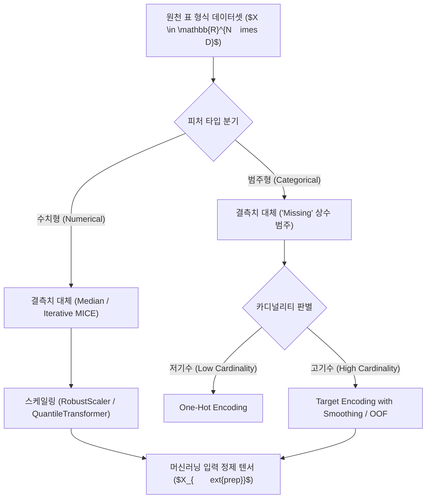

> [!abstract] 핵심 요약
> 표 데이터는 픽셀이나 단어와 달리 피처 간의 공간적/시간적 상관관계가 없으며(No Inductive Bias), 수치형과 고기수 범주형이 혼합된 **이종성(Heterogeneity)**을 띤다.
> 잘못된 결측치 대체나 타깃 정보가 누출되는 인코딩은 심각한 **데이터 누수(Data Leakage)**를 초래하므로, 교차 검증의 훈련 폴드 내에서만 통계량을 산출하는 정밀한 전처리 파이프라인 설계가 필수적이다.

---

## 1. 표 형식 데이터 전처리 5단계 파이프라인



---

## 2. 결측 메커니즘 3대 분류 및 대체 전략

| 결측 메커니즘 | 정의 및 특징 | 발생 예시 | 추천 대체 기법 |
| :-- | :-- | :-- | :-- |
| **MCAR (완전 무작위 결측)** | 결측 확률이 관측/미관측 데이터 모두와 완전 무관 | 센서 일시적 통신 오류 | 단순 평균/중앙값 대체, 완전 제거 |
| **MAR (무작위 결측)** | 결측 확률이 다른 관측된 변수들과 상관관계 존재 | 소득이 높은 고객이 세금 항목 누락 | **MICE**, **KNN Imputation** ⭐ |
| **MNAR (비무작위 결측)** | 결측 확률이 결측된 바로 그 값 자체와 밀접히 관련 | 초고소득자가 소득 기재를 고의 회피 | 결측 여부 지시자(Missing Indicator) 피처 추가 |

---

## 3. 실시간 결측치 대체 방식 선택기

```html preview
<div style="font-family:system-ui,-apple-system,sans-serif;padding:20px;background:var(--card);color:var(--card-foreground);border:1px solid var(--border);border-radius:var(--radius)">
  <div style="font-size:16px;font-weight:700;margin-bottom:14px;color:var(--primary);display:flex;align-items:center;gap:8px">
    <span>📊 결측치 발생 유형별 전처리 전략 판별기</span>
  </div>

  <div style="margin-bottom:14px">
    <label style="font-size:11px;color:var(--muted-foreground)">데이터 결측 유형 및 특성:</label>
    <select id="selMissingType" style="width:100%;padding:6px;background:var(--background);color:var(--foreground);border:1px solid var(--border);border-radius:var(--radius);font-weight:700">
      <option value="mar">1. MAR (다른 관측 변수와 상관관계 있는 누락 - 예: 연령별 직업 누락)</option>
      <option value="mnar">2. MNAR (값 자체가 결측을 유발 - 예: 고소득자 자산 미기재)</option>
      <option value="mcar">3. MCAR (완전 무작위 결측 - 예: 단순 센서 통신 노이즈)</option>
    </select>
  </div>

  <div style="padding:12px;background:var(--background);border:1px solid var(--border);border-radius:var(--radius)">
    <div style="font-size:11px;font-weight:700;color:var(--muted-foreground);margin-bottom:4px">최적 전처리 및 머신러닝 파이프라인 권장안</div>
    <div id="missingDescOut" style="font-size:13px;line-height:1.6;color:var(--foreground)">
      <strong style="color:var(--primary)">MAR 권장 파이프라인:</strong> IterativeImputer(MICE) 또는 KNNImputer를 활용하여 다변량 관계를 반영해 결측치를 복원합니다.
    </div>
  </div>

  <script>
    document.getElementById('selMissingType').onchange = function() {
      var val = this.value;
      var out = document.getElementById('missingDescOut');
      if (val === 'mar') {
        out.innerHTML = "<strong style='color:var(--primary)'>⭐ MAR 다변량 대체 (Best Practice):</strong><br/>• MICE(Chained Equations) 또는 KNN 기반 대체를 통해 타 변수와의 다차원 통계 분포를 완벽 보존<br/>• 단순 평균 대체 대비 분산 왜곡 방지";
      } else if (val === 'mnar') {
        out.innerHTML = "<strong style='color:var(--destructive,#ef4444)'>⚠️ MNAR 특화 처리:</strong><br/>• 결측 자체가 중요한 정보(Signal)이므로 결측 여부를 나타내는 이진 피처(Missing Indicator)를 반드시 생성<br/>• 트리 모델의 결측치 자체 분기(NaN-aware split) 활용";
      } else {
        out.innerHTML = "<strong style='color:var(--chart-1)'>ℹ️ MCAR 단순 처리:</strong><br/>• 결측 비율이 5% 미만인 경우 단순 중앙값(Median) 대체 또는 결측 행 제거(Listwise deletion) 가능";
      }
    };
  </script>
</div>
```
