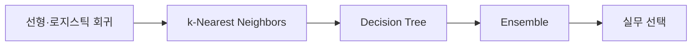

# 07. Tabular ML — Classical Models

> [!abstract] 한 줄 요약
> 선형·로지스틱 회귀와 kNN을 baseline으로 삼고, 결정 트리·앙상블·gradient boosting이 표 데이터의 비선형성과 상호작용을 다루는 과정을 정리한다.

---

## 강의 흐름



<Tabs>
  <Tab label="핵심 개념">
- **baseline** — 선형·로지스틱 회귀처럼 빠르고 해석 가능한 기준 모델로 데이터와 파이프라인을 점검한다.
- **local partition** — kNN은 이웃, 결정 트리는 공간 분할을 이용해 표 데이터의 국소 구조를 표현한다.
- **ensemble** — 여러 모델의 편향·분산을 결합해 단일 모델보다 안정적인 예측을 노린다.
  </Tab>
  <Tab label="적용 순서">
1. 회귀·분류 target과 평가 지표를 정한다.
2. 선형 모델로 해석 가능한 baseline을 만든다.
3. 거리·분할·앙상블 모델을 비교한다.
4. scaling·깊이·k·샘플링을 검증 세트에서 조정한다.
  </Tab>
  <Tab label="점검 질문">
- 선형 모델과 트리가 각각 잘 포착하는 구조는 무엇인가?
- kNN에서 feature scaling이 중요한 이유는 무엇인가?
- bagging과 boosting의 학습 순서와 오류 보완 방식은 어떻게 다른가?
  </Tab>
</Tabs>

---

## 단계별 정리

### 선형·로지스틱 회귀

- 선형 회귀는 가중합으로 연속 target을 예측하고 MSE를 최소화한다.
- 로지스틱 회귀는 선형 점수를 sigmoid로 확률로 바꾸고 cross-entropy를 사용한다.
- 단순·빠르고 해석 가능하지만 직접적인 비선형 상호작용에는 한계가 있다.

### k-Nearest Neighbors

- 새 점의 가장 가까운 k개 훈련 샘플을 찾아 다수결 또는 평균으로 예측한다.
- Euclidean·Manhattan·Cosine 등 거리와 feature scaling이 결과를 좌우한다.
- 작은 k는 유연하지만 노이즈에 민감하고 큰 k는 매끄럽지만 국소 구조를 잃는다.

### Decision Tree

- 각 내부 노드는 feature와 threshold로 공간을 나누고 leaf는 지역 예측을 만든다.
- 트리 깊이·분할 기준·leaf 수가 복잡도와 과적합을 조절한다.
- 꽃받침·꽃잎 예시처럼 순차 조건이 의사결정 경로로 읽힌다.

### Ensemble

- Bagging은 여러 표본·모델의 예측을 평균·투표해 분산을 줄인다.
- Random forest는 feature·sample 무작위성을 이용한 트리 앙상블이다.
- Boosting은 이전 오차를 보완하는 모델을 순차적으로 더해 강한 예측기를 만든다.

### 실무 선택

- 회귀 모델은 baseline과 해석, kNN은 거리와 메모리, 트리는 상호작용을 중심으로 비교한다.
- Isolation forest 같은 방법은 label이 적은 이상 탐지에 활용된다.
- 모델 자체보다 scaling·검증 분할·class imbalance 처리까지 함께 평가한다.

| 단계 | 원본에서 관찰할 신호 | 학습 산출물 |
| --- | --- | --- |
| baseline | 선형·로지스틱 회귀 | 해석·속도·손실 |
| 거리 | kNN | 스케일·k·메모리 |
| 분할 | Decision Tree | 상호작용·깊이 |
| 결합 | RF·Boosting·Isolation Forest | 분산·이상 탐지 |

> [!warning] 읽을 때의 주의점
> 강의의 모델 비교는 표 데이터 전반의 경향을 설명한다. 실제 데이터에서는 동일한 전처리·교차검증·튜닝 예산으로 비교해야 한다.

---

## 인터랙티브: 강의 단계 탐색

아래 슬라이더를 움직여 단계별 핵심 질문을 확인합니다. 범위와 단계명은 이 PDF의 강의 목차를 그대로 반영했습니다.

```html preview
<div style="font-family:system-ui,sans-serif;padding:20px;color:var(--foreground)">
<label for="a9tabclassical" style="font-size:14px;font-weight:600">Classical ML 단계</label>
<div id="a9tabclassical-out" style="font-size:24px;font-weight:700;color:var(--chart-1);margin:6px 0"></div>
<input id="a9tabclassical" type="range" min="0" max="4" step="1" value="0" style="width:100%;accent-color:var(--primary)" />
<p id="a9tabclassical-hint" style="font-size:13px;color:var(--muted-foreground);margin-top:8px"></p>
<script>
var control = document.getElementById('a9tabclassical');
var out = document.getElementById('a9tabclassical-out');
var hint = document.getElementById('a9tabclassical-hint');
var labels = ["선형·로지스틱 회귀","k-Nearest Neighbors","Decision Tree","Ensemble","실무 선택"];
var hints = ["해석 가능한 실용 baseline에서 시작합니다.","거리·스케일·k 선택을 확인합니다.","입력 공간을 재귀적으로 분할합니다.","bagging·boosting으로 여러 약점을 결합합니다.","표현·차원·속도·해석 요구를 기준으로 고릅니다."];
function renderStage() {
  var index = Number(control.value);
  out.textContent = labels[index];
  hint.textContent = hints[index];
}
control.addEventListener('input', renderStage);
renderStage();
</script>
</div>
```

<details>
  <summary>복습 체크리스트</summary>

- [ ] 선형·로지스틱 회귀를 baseline으로 설정할 수 있다.
- [ ] kNN의 거리와 k가 예측에 미치는 영향을 설명할 수 있다.
- [ ] 트리·bagging·boosting의 구조적 차이를 말할 수 있다.

</details>
