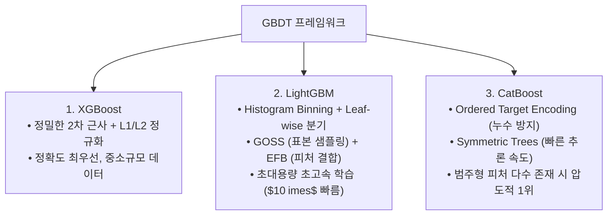

> [!abstract] 핵심 요약
> **그래디언트 부스팅 트리(GBDT)**는 손실 함수의 1차·2차 도함수(Gradients & Hessians)를 기반으로 이전 트리의 잔차(Residual)를 순차적으로 보정하는 최적화 기법이다.
> **XGBoost**(Exact 2nd-order Taylor), **LightGBM**(Histogram & Leaf-wise 초고속 학습), **CatBoost**(Ordered Target Encoding)는 각각의 최적화 메커니즘으로 실무 캐글 및 기업 표 데이터 과업의 표준 3대장으로 군림한다.

---

## 1. XGBoost 목적함수 2차 테일러 전개 및 최적 분할 수식

$$\mathcal{L}^{(t)} pprox \sum_{i=1}^n \left[ g_i f_t(x_i) + rac{1}{2} h_i f_t^2(x_i) 
ight] + \gamma T + rac{1}{2}\lambda \sum_{j=1}^T w_j^2$$

여기서 $g_i = \partial_{\hat{y}^{(t-1)}} l(y_i, \hat{y}^{(t-1)})$, $h_i = \partial^2_{\hat{y}^{(t-1)}} l(y_i, \hat{y}^{(t-1)})$이다.

리프 $j$의 최적 가중치 $w_j^*$ 및 분할 이득(Gain):
$$w_j^* = -rac{\sum_{i \in I_j} g_i}{\sum_{i \in I_j} h_i + \lambda}$$
$$	ext{Gain} = rac{1}{2} \left[ rac{(\sum_{i \in I_L} g_i)^2}{\sum_{i \in I_L} h_i + \lambda} + rac{(\sum_{i \in I_R} g_i)^2}{\sum_{i \in I_R} h_i + \lambda} - rac{(\sum_{i \in I} g_i)^2}{\sum_{i \in I} h_i + \lambda} 
ight] - \gamma$$

---

## 2. GBDT 3대 라이브러리 심층 비교



---

## 3. 실시간 비즈니스 데이터 특성별 GBDT 알고리즘 추천기

```html preview
<div style="font-family:system-ui,-apple-system,sans-serif;padding:20px;background:var(--card);color:var(--card-foreground);border:1px solid var(--border);border-radius:var(--radius)">
  <div style="font-size:16px;font-weight:700;margin-bottom:14px;color:var(--primary);display:flex;align-items:center;gap:8px">
    <span>🌲 데이터셋 특성별 GBDT 최적 알고리즘 추천기</span>
  </div>

  <div style="margin-bottom:14px">
    <label style="font-size:11px;color:var(--muted-foreground)">데이터셋 규모 및 피처 구성:</label>
    <select id="selGbdtData" style="width:100%;padding:6px;background:var(--background);color:var(--foreground);border:1px solid var(--border);border-radius:var(--radius);font-weight:700">
      <option value="cat">1. 고기수 범주형(사용자ID, 상품코드 등)이 다수 포함된 이커머스 데이터</option>
      <option value="lgb">2. 천만 건 이상의 대용량 로그 데이터로 초고속 학습 및 서빙이 필요한 경우</option>
      <option value="xgb">3. 수치형 피처 중심의 중소규모 정밀 금융/의료 데이터</option>
    </select>
  </div>

  <div style="padding:12px;background:var(--background);border:1px solid var(--border);border-radius:var(--radius)">
    <div style="font-size:11px;font-weight:700;color:var(--muted-foreground);margin-bottom:4px">최적 알고리즘 및 튜닝 포인트</div>
    <div id="gbdtDescOut" style="font-size:13px;line-height:1.6;color:var(--foreground)">
      <strong style="color:var(--primary)">추천: CatBoost</strong><br/>별도의 수동 타깃 인코딩 없이 Ordered Boosting으로 데이터 누출 없이 최고 정확도를 달성합니다.
    </div>
  </div>

  <script>
    document.getElementById('selGbdtData').onchange = function() {
      var val = this.value;
      var out = document.getElementById('gbdtDescOut');
      if (val === 'cat') {
        out.innerHTML = "<strong style='color:var(--primary)'>⭐ 추천: CatBoost</strong><br/>• 별도의 수동 Target Encoding 없이 범주형 변수를 원본 그대로 투입 가능<br/>• Target Leakage를 수학적으로 원천 차단하여 과적합 방지";
      } else if (val === 'lgb') {
        out.innerHTML = "<strong style='color:var(--chart-1)'>⭐ 추천: LightGBM</strong><br/>• Histogram 기반 양자화와 Leaf-wise 분기로 수천만 행 데이터를 몇 분 내 학습<br/>• 메모리 점유율이 가장 낮아 대규모 실시간 파이프라인에 최적";
      } else {
        out.innerHTML = "<strong style='color:var(--primary)'>⭐ 추천: XGBoost</strong><br/>• 2차 테일러 근사 및 풍부한 감마/람다 정규화로 안정적인 최고 성능 발휘";
      }
    };
  </script>
</div>
```
