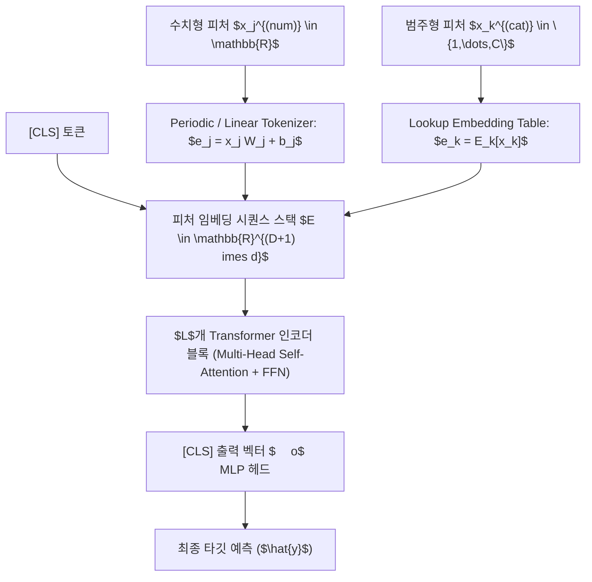

> [!abstract] 핵심 요약
> 전통적으로 표 데이터는 불규칙한 결정 경계와 이종성으로 인해 딥러닝이 GBDT에 열세를 보여왔다.
> 그러나 최근 **FT-Transformer**(Feature Tokenizer + Transformer)와 주기적 임베딩(**Periodic Embeddings**), 그리고 희소 피처 선택을 수행하는 **TabNet**의 등장으로 복합 멀티모달 표 데이터셋에서 딥러닝이 GBDT와 대등하거나 뛰어난 성능을 입증하고 있다.

---

## 1. FT-Transformer 및 Periodic Numerical Embedding 구조



---

## 2. 표 데이터 딥러닝 아키텍처 비교

| 아키텍처 | 핵심 동작 원리 | 장점 | 단점 / 튜닝 난이도 |
| :-- | :-- | :-- | :-- |
| **TabNet** | Sparsemax 기반 순차적 피처 마스크 선택 | 트리 모델처럼 피처 중요도 해석 가능 | 하이퍼파라미터 튜닝 극도로 민감 |
| **FT-Transformer** | 각 피처를 토큰화한 후 Transformer Self-Attention | 피처 간 복합 고차 상호작용 학습 우수 | 피처 수 $D$ 증가 시 연산량 $O(D^2)$ |
| **SAINT** | Feature Attention + Row-wise Intersample Attention | 소규모 데이터셋에서 높은 일반화 | 배치 크기 메모리 점유율 높음 |
| **ResNet-Tabular** | 잔차 연결(Residual) + Swish 활성화 + LayerNorm | 구현이 단순하고 안정적인 수렴 | 복잡한 피처 상호작용 포착 한계 |

---

## 3. 실시간 딥러닝 표 모델 vs GBDT 트레이드오프 분석기

```html preview
<div style="font-family:system-ui,-apple-system,sans-serif;padding:20px;background:var(--card);color:var(--card-foreground);border:1px solid var(--border);border-radius:var(--radius)">
  <div style="font-size:16px;font-weight:700;margin-bottom:14px;color:var(--primary);display:flex;align-items:center;gap:8px">
    <span>⚡ 표 형식 데이터: GBDT vs 딥러닝(FT-Transformer) 선택 가이드</span>
  </div>

  <div style="margin-bottom:14px">
    <label style="font-size:11px;color:var(--muted-foreground)">프로젝트 환경 및 제약 조건:</label>
    <select id="selModelArena" style="width:100%;padding:6px;background:var(--background);color:var(--foreground);border:1px solid var(--border);border-radius:var(--radius);font-weight:700">
      <option value="gbdt">1. 빠른 학습/추론 속도 최우선, 순수 정형 표 데이터, GPU 자원 제한적</option>
      <option value="deep_multi">2. 표 데이터와 비정형 데이터(이미지, 텍스트)의 멀티모달 End-to-End 결합</option>
      <option value="deep_pretrain">3. 레이블 없는 대규모 표 데이터로 사전학습(Self-supervised) 후 전이학습</option>
    </select>
  </div>

  <div style="padding:12px;background:var(--background);border:1px solid var(--border);border-radius:var(--radius)">
    <div style="font-size:11px;font-weight:700;color:var(--muted-foreground);margin-bottom:4px">최적 모델 아키텍처 제안</div>
    <div id="arenaDescOut" style="font-size:13px;line-height:1.6;color:var(--foreground)">
      <strong style="color:var(--primary)">추천: GBDT (LightGBM / XGBoost)</strong><br/>순수 정형 데이터에서는 트리 모델이 여전히 개발 속도, 튜닝 안정성, 추론 속도 면에서 압도적인 가성비를 제공합니다.
    </div>
  </div>

  <script>
    document.getElementById('selModelArena').onchange = function() {
      var val = this.value;
      var out = document.getElementById('arenaDescOut');
      if (val === 'gbdt') {
        out.innerHTML = "<strong style='color:var(--primary)'>⭐ 추천: GBDT (LightGBM / XGBoost)</strong><br/>• CPU 환경에서도 초고속 수렴하며, 피처 스케일링에 둔감하여 견고한 성능 발휘<br/>• 실무 및 대회 1순위 베이스라인";
      } else if (val === 'deep_multi') {
        out.innerHTML = "<strong style='color:var(--chart-1)'>⭐ 추천: FT-Transformer / ResNet-Tabular</strong><br/>• 텍스트(BERT/LLM) 및 이미지(ViT) 임베딩과 단일 그래디언트 역전파 파이프라인 구축 가능";
      } else {
        out.innerHTML = "<strong style='color:var(--primary)'>⭐ 추천: SAINT / VIME 사전학습 딥러닝</strong><br/>• 마스킹 복원 자기지도 학습으로 레이블 부족 한계를 극복";
      }
    };
  </script>
</div>
```
