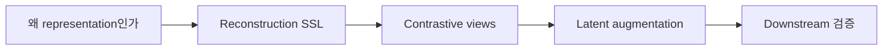

# 09. Tabular ML — Representation Learning

> [!abstract] 한 줄 요약
> 라벨이 부족한 표 데이터를 위해 VIME·SubTab·SCARF·SAINT의 재구성·대조 학습과 RaTab·T-JEPA의 잠재 공간 증강을 비교한다.

---

## 강의 흐름



<Tabs>
  <Tab label="핵심 개념">
- **pretext task** — 라벨 대신 데이터 자체에서 구성한 복원·대조·잠재 예측 문제로 encoder를 사전학습한다.
- **view** — 같은 행 또는 의미를 공유하는 부분 표현을 여러 관점으로 만든 학습 입력이다.
- **latent augmentation** — 비현실적인 원시 행을 만들지 않고 representation 공간에서 변형·예측 신호를 만든다.
  </Tab>
  <Tab label="적용 순서">
1. 라벨·비라벨 데이터와 downstream 과업을 정의한다.
2. 복원·feature subset·corruption·mixing 중 pretext를 고른다.
3. representation을 pretrain하고 fine-tune한다.
4. few-shot·anomaly·cross-table 성능과 의미 보존을 평가한다.
  </Tab>
  <Tab label="점검 질문">
- VIME의 복원 목표가 feature dependency 학습으로 이어지는 이유는 무엇인가?
- SubTab·SCARF·SAINT의 positive view 생성 방식은 어떻게 다른가?
- latent augmentation이 원시 입력 교란보다 안전할 수 있는 조건은 무엇인가?
  </Tab>
</Tabs>

---

## 단계별 정리

### 왜 representation인가

- 표 데이터는 라벨이 비싸거나 희소·노이즈가 있어 비라벨 행을 활용할 필요가 있다.
- 좋은 representation은 downstream label이 적어도 전이·few-shot·이상 탐지에 도움이 된다.
- self-supervised pretext task가 라벨 없이 encoder를 학습시킨다.

### Reconstruction SSL

- 일부 feature를 다른 행의 값으로 바꾸고 어떤 값이 손상됐는지 mask를 예측한다.
- 복원하려면 열 사이의 dependency를 학습해야 한다.
- 원시 값 교란이 비현실적인 행을 만들 수 있다는 한계가 있다.

### Contrastive views

- SubTab은 같은 행의 feature subset을 여러 view로 만든다.
- SCARF는 feature corruption으로 원본과 positive view를 만들고, SAINT는 CutMix·Mixup과 row attention을 사용한다.
- 대조 학습은 관련 view를 가깝게, 다른 행을 멀게 만든다.

### Latent augmentation

- RaTab은 encoder weight의 truncated SVD로 alternative view를 만든다.
- T-JEPA는 context subset으로 target subset의 latent feature를 예측해 입력 교란을 줄인다.
- JEPA는 입력 복원 대신 embedding 공간 예측을 목표로 한다.

### Downstream 검증

- self-supervised pretraining 뒤 supervised fine-tuning에서 표현의 전이성을 평가한다.
- few-shot·cross-table·anomaly detection처럼 라벨 조건이 다른 과업을 비교한다.
- 증강이 의미를 보존했는지와 representation collapse를 함께 점검한다.

| 단계 | 원본에서 관찰할 신호 | 학습 산출물 |
| --- | --- | --- |
| 동기 | 라벨 부족·비라벨 풍부 | 전이·few-shot |
| 복원 | VIME | mask·feature dependency |
| 대조 | SubTab·SCARF·SAINT | positive view·불변성 |
| 잠재 | RaTab·T-JEPA | latent 예측·증강 |

> [!warning] 읽을 때의 주의점
> 대조·복원에서 만든 view가 항상 현실적인 표 행을 보장하지 않는다. downstream 성능뿐 아니라 원래 의미와 분포를 보존하는지 확인한다.

---

## 인터랙티브: 강의 단계 탐색

아래 슬라이더를 움직여 단계별 핵심 질문을 확인합니다. 범위와 단계명은 이 PDF의 강의 목차를 그대로 반영했습니다.

```html preview
<div style="font-family:system-ui,sans-serif;padding:20px;color:var(--foreground)">
<label for="a9tabrepr" style="font-size:14px;font-weight:600">표현 학습 단계</label>
<div id="a9tabrepr-out" style="font-size:24px;font-weight:700;color:var(--chart-1);margin:6px 0"></div>
<input id="a9tabrepr" type="range" min="0" max="4" step="1" value="0" style="width:100%;accent-color:var(--primary)" />
<p id="a9tabrepr-hint" style="font-size:13px;color:var(--muted-foreground);margin-top:8px"></p>
<script>
var control = document.getElementById('a9tabrepr');
var out = document.getElementById('a9tabrepr-out');
var hint = document.getElementById('a9tabrepr-hint');
var labels = ["왜 representation인가","Reconstruction SSL","Contrastive views","Latent augmentation","Downstream 검증"];
var hints = ["라벨 부족·비라벨 데이터 활용 문제를 정의합니다.","VIME가 손상된 feature를 복원하는 과정을 봅니다.","SubTab·SCARF·SAINT의 positive view를 비교합니다.","원시 입력 대신 representation 공간을 변형합니다.","pretrain→fine-tune과 이상 탐지로 효과를 확인합니다."];
function renderStage() {
  var index = Number(control.value);
  out.textContent = labels[index];
  hint.textContent = hints[index];
}
control.addEventListener('input', renderStage);
renderStage();
</script>
</div>
```

<details>
  <summary>복습 체크리스트</summary>

- [ ] pretext task와 downstream task를 구분할 수 있다.
- [ ] VIME·SubTab·SCARF·SAINT의 view 생성 차이를 설명할 수 있다.
- [ ] latent augmentation의 장점과 검증 위험을 말할 수 있다.

</details>
