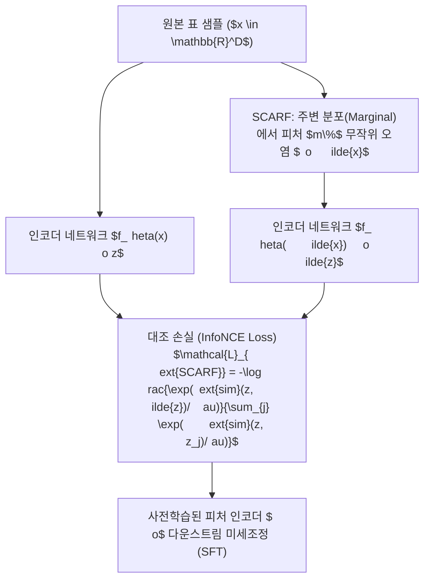

> [!abstract] 핵심 요약
> 표 데이터셋은 소량의 레이블과 방대한 미분류 데이터로 구성된 경우가 많다.
> **VIME**와 **SCARF**는 비정형 도메인의 자기지도 학습(Self-Supervised Learning)을 표 데이터에 이식하여, 피처 손상 복원 및 대조 손실(InfoNCE) 최적화를 통해 풍부한 잠재 표상(Latent Representation)을 추출함으로써 적은 레이블로도 높은 다운스트림 성능을 보장한다.

---

## 1. SCARF 대조 학습 및 VIME 자기지도 학습 파이프라인



---

## 2. VIME 복합 목적함수 수식

$$x \sim \mathcal{D}, \quad m \sim 	ext{Bernoulli}(p)^D, \quad 	ilde{x} = m \odot ar{x} + (1 - m) \odot x$$

$$\mathcal{L}_{	ext{VIME}} = \mathcal{L}_{	ext{mask}}(m, \hat{m}) + lpha \mathcal{L}_{	ext{recon}}(x, \hat{x})$$

| 표현 학습 모델 | 사전학습 방식 | 핵심 손실 함수 | 장점 |
| :-- | :-- | :-- | :-- |
| **VIME** | 마스크 여부 추정 + 원본 피처 복원 | BCE (Mask) + MSE/Cross-Entropy (Recon) | 피처 간 조건부 의존성 완벽 학습 |
| **SCARF** | 주변 분포 오염 기반 대조 학습 | **InfoNCE Loss** (대조 손실) | 아키텍처가 단순하며 전이 성능 우수 |
| **SubTab** | 피처 부분집합(Subset) 간 재구성 | 다중 뷰 오토인코더 손실 | 고차원 피처 데이터셋에 효과적 |

---

## 3. 실시간 SCARF 대조 유사도 시뮬레이터

```html preview
<div style="font-family:system-ui,-apple-system,sans-serif;padding:20px;background:var(--card);color:var(--card-foreground);border:1px solid var(--border);border-radius:var(--radius)">
  <div style="font-size:16px;font-weight:700;margin-bottom:14px;color:var(--primary);display:flex;align-items:center;gap:8px">
    <span>🔬 SCARF 대조 학습(Positive vs Negative) 코사인 유사도 분석기</span>
  </div>

  <div style="margin-bottom:14px">
    <label style="font-size:11px;color:var(--muted-foreground)">피처 오염 비율 (Corruption Ratio $m$): <span id="corrVal">30%</span></label>
    <input id="inCorruption" type="range" min="10" max="80" step="5" value="30" style="width:100%" />
  </div>

  <div style="display:grid;grid-template-columns:1fr 1fr;gap:12px;margin-bottom:12px">
    <div style="padding:10px;background:var(--background);border:1px solid var(--border);border-radius:var(--radius);text-align:center">
      <div style="font-size:10px;color:var(--muted-foreground)">양성 쌍(Positive) 잠재 유사도</div>
      <div id="posSimOut" style="font-family:monospace;font-size:18px;font-weight:800;color:var(--primary);margin-top:2px">0.85</div>
    </div>
    <div style="padding:10px;background:var(--background);border:1px solid var(--border);border-radius:var(--radius);text-align:center">
      <div style="font-size:10px;color:var(--muted-foreground)">인코더 표상 견고성</div>
      <div id="robustOut" style="font-family:monospace;font-size:15px;font-weight:800;color:var(--primary);margin-top:4px">강건 (Robust)</div>
    </div>
  </div>

  <script>
    function updateScarf() {
      var c = parseFloat(document.getElementById('inCorruption').value);
      document.getElementById('corrVal').textContent = c + "%";
      var sim = 1.0 - (c / 100) * 0.5;
      document.getElementById('posSimOut').textContent = sim.toFixed(2);
      var r = document.getElementById('robustOut');
      if (c <= 40) {
        r.textContent = "강건 (Robust - 최적 사전학습)";
        r.style.color = "var(--primary)";
      } else {
        r.textContent = "정보 손실 과다 (오염 비율 과도)";
        r.style.color = "var(--destructive,#ef4444)";
      }
    }
    document.getElementById('inCorruption').addEventListener('input', updateScarf);
  </script>
</div>
```
