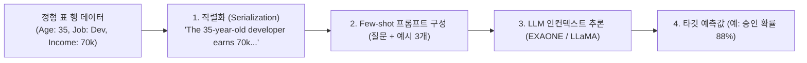

> [!abstract] 핵심 요약
> LLM은 사전학습된 방대한 도메인 상식을 바탕으로, 훈련 데이터가 수십~수백 건에 불과한 **극소량 데이터(Few-shot / Zero-shot Tabular Regime)**에서 전통적인 GBDT나 딥러닝을 압도하는 예측력을 발휘한다.
> 성공적인 핵심 열쇠는 컬럼명의 의미를 온전히 보존하면서 행 데이터를 자연스러운 문장으로 변환하는 **직렬화(Serialization)** 템플릿 설계이다.

---

## 1. 표 데이터의 LLM 직렬화 및 추론 파이프라인



---

## 2. 직렬화 기법 비교 매트릭스

| 직렬화 포맷 | 변환 예시 | 토큰 효율성 | 시맨틱 보존성 |
| :-- | :-- | :--: | :--: |
| **자연어 템플릿 (Text-Template)** | "환자의 나이는 45세이고 혈압은 정상입니다." | 보통 | **최상 (LLM 친화적)** ⭐ |
| **JSON 포맷** | `{"age": 45, "bp": "normal"}` | 낮음 (중괄호 소모) | 상 |
| **CSV / Markdown Table** | `| Age | BP | 
 | 45 | normal |` | **높음** | 중 |

---

## 3. 실시간 정형 데이터 $	o$ 자연어 직렬화 변환기

```html preview
<div style="font-family:system-ui,-apple-system,sans-serif;padding:20px;background:var(--card);color:var(--card-foreground);border:1px solid var(--border);border-radius:var(--radius)">
  <div style="font-size:16px;font-weight:700;margin-bottom:14px;color:var(--primary);display:flex;align-items:center;gap:8px">
    <span>📝 표 데이터(Tabular Row) 직렬화 및 프롬프트 변환기</span>
  </div>

  <div style="display:grid;grid-template-columns:1fr 1fr;gap:12px;margin-bottom:14px">
    <div>
      <label style="font-size:11px;color:var(--muted-foreground)">직무 (Job):</label>
      <input id="inJob" type="text" value="데이터 엔지니어" style="width:100%;padding:4px;background:var(--background);color:var(--foreground);border:1px solid var(--border);border-radius:var(--radius);font-weight:700" />
    </div>
    <div>
      <label style="font-size:11px;color:var(--muted-foreground)">경력 연수 (Experience):</label>
      <input id="inExp" type="number" value="5" style="width:100%;padding:4px;background:var(--background);color:var(--foreground);border:1px solid var(--border);border-radius:var(--radius);font-weight:700" />
    </div>
  </div>

  <div style="padding:12px;background:var(--background);border:1px solid var(--border);border-radius:var(--radius)">
    <div style="font-size:11px;font-weight:700;color:var(--muted-foreground);margin-bottom:4px">LLM 입력용 직렬화 프롬프트 텍스트</div>
    <div id="serialOut" style="font-family:monospace;font-size:12px;line-height:1.6;color:var(--primary)">
      "해당 지원자는 5년 차 경력의 데이터 엔지니어입니다. 이 지원자의 이직 가능성을 예측하시오."
    </div>
  </div>

  <script>
    function updateSerial() {
      var job = document.getElementById('inJob').value || '개발자';
      var exp = document.getElementById('inExp').value || 1;
      document.getElementById('serialOut').textContent = '"해당 지원자는 ' + exp + '년 차 경력의 ' + job + '입니다. 이 지원자의 이직 가능성을 예측하시오."';
    }
    document.getElementById('inJob').addEventListener('input', updateSerial);
    document.getElementById('inExp').addEventListener('input', updateSerial);
  </script>
</div>
```
