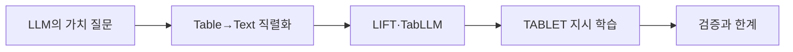

> [!abstract] 한 줄 요약
> 표의 열·값에 의미를 부여하는 LLM을 활용하기 위해 테이블을 텍스트로 직렬화하고 LIFT·TabLLM·TABLET 계열의 예측·이해·지시 학습 흐름을 정리한다.

---

## 강의 흐름



<Tabs>
  <Tab label="핵심 개념">
- **semantic interface** — 열·값의 의미와 과업 설명을 언어 형태로 제공해 LLM의 추론 능력을 표 데이터에 연결한다.
- **serialization** — 2차원 표를 LLM이 읽을 수 있는 행·열 텍스트 시퀀스로 변환하는 방법이다.
- **few-shot** — 소수의 입력·정답 예시를 프롬프트에 넣어 새로운 표 행의 label을 예측하게 한다.
  </Tab>
  <Tab label="적용 순서">
1. 표 스키마·타깃·수치 제약을 명세한다.
2. 직렬화 포맷과 task instruction을 만든다.
3. LIFT·TabLLM·TABLET 방식으로 baseline을 비교한다.
4. 숫자 정확도·구조 보존·프롬프트 민감도를 평가한다.
  </Tab>
  <Tab label="점검 질문">
- LLM의 semantic capability가 전통 모델을 보완하는 지점은 무엇인가?
- 직렬화에서 열 순서와 메타데이터가 중요한 이유는 무엇인가?
- 그럴듯한 언어 출력과 정확한 표 예측을 어떻게 분리해 검증하는가?
  </Tab>
</Tabs>

---

## 단계별 정리

### LLM의 가치 질문

- 전통 tabular 모델은 값·통계 패턴에 강하고 LLM은 열·값의 의미와 언어 추론에 강하다.
- 질문은 LLM의 semantic capability가 표 과업에 실제 이점을 주는지다.
- 표의 구조·타입·결측을 잃지 않으면서 언어 입력으로 옮겨야 한다.

### Table→Text 직렬화

- 테이블을 열 이름·값·행 단위 텍스트로 표현해 LLM 입력으로 넣는다.
- 직렬화 방법은 순서·구분자·설명·짧은 task description에 따라 달라진다.
- 표의 구조 정보가 사라지면 semantic reasoning과 통계 추론 모두 손상될 수 있다.

### LIFT·TabLLM

- LIFT는 비언어 ML 과업을 language-output task와 interface로 연결한다.
- TabLLM은 짧은 task description과 표 직렬화를 사용해 few-shot classification을 시도한다.
- 프롬프트·예시 선택·label 표현이 예측 결과에 영향을 준다.

### TABLET 지시 학습

- TABLET은 지시를 통해 표 예측 과업을 해결하도록 학습하는 방향이다.
- 문제 정의·열 설명·출력 형식을 instruction으로 명시한다.
- 언어 모델의 일반화와 표 데이터의 정량적 제약 사이를 평가해야 한다.

### 검증과 한계

- LLM이 도메인 의미를 읽는 이점이 있어도 숫자 계산·결측·불균형 오류가 남는다.
- 직렬화·프롬프트·few-shot 사례에 따른 민감도를 비교한다.
- 언어 출력의 그럴듯함을 표 예측의 정확성으로 혼동하지 않는다.

| 단계 | 원본에서 관찰할 신호 | 학습 산출물 |
| --- | --- | --- |
| 질문 | 의미 추론 vs 통계 | LLM의 역할 |
| 변환 | Table→Text serialization | 구조·순서 보존 |
| 방법 | LIFT·TabLLM·TABLET | interface·few-shot·instruction |
| 검증 | 수치·결측·프롬프트 민감도 | 정확도·신뢰성 |

> [!warning] 읽을 때의 주의점
> LLM이 표를 자연어로 설명한다고 해서 수치 계산·통계적 관계를 자동으로 정확히 보존하는 것은 아니다. 원본이 제시한 비교 축을 따라 검증한다.

---

## 인터랙티브: 강의 단계 탐색

아래 슬라이더를 움직여 단계별 핵심 질문을 확인합니다. 범위와 단계명은 이 PDF의 강의 목차를 그대로 반영했습니다.

```html preview
<div style="font-family:system-ui,sans-serif;padding:20px;color:var(--foreground)">
<label for="a9tabllm" style="font-size:14px;font-weight:600">Tabular LLM 단계</label>
<div id="a9tabllm-out" style="font-size:24px;font-weight:700;color:var(--chart-1);margin:6px 0"></div>
<input id="a9tabllm" type="range" min="0" max="4" step="1" value="0" style="width:100%;accent-color:var(--primary)" />
<p id="a9tabllm-hint" style="font-size:13px;color:var(--muted-foreground);margin-top:8px"></p>
<script>
var control = document.getElementById('a9tabllm');
var out = document.getElementById('a9tabllm-out');
var hint = document.getElementById('a9tabllm-hint');
var labels = ["LLM의 가치 질문","Table→Text 직렬화","LIFT·TabLLM","TABLET 지시 학습","검증과 한계"];
var hints = ["통계 패턴과 의미 추론을 분리합니다.","행·열과 메타데이터를 텍스트 프롬프트로 만듭니다.","언어 인터페이스와 few-shot 분류를 비교합니다.","자연어 지시와 표 예측을 함께 학습합니다.","의미 추론 이점과 수치·구조 오류를 함께 점검합니다."];
function renderStage() {
  var index = Number(control.value);
  out.textContent = labels[index];
  hint.textContent = hints[index];
}
control.addEventListener('input', renderStage);
renderStage();
</script>
</div>
```

<details>
  <summary>복습 체크리스트</summary>

- [ ] 표 직렬화가 왜 필요한지 설명할 수 있다.
- [ ] LIFT·TabLLM·TABLET의 연결 방식을 비교할 수 있다.
- [ ] 언어적 그럴듯함과 수치적 정확도를 분리해 평가할 수 있다.

</details>
