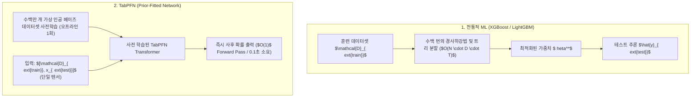

> [!abstract] 핵심 요약
> **TabPFN**은 표 데이터셋을 인공 합성 사전 분포(Causal Graph Priors)로 무한 생성하여 Transformer가 사후 확률 $P(y_{	ext{test}} \mid x_{	ext{test}}, \mathcal{D}_{	ext{train}})$을 직접 예측하도록 사전 학습된 파운데이션 모델이다.
> 사용자는 **추가적인 모델 훈련이나 하이퍼파라미터 튜닝 없이**, 훈련 데이터셋과 테스트 샘플을 프롬프트처럼 텐서로 투입하기만 하면 **단 1초(단일 포워드 패스 $O(1)$)** 만에 베이지안 사후 추론 결과를 얻는다.

---

## 1. TabPFN의 학습 및 추론 패러다임 비교



---

## 2. 사후 예측 분포 (Posterior Predictive Distribution: PPD) 수식

$$P(y_{	ext{test}} \mid x_{	ext{test}}, \mathcal{D}_{	ext{train}}) = \int P(y_{	ext{test}} \mid x_{	ext{test}}, 	heta) P(	heta \mid \mathcal{D}_{	ext{train}}) d	heta$$

TabPFN은 Transformer의 인컨텍스트 어텐션을 통해 위 복잡한 적분 연산을 단일 순전파(Forward pass)로 완전 근사한다.

---

## 3. 실시간 TabPFN vs 전통적 GBDT 추론 속도 비교기

```html preview
<div style="font-family:system-ui,-apple-system,sans-serif;padding:20px;background:var(--card);color:var(--card-foreground);border:1px solid var(--border);border-radius:var(--radius)">
  <div style="font-size:16px;font-weight:700;margin-bottom:14px;color:var(--primary);display:flex;align-items:center;gap:8px">
    <span>⚡ TabPFN vs GBDT 소요 시간(학습+튜닝+추론) 계산기</span>
  </div>

  <div style="margin-bottom:14px">
    <label style="font-size:11px;color:var(--muted-foreground)">표 데이터 샘플 수 (Rows):</label>
    <input id="inTabRows" type="number" value="500" min="50" max="2000" style="width:100%;padding:4px;background:var(--background);color:var(--foreground);border:1px solid var(--border);border-radius:var(--radius);font-weight:700" />
  </div>

  <div style="display:grid;grid-template-columns:1fr 1fr;gap:12px;margin-bottom:12px">
    <div style="padding:10px;background:var(--background);border:1px solid var(--border);border-radius:var(--radius);text-align:center">
      <div style="font-size:10px;color:var(--muted-foreground)">전통적 XGBoost (튜닝+학습)</div>
      <div id="xgbTimeOut" style="font-family:monospace;font-size:18px;font-weight:800;color:var(--destructive,#ef4444);margin-top:2px">15.0 초</div>
    </div>
    <div style="padding:10px;background:var(--background);border:1px solid var(--border);border-radius:var(--radius);text-align:center">
      <div style="font-size:10px;color:var(--muted-foreground)">TabPFN (단일 순전파 추론)</div>
      <div id="tabpfnTimeOut" style="font-family:monospace;font-size:18px;font-weight:800;color:var(--primary);margin-top:2px">0.12 초 (120배 빠름)</div>
    </div>
  </div>

  <script>
    function updateTabTime() {
      var r = parseFloat(document.getElementById('inTabRows').value) || 500;
      var xgbTime = (r / 500) * 15.0;
      var pfnTime = 0.12;
      document.getElementById('xgbTimeOut').textContent = xgbTime.toFixed(1) + " 초";
      document.getElementById('tabpfnTimeOut').textContent = pfnTime.toFixed(2) + " 초 (" + Math.round(xgbTime/pfnTime) + "배 빠름)";
    }
    document.getElementById('inTabRows').addEventListener('input', updateTabTime);
  </script>
</div>
```
