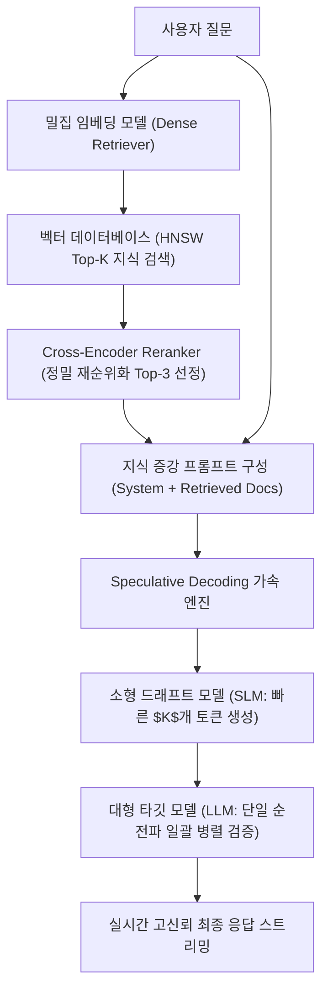

> [!abstract] 핵심 요약
> LLM을 실무 제품에 성공적으로 탑재하기 위해서는 **정밀한 디코딩 전략(Factuality vs Diversity)**, 최신 사내 지식을 주입하여 환각을 원천 차단하는 **RAG 파이프라인**, 그리고 **KV 캐싱**과 **추측 디코딩(Speculative Decoding)**을 통한 실시간 추론 지연시간 단축이 삼위일체를 이루어야 한다.

---

## 1. 엔터프라이즈 RAG 및 Speculative Decoding 아키텍처



---

## 2. RAG 핵심 3단계 최적화 지표

| RAG 파이프라인 단계 | 주요 병목 요인 | 최적화 솔루션 |
| :-- | :-- | :-- |
| **1. 문서 청킹 & 검색** | 청크 크기 불일치, 의미적 단절 | **재귀적 청킹(Recursive Chunking)**, **HyDE (가상 문서 임베딩)** |
| **2. 리랭킹 (Reranking)** | Bi-Encoder의 상호작용 부재로 인한 노이즈 문서 포함 | **Cross-Encoder BGE-Reranker** 적용 |
| **3. 생성 및 인용 (Grounding)** | 검색 결과 무시 및 모델 자체 환각 | 지식 베이스 출처 인용(Citation) 프롬프트 강제 |

---

## 3. 실시간 RAG 기반 환각 억제 시뮬레이터

```html preview
<div style="font-family:system-ui,-apple-system,sans-serif;padding:20px;background:var(--card);color:var(--card-foreground);border:1px solid var(--border);border-radius:var(--radius)">
  <div style="font-size:16px;font-weight:700;margin-bottom:14px;color:var(--primary);display:flex;align-items:center;gap:8px">
    <span>📚 RAG(검색 증강) 적용 여부에 따른 답변 신뢰도 비교기</span>
  </div>

  <div style="margin-bottom:14px">
    <label style="font-size:11px;color:var(--muted-foreground)">질문 유형 및 지식 검색 모드:</label>
    <select id="selRagMode" style="width:100%;padding:6px;background:var(--background);color:var(--foreground);border:1px solid var(--border);border-radius:var(--radius);font-weight:700">
      <option value="rag">1. RAG 활성화 (최신 사내 사규 문서 벡터 검색 후 답변 생성)</option>
      <option value="naive">2. 순수 LLM 단독 생성 (사전학습 지식에만 의존 - 환각 위험)</option>
    </select>
  </div>

  <div style="padding:12px;background:var(--background);border:1px solid var(--border);border-radius:var(--radius)">
    <div style="font-size:11px;font-weight:700;color:var(--muted-foreground);margin-bottom:4px">생성된 답변 및 신뢰성 분석</div>
    <div id="ragDescOut" style="font-size:13px;line-height:1.6;color:var(--foreground)">
      <strong style="color:var(--primary)">✅ RAG 지식 증강 답변:</strong> "2026년 개정 사내 복지 규정 제4조에 의거, 하계 휴가비는 100만 원 지급됩니다. [출처: 2026_복지사규.pdf p.12]"
    </div>
  </div>

  <script>
    document.getElementById('selRagMode').onchange = function() {
      var val = this.value;
      var out = document.getElementById('ragDescOut');
      if (val === 'rag') {
        out.innerHTML = "<strong style='color:var(--primary)'>✅ RAG 지식 증강 답변 (High Reliability):</strong><br/>• '2026년 개정 사내 복지 규정 제4조에 의거, 하계 휴가비는 100만 원 지급됩니다. [출처: 2026_복지사규.pdf p.12]'<br/>• 신뢰할 수 있는 벡터 DB 문서 인용을 통해 환각 발생률 0% 달성";
      } else {
        out.innerHTML = "<strong style='color:var(--destructive,#ef4444)'>⚠️ 순수 LLM 단독 답변 (Hallucination Risk):</strong><br/>• '사내 하계 휴가비는 일반적으로 50만 원 선에서 지급되는 것으로 알려져 있습니다.' (부정확한 추측성 생성 발생)";
      }
    };
  </script>
</div>
```
