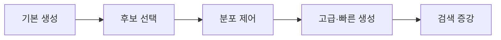

> [!abstract] 한 줄 요약
> 다음 토큰 분포에서 greedy·beam·sampling을 거쳐 diverse·contrastive·speculative decoding과 RAG 검색까지 확장되는 생성 제어의 흐름을 정리한다.

---

## 강의 흐름



<Tabs>
  <Tab label="핵심 개념">
- **누적 likelihood** — Beam search가 여러 시점의 후보를 비교하기 위해 토큰 확률의 곱 또는 로그합을 누적하는 기준이다.
- **적응형 후보** — Top-P는 확률 질량 임계값에 따라 후보 수를 바꿔 분포 모양에 적응한다.
- **draft–verify** — 작은 모델 제안과 큰 모델 검증을 묶어 결과 보장을 유지하면서 속도를 높인다.
  </Tab>
  <Tab label="적용 순서">
1. logit·softmax와 자동회귀 비용을 확인한다.
2. Greedy·Beam·Sampling으로 기본 후보 선택을 비교한다.
3. temperature·Top-K·Top-P를 과업별로 튜닝한다.
4. 다양성·대조·draft-verify를 추가한다.
5. retrieval과 근거 검증을 RAG에 통합한다.
  </Tab>
  <Tab label="점검 질문">
- Beam search의 누적 likelihood가 긴 문장에서 어떤 편향을 만들 수 있는가?
- Top-K와 Top-P를 같은 분포에서 어떻게 다르게 작동시키는가?
- Speculative decoding과 RAG가 각각 줄이는 병목은 무엇인가?
  </Tab>
</Tabs>

---

## 단계별 정리

### 기본 생성

- 토큰 시퀀스와 vocabulary를 바탕으로 다음 토큰 logits를 계산한다.
- softmax 분포에서 한 토큰을 선택하고 자동회귀적으로 반복한다.
- 생성 목표는 품질뿐 아니라 다양성·지연·사실성에 따라 달라진다.

### 후보 선택

- Greedy는 argmax를 순차 선택하며 간단하지만 미래 토큰을 보지 못한다.
- Beam은 여러 후보의 누적 likelihood를 유지해 더 나은 경로를 탐색한다.
- Sampling은 확률적 탐색을 허용해 반복을 줄일 수 있지만 품질 변동이 있다.

### 분포 제어

- Temperature는 분포를 평탄화하거나 날카롭게 만든다.
- Top-K는 상위 K개 후보만 남기고 Top-P는 누적 확률 τ에 맞춰 K를 바꾼다.
- 파라미터 선택은 과업과 출력 안전성에 맞춘 실험으로 결정한다.

### 고급·빠른 생성

- Diverse Beam Search는 그룹 간 dissimilarity로 여러 결과의 다양성을 높인다.
- Contrastive Decoding은 expert·amateur 또는 context/no-context 분포를 대조한다.
- Speculative Decoding은 작은 draft와 큰 target의 검증으로 순차 추론을 줄인다.

### 검색 증강

- LLM의 pretraining knowledge cutoff는 최신 정보 질의에서 한계를 만든다.
- PageRank·BM25·DPR 등 sparse·dense retrieval로 문서를 찾는다.
- RAG는 긴 컨텍스트·질의 품질·노이즈 문서에 대한 강건성까지 함께 설계한다.

| 단계 | 원본에서 관찰할 신호 | 학습 산출물 |
| --- | --- | --- |
| 입력 | token·logit·softmax | 분포 |
| 선택 | greedy·beam·sampling | 탐색·다양성 |
| 제어 | temperature·Top-K·Top-P | 후보·무작위성 |
| 확장 | DBS·contrastive·speculative·RAG | 목적·속도·근거 |

> [!warning] 읽을 때의 주의점
> 두 기수의 LLM Application 자료는 동일한 제목이지만 강의 시점과 편집이 다를 수 있다. 이 노트는 9기 PDF의 흐름과 예시를 기준으로 한다.

---

## 인터랙티브: 강의 단계 탐색

아래 슬라이더를 움직여 단계별 핵심 질문을 확인합니다. 범위와 단계명은 이 PDF의 강의 목차를 그대로 반영했습니다.

```html preview
<div style="font-family:system-ui,sans-serif;padding:20px;color:var(--foreground)">
<label for="a9llmdecoding" style="font-size:14px;font-weight:600">LLM 생성 단계</label>
<div id="a9llmdecoding-out" style="font-size:24px;font-weight:700;color:var(--chart-1);margin:6px 0"></div>
<input id="a9llmdecoding" type="range" min="0" max="4" step="1" value="0" style="width:100%;accent-color:var(--primary)" />
<p id="a9llmdecoding-hint" style="font-size:13px;color:var(--muted-foreground);margin-top:8px"></p>
<script>
var control = document.getElementById('a9llmdecoding');
var out = document.getElementById('a9llmdecoding-out');
var hint = document.getElementById('a9llmdecoding-hint');
var labels = ["기본 생성","후보 선택","분포 제어","고급·빠른 생성","검색 증강"];
var hints = ["tokenization·logit·softmax에서 시작합니다.","Greedy·Beam·Sampling의 탐색 폭을 비교합니다.","temperature·Top-K·Top-P로 확률 꼬리를 자릅니다.","다양성·대조·draft-verify를 목적별로 추가합니다.","지식 cutoff를 retrieval·read·generate로 보완합니다."];
function renderStage() {
  var index = Number(control.value);
  out.textContent = labels[index];
  hint.textContent = hints[index];
}
control.addEventListener('input', renderStage);
renderStage();
</script>
</div>
```

<details>
  <summary>복습 체크리스트</summary>

- [ ] 기본 decoding 전략의 장단점을 비교할 수 있다.
- [ ] Top-K·Top-P·temperature를 출력 목적과 연결할 수 있다.
- [ ] speculative decoding과 RAG의 검증 포인트를 말할 수 있다.

</details>
