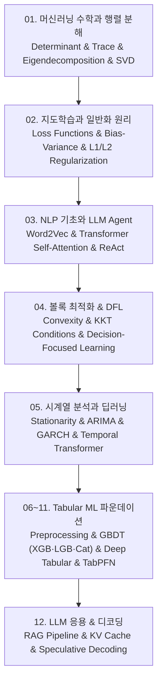

# 📚 LG Aimers 9기 — 머신러닝 기초, 최적화, 시계열 및 정형 데이터(Tabular Foundation Models) 전체 로드맵

머신러닝의 수학적 기초인 선형대수와 행렬 분해(Determinant, Trace, Eigendecomposition, SVD, Low-rank Approximation), 지도학습 핵심 원리와 일반화 오차(Bias-Variance Tradeoff, L1/L2 Regularization), 자연어처리 기초와 Transformer 어텐션 및 ReAct 에이전트, 볼록 최적화와 의사결정 중심 학습(Convex Sets/Functions, KKT 조건, End-to-End Decision-Focused Learning), 시계열 분석과 딥러닝 예측(정상성 ADF, ARIMA, GARCH, Temporal Transformer), 그리고 표 형식 데이터(Tabular ML)의 6단계 심화 분석(이종 피처 전처리, XGBoost/LightGBM/CatBoost 트리 앙상블, TabNet/FT-Transformer 딥러닝 아키텍처, VIME/SCARF 표현 학습, 직렬화 기반 LLM 표 추론 TabLLM, 사전 피팅 네트워크 TabPFN)과 RAG·Speculative Decoding까지 체계적으로 다룹니다.

---

## 🗺️ 강의 목차 (Curriculum Overview)

---

## 📑 개별 정리 문서 목록

1. [01. Mathematics for ML — 행렬 분해의 지도](file:///Users/um-yunsang/work/edu/LGAimer/LG%20Aimers%209%EA%B8%B0/notes/01.%20Mathematics%20for%20ML%20%E2%80%94%20%ED%96%89%EB%A0%AC%20%EB%B6%84%ED%95%B4%EC%9D%98%20%EC%A7%80%EB%8F%84.md)
   - 행렬식, 대각합, 고유값 분해, SVD, Eckart-Young-Mirsky 저계수 근사, 대화형 2D 행렬 변환기
2. [02. 지도학습 — Supervised Learning Overview](file:///Users/um-yunsang/work/edu/LGAimer/LG%20Aimers%209%EA%B8%B0/notes/02.%20%EC%A7%80%EB%8F%84%ED%95%99%EC%8A%B5%20%E2%80%94%20Supervised%20Learning%20Overview.md)
   - 일반화 오차의 편향-분산 분해, L1 Lasso vs L2 Ridge 정규화, 대화형 모델 복잡도 오차 분석기
3. [03. 딥러닝 자연어처리와 LLM Agent — AI 기초](file:///Users/um-yunsang/work/edu/LGAimer/LG%20Aimers%209%EA%B8%B0/notes/03.%20%EB%94%A5%EB%9F%AC%EB%8B%9D%20%EC%9E%90%EC%97%B0%EC%96%B4%EC%B2%98%EB%A6%AC%EC%99%80%20LLM%20Agent%20%E2%80%94%20AI%20%EA%B8%B0%EC%B4%88.md)
   - Transformer Self-Attention 수식 유도, ReAct 에이전트 루프, 대화형 Self-Attention 유사도 계산기
4. [04. Optimization & Decision-Focused Learning — 볼록 최적화](file:///Users/um-yunsang/work/edu/LGAimer/LG%20Aimers%209%EA%B8%B0/notes/04.%20Optimization%20&%20Decision-Focused%20Learning%20%E2%80%94%20%EB%B3%BC%EB%A1%9D%20%EC%B5%9C%EC%A0%81%ED%99%94.md)
   - 볼록성 판정, 라그랑주 쌍대성, KKT 4대 조건, End-to-End DFL, 대화형 KKT 조건 분석기
5. [05. Time-Series Analysis — 의존성·예측·딥러닝](file:///Users/um-yunsang/work/edu/LGAimer/LG%20Aimers%209%EA%B8%B0/notes/05.%20Time-Series%20Analysis%20%E2%80%94%20%EC%9D%98%EC%A1%B4%EC%84%B1%C2%B7%EC%98%88%EC%B8%A1%C2%B7%EB%94%A5%EB%9F%AC%EB%8B%9D.md)
   - 약정상성 ADF 검정, ARIMA 모델링, GARCH 변동성, 대화형 AR(1) ACF 감쇠 시뮬레이터
6. [06. Tabular ML — 표 형식 데이터와 과업](file:///Users/um-yunsang/work/edu/LGAimer/LG%20Aimers%209%EA%B8%B0/notes/06.%20Tabular%20ML%20%E2%80%94%20%ED%91%9C%20%ED%98%95%EC%8B%9D%20%EB%8D%B0%EC%9D%B4%ED%84%B0%EC%99%80%20%EA%B3%BC%EC%97%85.md)
   - 이종 피처 특성, 결측 메커니즘(MCAR/MAR/MNAR) 대체 기법, 고기수 타깃 인코딩, 대화형 결측치 선택기
7. [07. Tabular ML — Classical Models](file:///Users/um-yunsang/work/edu/LGAimer/LG%20Aimers%209%EA%B8%B0/notes/07.%20Tabular%20ML%20%E2%80%94%20Classical%20Models.md)
   - GBDT 2차 테일러 전개 목적함수, XGBoost vs LightGBM vs CatBoost 비교, 대화형 GBDT 추천기
8. [08. Tabular ML — Deep Architectures](file:///Users/um-yunsang/work/edu/LGAimer/LG%20Aimers%209%EA%B8%B0/notes/08.%20Tabular%20ML%20%E2%80%94%20Deep%20Architectures.md)
   - FT-Transformer 주기적 임베딩, TabNet 순차 어텐션 마스크, SAINT, 대화형 GBDT vs 딥러닝 비교기
9. [09. Tabular ML — Representation Learning](file:///Users/um-yunsang/work/edu/LGAimer/LG%20Aimers%209%EA%B8%B0/notes/09.%20Tabular%20ML%20%E2%80%94%20Representation%20Learning.md)
   - 자기지도 학습 VIME, 대조 학습 SCARF 및 InfoNCE 손실, 대화형 대조 유사도 분석기
10. [10. Tabular ML — LLM을 표 데이터에 연결하기](file:///Users/um-yunsang/work/edu/LGAimer/LG%20Aimers%209%EA%B8%B0/notes/10.%20Tabular%20ML%20%E2%80%94%20LLM%EC%9D%84%20%ED%91%9C%20%EB%8D%B0%EC%9D%B4%ED%84%B0%EC%97%90%20%EC%97%B0%EA%B2%B0%ED%95%98%EA%B8%B0.md)
    - 직렬화(Serialization) 템플릿, 퓨샷 인컨텍스트 표 학습, TabLLM, 대화형 직렬화 변환기
11. [11. Tabular ML — TabPFN과 Prior-Fitted Networks](file:///Users/um-yunsang/work/edu/LGAimer/LG%20Aimers%209%EA%B8%B0/notes/11.%20Tabular%20ML%20%E2%80%94%20TabPFN%EA%B3%BC%20Prior-Fitted%20Networks.md)
    - 인공 사전 분포 생성, 단일 순전파 $O(1)$ 베이지안 사후 추론, 대화형 TabPFN 속도 비교기
12. [12. LLM Decoding — 생성 제어·RAG·Speculative Decoding](file:///Users/um-yunsang/work/edu/LGAimer/LG%20Aimers%209%EA%B8%B0/notes/12.%20LLM%20Decoding%20%E2%80%94%20%EC%83%9D%EC%84%B1%20%EC%A0%9C%EC%96%B4%C2%B7RAG%C2%B7Speculative%20Decoding.md)
    - RAG 지식 증강 파이프라인, KV 캐싱, Speculative Decoding 무손실 가속, 대화형 RAG 환각 억제기
