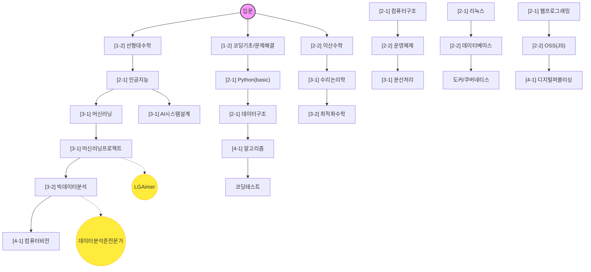

# 🧭 Obsidian | Computer Science & AI Curriculum Map

  
  
  
  
  

3년간의 컴퓨터공학 및 AI 전공 과정을 체계적으로 정리한 아카이브입니다. 기초 이론부터 실전 구현, 대외 활동까지 모든 학습 노드를 연결하였습니다.

---

## 🗺️ Knowledge Graph (관계성 지도)

학습 로드맵에 따른 과목 간의 유기적인 관계를 보여줍니다.

---

## 📂 학년/학기별 커리큘럼 & 실습 코드

### [1학년] - 기초 다지기
| 과목명 | 핵심 내용 | 실습 및 과제 |
| :--- | :--- | :--- |
| **[1-2] 코딩 기초와 문제해결** | 컴퓨팅 사고, 아두이노 | [아두이노 실습](./ComputerScience/%5B1-2%5D%20%EC%BD%94%EB%94%A9%20%EA%B8%B0%EC%B4%88%EC%99%80%20%EB%AC%B8%EC%A0%9C%ED%95%B4%EA%B2%B0/4.%20%EC%95%84%EB%91%90%EC%9D%B4%EB%88%84/%EC%95%84%EB%91%90%EC%9D%B4%EB%85%B8%20%EC%8B%A4%EC%8A%B5.md) |
| **[1-2] 선형대수학** | 벡터, 행렬, 선형변환 | [Linear Algebra Lab 🔗](https://github.com/umyunsang/Linear-Algebra) |

### [2학년] - CS 핵심 및 AI 입문
| 과목명 | 핵심 내용 | 실습 및 과제 |
| :--- | :--- | :--- |
| **[2-1] Python(basic)** | 파이썬 문법, 객체지향 | [Python Repository 🔗](https://github.com/umyunsang/Python) [지뢰찾기 구현](./ComputerScience/%5B2-1%5D%20Python(basic)/%EC%A7%80%EB%A2%B0%EC%B0%BE%EA%B8%B0) |
| **[2-1] 데이터 구조** | 리스트, 스택, 큐, 트리 | [Data Structures Repo 🔗](https://github.com/umyunsang/Data_Structures) [정렬 알고리즘 실습](./ComputerScience/%5B2-1%5D%20%EB%8D%B0%EC%9D%B4%ED%84%B0%20%EA%B5%AC%EC%A1%B0/5.%20%EC%A0%95%EB%A0%AC/1705817_%EC%97%84%EC%9C%A4%EC%83%81_%EB%8D%B0%EC%9D%B4%ED%84%B0%EA%B5%AC%EC%A1%B0_4%EC%A3%BC%EC%B0%A8%EA%B3%BC%EC%A0%9C.md) |
| **[2-1] 인공지능** | 신경망 기초, CNN | [AI Repository 🔗](https://github.com/umyunsang/Artificial_Intelligence) [MLP/CNN 실습](./ComputerScience/%5B2-1%5D%20%EC%9D%B8%EA%B3%B5%EC%A7%80%EB%8A%A5) |
| **[2-1] 웹프로그래밍** | HTML, Spring Boot | [Web Programming Repo 🔗](https://github.com/umyunsang/Web_Programming) [Spring Boot 실습](./ComputerScience/%5B2-1%5D%20%EC%9B%B9%ED%94%84%EB%A1%9C%EA%B7%B8%EB%9E%98%EB%B0%8D/3.%20Spring%20Boot%20%EA%B8%B0%EC%B4%88/Spring%20Boot%20%EA%B8%B0%EC%B4%88%20%EC%8B%A4%EC%8A%B5.md) |
| **[2-1] 리눅스시스템** | 셸·편집기·프로세스·서버 기초 | [Linux Repository 🔗](https://github.com/umyunsang/Linux) |
| **[2-1] 확률과 통계** | 확률·통계 기초와 데이터 해석 | [강의 자료 정리(Local)](./ComputerScience/%5B2-1%5D%20%ED%99%95%EB%A5%A0%EA%B3%BC%20%ED%86%B5%EA%B3%84) |
| **[2-1] 컴퓨터 구조** | CPU, 메모리 구조 | [Cache Friendly 코딩](./ComputerScience/%5B2-1%5D%20%EC%BB%B4%ED%93%A8%ED%84%B0%20%EA%B5%AC%EC%A1%B0/5.%20%EA%B8%B0%EC%96%B5%20%EC%9E%A5%EC%B9%98/%EA%B3%BC%EC%A0%9C_CacheFriendly%EC%BD%94%EB%94%A9%EC%8B%A4%EC%8A%B5.md) |
| **[2-2] 운영체제** | 스케줄링, 동기화 | [스케줄러 구현(FCFS/SJF/SRTF)](./ComputerScience/%5B2-2%5D%20%EC%9A%B4%EC%98%81%EC%B2%B4%EC%A0%9C/%EA%B3%BC%EC%A0%9C) |
| **[2-2] OSS** | JS 이벤트·객체·DOM 등 클라이언트 기초 | [OSS Repository 🔗](https://github.com/umyunsang/OSS) |
| **[2-2] 데이터베이스** | SQL, 정규화, 모델링 | - |

### [3학년] - 머신러닝 심화 및 분산 시스템
| 과목명 | 핵심 내용 | 실습 및 과제 |
| :--- | :--- | :--- |
| **[3-1] 머신러닝** | 회귀, SVM, RNN, Transformer | [CNN/RNN/Transformer](./ComputerScience/%5B3-1%5D%20%EB%A8%B8%EC%8B%A0%EB%9F%AC%EB%8B%9D) |
| **[3-1] 머신러닝프로젝트** | SKLearn, Pandas, LangChain | [파이썬 기초 실력과제](./ComputerScience/%5B3-1%5D%20%EB%A8%B8%EC%8B%A0%EB%9F%AC%EB%8B%9D%ED%94%84%EB%A1%9C%EC%A0%9D%ED%8A%B8/Python%20%EA%B8%B0%EC%B4%88/%EC%8B%A4%EB%A0%A5%EA%B3%BC%EC%A0%9C.md) |
| **[3-1] 분산처리** | CUDA, 병렬 프로그래밍 | [CUDA Projects 🔗](https://github.com/umyunsang/cudaProj) |
| **[3-1] AI시스템개발/설계** | MLOps, 아키텍처 설계 | [Cafe Project 🔗](https://github.com/umyunsang/cafeProj) |
| **[3-2] 빅데이터분석** | 데이터 레이크, 분석 도구 | [MLFlow 과제](./ComputerScience/%5B3-2%5D%20%EB%B9%85%EB%8D%B0%EC%9D%B4%ED%84%B0%EB%B6%84%EC%84%9D/md/MLFlow%20%EA%B3%BC%EC%A0%9C.md) [Big Data Pipeline 🔗](https://github.com/umyunsang/Bigdata_Proj) |
| **[3-2] 뉴럴네트워크** | 심화 신경망 아키텍처 | [Neural Network Labs 🔗](https://github.com/umyunsang/neural_network) |
| **[3-2] 컴퓨터 그래픽스** | 렌더링, 그래픽스 기초 | [Graphics Labs 🔗](https://github.com/umyunsang/Graphics) |

### [4학년] - 실전 알고리즘 및 비전
| 과목명 | 핵심 내용 | 실습 및 과제 |
| :--- | :--- | :--- |
| **[4-1] 알고리즘** | 분할정복, 탐욕법, DP, NP | [CoTest Repository 🔗](https://github.com/umyunsang/COTEST) |
| **[4-1] 컴퓨터비전** | 영상처리, 기하변환 | [CV 코랩 실습(ipynb)](./ComputerScience/%5B4-1%5D%20%EC%BB%B4%ED%93%A8%ED%84%B0%EB%B9%84%EC%A0%84/%EC%BD%94%EB%9E%A9%20%EC%8B%A4%EC%8A%B5) |
| **[4-1] AIOSS** | 실증적 개발, 오픈소스 AI 프로젝트 | [Govon Repository 🔗](https://github.com/govon-org/govon) (이슈·마일스톤 기여) |

---

## 🏆 대외 활동 & 자격증 (Extracurricular)

*   **LGAimer**: LG AI 연구원 해커톤 및 교육 과정 ([자료 이동](./LGAimer))
    *   [🏆 LG Aimers 8기 이수증 (LLM Compression)](./LGAimer/LG_Aimers_Certificate.pdf)
    *   [LLM Application & Evaluation 자료](./LGAimer/%E3%80%8ELLM%20Application%20%26%20Evaluation%E3%80%8F%20%EA%B0%95%EC%9D%98%EC%9E%90%EB%A3%8C%20Download.pdf)
*   **자격증**: 데이터분석준전문가(ADsP), 정보처리기사 등 ([자료 이동](./certifications))
    *   [자격증 취득 체크리스트](./certifications/%EC%B2%B4%ED%81%AC%EB%A6%AC%EC%8A%A4%ED%8A%B8.md)

---

## 🚀 실전 기술 스택 & 툴 (Highlights)

*   **LLM 활용**: [Fine-Tuning 실습](./ComputerScience/LLM%20%EC%9D%B4%ED%95%B4%EC%99%80%20%ED%99%9C%EC%9A%A9/ChatGPT%20API/Fine-Tuning%20%EC%8B%A4%EC%8A%B5.md), ChatGPT API 연동
*   **GenAI 실전**: [ComfyUI 워크플로우 실습](./ComputerScience/ComfyUI), [Hugging Face Models 🔗](https://huggingface.co/umyunsang)
*   **인프라**: [도커 및 쿠버네티스](./ComputerScience/%EB%8F%84%EC%BB%A4%EC%99%80%20%EC%BF%A0%EB%B2%84%EB%84%A4%ED%8B%B0%EC%8A%A4) (Ingress, Service 설정)
*   **알고리즘**: [코딩테스트 대비](./ComputerScience/%EC%BD%94%EB%94%A9%ED%85%8C%EC%8A%A4%ED%8A%B8) 및 백준 문제 풀이

---

## 🔎 검색 팁 (Obsidian)
- 실습 코드만 보기: `path:"실습" file:.md OR file:.ipynb`
- 특정 학기 검색: `file:"[2-1]"`
- 특정 기술 스택: `content:Python` 또는 `tag:#python` (사용 시)

---

Last Updated: 2026-03-19

