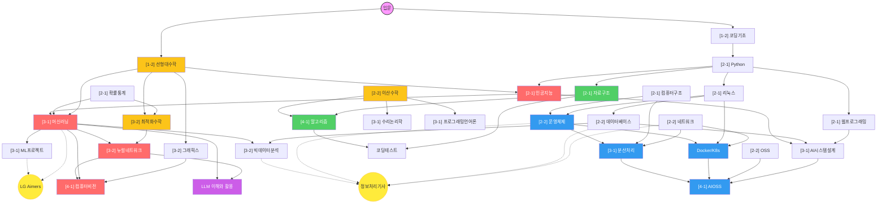

graph:: [[ComputerScience/00_graph-interfaces/지식그래프 허브|지식그래프 허브]]
bridge:: [[ComputerScience/00_graph-interfaces/bridges/아카이브 운영 브리지|아카이브 운영 브리지]]
central:: [[커리큘럼 관계 정리|커리큘럼 관계 정리]]

# 🧭 Obsidian | Computer Science & AI Curriculum Map

  
  
  
  
  

3년간의 컴퓨터공학 및 AI 전공 과정을 체계적으로 정리한 아카이브입니다. 기초 이론부터 실전 구현, 대외 활동까지 모든 학습 노드를 연결하였습니다.

---

## 🗺️ Knowledge Graph (관계성 지도)

학습 로드맵에 따른 과목 간의 유기적인 관계를 보여줍니다. 현재 파일 구조는 학년/학기 폴더가 아니라 지식그래프 인터페이스와 7개 분야별 인터페이스 폴더를 기준으로 정리되어 있으며, 학기 이력은 각 노트의 frontmatter에 남겨 둡니다.

> **Obsidian 사용자:** [[2026 GraphRAG 아카이브.canvas|`2026 GraphRAG 아카이브.canvas`]], [[지식그래프 레벨 인터페이스.canvas|`지식그래프 레벨 인터페이스.canvas`]], [[커리큘럼 관계 그래프.canvas|`커리큘럼 관계 그래프.canvas`]]를 열면 인터랙티브 Canvas 뷰로 볼 수 있습니다.

### 2026 GraphRAG 아카이브 스켈레톤

- 최상위 허브: [[ComputerScience/00_graph-interfaces/지식그래프 허브|지식그래프 허브]]
- 구조 기준: [[ComputerScience/00_graph-interfaces/archive-kg/2026 GraphRAG 아카이브 스켈레톤|2026 GraphRAG 아카이브 스켈레톤]]
- 주요 관계 필드: `domain::`, `stage::`, `module::`, `bridge::`, `kg_profile::`, `kg_evidence::`, `kg_concepts::`, `kg_query_mode::`

### 트랙별 요약

| 트랙 | 색상 | 최장 경로 |
|:---|:---|:---|
| **AI/ML** | 🔴 | 코딩기초 → Python → AI → ML → 뉴럴네트워크 → 컴퓨터비전 |
| **시스템** | 🔵 | 리눅스 → OS → 분산처리 → AIOSS |
| **수학** | 🟡 | 선형대수 → 확률통계 → 최적화수학 → 뉴럴네트워크 |
| **개발** | 🟢 | Python → 자료구조 → 알고리즘 → 코딩테스트 |

---

## 📂 분야별 인터페이스 폴더 & 커리큘럼

| 인터페이스 폴더 | 분류 기준 | 포함 과목 |
| :--- | :--- | :--- |
| `ComputerScience/00_graph-interfaces/` | Graph View에 실제 노드로 보이는 단계·브리지·과목·관계·리서치 인터페이스 | hub, stages, bridges, courses, ontology, research, tech-stacks, ecosystems, competencies |
| `ComputerScience/01_programming-foundations/` | 프로그래밍 언어와 구현 기초 | coding-basics, python-programming, data-structures, coding-test, java-programming |
| `ComputerScience/02_math-theory/` | 수학적 기초와 이론 | probability-statistics, discrete-mathematics, optimization-math, mathematical-logic |
| `ComputerScience/03_ai-ml-data/` | AI, ML, 데이터, 생성형 AI | artificial-intelligence, machine-learning, neural-networks, computer-vision, large-language-models, big-data-analysis |
| `ComputerScience/04_systems-infrastructure/` | 시스템과 인프라 | linux, computer-architecture, operating-systems, computer-networks, parallel-distributed-computing, container-orchestration |
| `ComputerScience/05_software-engineering/` | 소프트웨어 개발과 운영 | web-programming, database-systems, open-source-software, programming-languages, aioss-open-source-delivery |
| `ComputerScience/06_algorithms-graphics/` | 알고리즘 분석과 그래픽스 | algorithm-design-analysis, computer-graphics |
| `ComputerScience/07_professional-humanities/` | 전문 교양, 글쓰기, 포트폴리오 | intellectual-property, creative-writing, classics-reading, degree-portfolio |

아래 표는 학습 이력 순서를 설명하기 위한 보조 보기이며, 실제 파일 탐색의 기준은 위 분야별 인터페이스입니다.

### [1학년] - 기초 다지기
| 과목명 | 핵심 내용 | 실습 및 과제 |
| :--- | :--- | :--- |
| **[1-2] 코딩 기초와 문제해결** | 컴퓨팅 사고, 아두이노 | [[ComputerScience/01_programming-foundations/coding-basics/4. 아두이노/아두이노 실습|아두이노 실습]] |
| **[1-2] 선형대수학** | 벡터, 행렬, 선형변환 | [Linear Algebra Lab 🔗](https://github.com/umyunsang/Linear-Algebra) |

### [2학년] - CS 핵심 및 AI 입문
| 과목명 | 핵심 내용 | 실습 및 과제 |
| :--- | :--- | :--- |
| **[2-1] Python(basic)** | 파이썬 문법, 객체지향 | [Python Repository 🔗](https://github.com/umyunsang/Python) [[ComputerScience/01_programming-foundations/python-programming/지뢰찾기/지뢰찾기|지뢰찾기 구현]] |
| **[2-1] 데이터 구조** | 리스트, 스택, 큐, 트리 | [Data Structures Repo 🔗](https://github.com/umyunsang/Data_Structures) [[ComputerScience/01_programming-foundations/data-structures/5. 정렬/1705817_엄윤상_데이터구조_4주차과제|정렬 알고리즘 실습]] |
| **[2-1] 인공지능** | 신경망 기초, CNN | [AI Repository 🔗](https://github.com/umyunsang/Artificial_Intelligence) [[ComputerScience/03_ai-ml-data/artificial-intelligence/3. Backpropagation/실습/CIFAR10/CIFAR10|CNN 실습]] |
| **[2-1] 웹프로그래밍** | HTML, Spring Boot | [Web Programming Repo 🔗](https://github.com/umyunsang/Web_Programming) [[ComputerScience/05_software-engineering/web-programming/3. Spring Boot 기초/Spring Boot 기초 실습|Spring Boot 실습]] |
| **[2-1] 리눅스시스템** | 셸·편집기·프로세스·서버 기초 | [Linux Repository 🔗](https://github.com/umyunsang/Linux) |
| **[2-1] 확률과 통계** | 확률·통계 기초와 데이터 해석 | [[ComputerScience/02_math-theory/probability-statistics/3.Probability/Probability|강의 자료 정리(Local)]] |
| **[2-1] 컴퓨터 구조** | CPU, 메모리 구조 | [[ComputerScience/04_systems-infrastructure/computer-architecture/5. 기억 장치/과제_CacheFriendly코딩실습|Cache Friendly 코딩]] |
| **[2-2] 운영체제** | 스케줄링, 동기화 | [[ComputerScience/04_systems-infrastructure/operating-systems/과제/FCFS/FCFS CPU 스케줄링 구현 과제|스케줄러 구현(FCFS/SJF/SRTF)]] |
| **[2-2] OSS** | JS 이벤트·객체·DOM 등 클라이언트 기초 | [OSS Repository 🔗](https://github.com/umyunsang/OSS) |
| **[2-2] 데이터베이스** | SQL, 정규화, 모델링 | - |

### [3학년] - 머신러닝 심화 및 분산 시스템
| 과목명 | 핵심 내용 | 실습 및 과제 |
| :--- | :--- | :--- |
| **[3-1] 머신러닝** | 회귀, SVM, RNN, Transformer | [[ComputerScience/03_ai-ml-data/machine-learning/SVM/SVM|SVM·회귀 정리]] |
| **[3-1] 머신러닝프로젝트** | SKLearn, Pandas, LangChain | [[ComputerScience/03_ai-ml-data/ml-projects/Python 기초/실력과제|파이썬 기초 실력과제]] |
| **[3-1] 분산처리** | CUDA, 병렬 프로그래밍 | [CUDA Projects 🔗](https://github.com/umyunsang/cudaProj) |
| **[3-1] AI시스템개발/설계** | MLOps, 아키텍처 설계 | [Cafe Project 🔗](https://github.com/umyunsang/cafeProj) |
| **[3-2] 빅데이터분석** | 데이터 레이크, 분석 도구 | [[ComputerScience/03_ai-ml-data/big-data-analysis/md/MLFlow 과제|MLFlow 과제]] [Big Data Pipeline 🔗](https://github.com/umyunsang/Bigdata_Proj) |
| **[3-2] 뉴럴네트워크** | 심화 신경망 아키텍처 | [Neural Network Labs 🔗](https://github.com/umyunsang/neural_network) |
| **[3-2] 컴퓨터 그래픽스** | 렌더링, 그래픽스 기초 | [Graphics Labs 🔗](https://github.com/umyunsang/Graphics) |

### [4학년] - 실전 알고리즘 및 비전
| 과목명 | 핵심 내용 | 실습 및 과제 |
| :--- | :--- | :--- |
| **[4-1] 알고리즘** | 분할정복, 탐욕법, DP, NP | [CoTest Repository 🔗](https://github.com/umyunsang/COTEST) |
| **[4-1] 컴퓨터비전** | 영상처리, 기하변환 | [[ComputerScience/03_ai-ml-data/computer-vision/중간고사_컴퓨터비전_정밀분석_정리|CV 핵심 정리]] |
| **[4-1] AIOSS** | 실증적 개발, 오픈소스 AI 프로젝트 | [Govon Repository 🔗](https://github.com/govon-org/govon) (이슈·마일스톤 기여) |

---

## 🏆 대외 활동 & 자격증 (Extracurricular)

*   **LGAimer**: LG AI 연구원 해커톤 및 교육 과정 ([[LGAimer/LG Aimers 9기 지원서 초안|지원서 초안]])
    *   [[LGAimer/LG_Aimers_Certificate.pdf|🏆 LG Aimers 8기 이수증 (LLM Compression)]]
    *   [[LGAimer/『LLM Application & Evaluation』 강의자료 Download.pdf|LLM Application & Evaluation 자료]]
*   **자격증**: 데이터분석준전문가(ADsP), 정보처리기사 등 ([[certifications/체크리스트|체크리스트]])
    *   [[certifications/체크리스트|자격증 취득 체크리스트]]

---

## 🚀 실전 기술 스택 & 툴 (Highlights)

*   **LLM 활용**: [[ComputerScience/03_ai-ml-data/large-language-models/ChatGPT API/Fine-Tuning 실습|Fine-Tuning 실습]], ChatGPT API 연동
*   **GenAI 실전**: [[ComputerScience/03_ai-ml-data/large-language-models/검색 증강 생성 RAG/RAG|RAG 워크플로우]], [Hugging Face Models 🔗](https://huggingface.co/umyunsang)
*   **인프라**: [[ComputerScience/04_systems-infrastructure/container-orchestration/도커 기초|도커 및 쿠버네티스]] (Ingress, Service 설정)
*   **알고리즘**: [[ComputerScience/01_programming-foundations/coding-test/자료구조/1. 배열과 리스트|코딩테스트 대비]] 및 백준 문제 풀이

---

## 🔎 검색 팁 (Obsidian)
- 실습 코드만 보기: `path:"실습" file:.md OR file:.ipynb`
- 특정 학기 검색: `file:"[2-1]"`
- 특정 기술 스택: `content:Python` 또는 `tag:#python` (사용 시)

---

Last Updated: 2026-05-28

