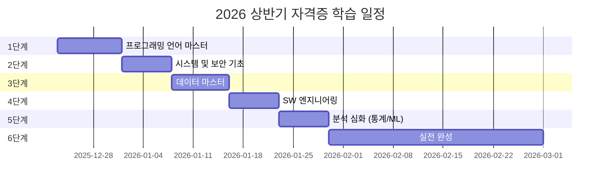

domain:: [[ComputerScience/05_software-engineering/소프트웨어 엔지니어링 인터페이스|소프트웨어 엔지니어링 인터페이스]]
up:: [[ComputerScience/04_systems-infrastructure/operating-systems/3. 프로세스와 프로세스 관리/프로세스와 프로세스 관리|프로세스와 프로세스 관리]]
prerequisites:: [[ComputerScience/05_software-engineering/database-systems/7. 데이터베이스 언어 SQL/데이터 베이스 언어 SQL|데이터 베이스 언어 SQL]]
related:: [[certifications/information-processing/실기/오답노트|오답노트]], [[certifications/information-processing/필기/1. 프로그래밍 언어 활용|1. 프로그래밍 언어 활용]], [[ComputerScience/05_software-engineering/programming-languages/필기/1. 기본사항|1. 기본사항]], [[ComputerScience/05_software-engineering/database-systems/13. 데이터 과학과 빅데이터/데이터 과학과 빅데이터|데이터 과학과 빅데이터]], [[ComputerScience/05_software-engineering/database-systems/12. 데이터베이스 응용 기술/데이터베이스 응용 기술|데이터베이스 응용 기술]], [[ComputerScience/05_software-engineering/database-systems/3. DB 시스템/DB 시스템|DB 시스템]], [[ComputerScience/05_software-engineering/database-systems/0. 시험/데이터베이스 연습문제|데이터베이스 연습문제]], [[ComputerScience/05_software-engineering/database-systems/6. 관계 데이터 연산/관계 데이터 연산|관계 데이터 연산]], [[ComputerScience/04_systems-infrastructure/operating-systems/1. OS의 시작과 발전/OS의 시작과 발전|OS의 시작과 발전]], [[ComputerScience/05_software-engineering/database-systems/1. 기본 개념/기본 개념|기본 개념]], [[ComputerScience/05_software-engineering/database-systems/7. 데이터베이스 언어 SQL/뷰(view)|뷰(view)]], [[ComputerScience/05_software-engineering/database-systems/0. 시험/7장 문제|7장 문제]], [[ComputerScience/05_software-engineering/database-systems/2. 관리 시스템/관리 시스템|관리 시스템]], [[ComputerScience/05_software-engineering/database-systems/8. 데이터베이스 설계/데이터베이스 설계|데이터베이스 설계]], [[ComputerScience/04_systems-infrastructure/operating-systems/2. 컴퓨터 시스템과 운영체제/컴퓨터 시스템과 OS|컴퓨터 시스템과 OS]], [[ComputerScience/05_software-engineering/database-systems/0. 시험/중간 주관식 예상(답)|중간 주관식 예상(답)]], [[ComputerScience/05_software-engineering/database-systems/5. 관계 데이터 모델/관계 데이터 모델 (용어 암기)|관계 데이터 모델 (용어 암기)]], [[ComputerScience/05_software-engineering/database-systems/4. 데이터 모델링/데이터 모델링|데이터 모델링]], [[ComputerScience/04_systems-infrastructure/operating-systems/11. 파일 시스템 관리/파일 시스템 관리|파일 시스템 관리]], [[ComputerScience/05_software-engineering/database-systems/0. 시험/중간 주관식 예상|중간 주관식 예상]], [[ComputerScience/04_systems-infrastructure/operating-systems/12. 저장 장치 관리/대용량 저장 장치 관리|대용량 저장 장치 관리]], [[ComputerScience/05_software-engineering/database-systems/0. 시험/레포트|레포트]], [[ComputerScience/05_software-engineering/database-systems/10. 회복과 병행제어/회복과 병행 제어|회복과 병행 제어]], [[ComputerScience/04_systems-infrastructure/operating-systems/4. 스레드와 멀티테스킹/스레드와 멀티테스킹|스레드와 멀티테스킹]], [[ComputerScience/05_software-engineering/database-systems/11. 보안과 권한 관리/보안과 권한 관리|보안과 권한 관리]], [[ComputerScience/04_systems-infrastructure/operating-systems/6. 스레드 동기화/스레드 동기화|스레드 동기화]], [[ComputerScience/04_systems-infrastructure/operating-systems/8. 메모리관리/메모리 관리|메모리 관리]], [[ComputerScience/04_systems-infrastructure/operating-systems/10. 가상 메모리/가상 메모리|가상 메모리]], [[ComputerScience/04_systems-infrastructure/operating-systems/5. CPU 스케줄링/CPU 스케줄링|CPU 스케줄링]], [[ComputerScience/05_software-engineering/database-systems/9. 정규화/정규화|정규화]], [[ComputerScience/05_software-engineering/database-systems/0. 시험/기말시험 범위 및 연습문제|기말시험 범위 및 연습문제]], [[ComputerScience/04_systems-infrastructure/operating-systems/3. 프로세스와 프로세스 관리/3장문제|3장문제]], [[ComputerScience/04_systems-infrastructure/operating-systems/9. 페이징 메모리 관리/페이징 메모리 관리|페이징 메모리 관리]], [[ComputerScience/04_systems-infrastructure/operating-systems/시험/기말 정리|기말 정리]], [[ComputerScience/04_systems-infrastructure/operating-systems/7. 교착상태/교착상태|교착상태]], [[ComputerScience/05_software-engineering/database-systems/9. 정규화/고급 정규형|고급 정규형]], [[ComputerScience/04_systems-infrastructure/operating-systems/과제/Page/페이지 교체 알고리즘 구현 과제|페이지 교체 알고리즘 구현 과제]], [[ComputerScience/04_systems-infrastructure/operating-systems/과제/MemoryAlloc/메모리 할당 알고리즘 구현 과제|메모리 할당 알고리즘 구현 과제]], [[ComputerScience/04_systems-infrastructure/operating-systems/과제/FCFS/FCFS CPU 스케줄링 구현 과제|FCFS CPU 스케줄링 구현 과제]], [[ComputerScience/04_systems-infrastructure/operating-systems/과제/SJF/SJF CPU 스케줄링 구현 과제|SJF CPU 스케줄링 구현 과제]], [[ComputerScience/04_systems-infrastructure/operating-systems/과제/SRTF/SRTF CPU 스케줄링 구현 과제|SRTF CPU 스케줄링 구현 과제]], [[ComputerScience/04_systems-infrastructure/operating-systems/과제/Banker/Banker Algorithm 구현 과제|Banker Algorithm 구현 과제]], [[ComputerScience/04_systems-infrastructure/operating-systems/과제/sum/sum.c|sum.c]]

# 🎯 2026년 상반기 자격증 합격 로드맵

> [!success] 🔥 목표: 정보처리기사 + 빅데이터분석기사 동시 합격!
> **"매일 조금씩, 꾸준히, 반드시 합격한다!"**

---

## 📋 시험 일정 한눈에 보기

> [!info] 정보처리기사 2026년 일정
> | 회차 | 구분 | 원서 접수 | 시험일 | 합격 발표 |
> |:---:|:---:|:---:|:---:|:---:|
> | **1회** | 필기 | 01.12 ~ 01.15 | 01.30 ~ 03.03 | 03.11(수) |
> | | ==실기== | 03.23 ~ 03.26 | **04.18(토)** | 06.12(금) |
> | **2회** | 필기 | 04.20 ~ 04.23 | 05.09 ~ 05.29 | 06.10(수) |
> | | ==실기== | 06.22 ~ 06.25 | **07.19(일)** | 09.11(금) |
> | **3회** | 필기 | 07.20 ~ 07.23 | 08.07 ~ 09.01 | 09.09(수) |
> | | ==실기== | 09.21 ~ 09.28 | **10.25(일)** | 12.18(금) |

> [!info] 빅데이터분석기사 2026년 일정
> | 회차 | 구분 | 원서 접수 | 시험일 | 합격 발표 |
> |:---:|:---:|:---:|:---:|:---:|
> | **12회** | 필기 | 03.03 ~ 03.09 | 04.04(토) | 04.24(금) |
> | | ==실기== | 05.18 ~ 05.22 | **06.20(토)** | 07.10(금) |
> | **13회** | 필기 | 08.03 ~ 08.07 | 09.05(토) | 09.23(수) |
> | | ==실기== | 10.26 ~ 10.30 | **11.28(토)** | 12.18(금) |

---

## 🗺️ 전체 학습 로드맵



> [!abstract] 📅 단계별 일정 요약
> | 단계 | 기간 | 핵심 주제 | 목표 |
> |:---:|:---:|:---|:---|
> | **1단계** | 12/23 ~ 12/31 | C, Java, Python, R | 코드 → 실행결과 예측 |
> | **2단계** | 01/01 ~ 01/07 | OS, 네트워크, 보안 | 시스템 흐름 이해 |
> | **3단계** | 01/08 ~ 01/15 | DB, SQL, 빅데이터, R 전처리 | SQL 자유자재 |
> | **4단계** | 01/16 ~ 01/22 | 요구사항, 설계, 테스트 | SW 개발 프로세스 완벽 이해 |
> | **5단계** | 01/23 ~ 01/29 | 통계, 머신러닝, R 분석 | 모델 구현 & 해석 |
> | **6단계** | 01/30 ~ 시험일 | 기출문제 정복 | 합격 점수 확보 |

---

# 🚀 1단계: 프로그래밍 언어 마스터
`12/23 (월) ~ 12/31 (화)` #1단계 #프로그래밍

> [!quote] 🎯 단계 목표
> **"코드를 보면 실행 결과가 머릿속에 그려진다."**

---

### 📆 12월 23일 (월) - 학습 시작 & OT
`Day 1` #OT #C언어

> [!todo] 오늘의 학습
> - [x] 🎬 [정처기-필기] 01강: 합격전략 OT
> - [x] 🎬 [정처기-실기] 01강: 2025년 1회 대비 기출 분석 및 합격전략
> - [x] 🎬 [정처기-실기] 02강: 정보처리기사 실기 시험장 유의사항
> - [x] 🎬 [정처기-실기] 03강: 정보처리기사 실기 강의 및 교재 활용법
> - [x] 🎬 [빅분기] 01강: 통계 기초 - 오리엔테이션
> - [x] 🎬 [필기] 02-01강: C언어 - 프로그래밍 언어 개념
> - [x] 🎬 [필기] 02-02강: C언어 - 문법 (1)

> [!tip] 📝 복습 체크
> - [x] 시험 일정 캘린더에 등록 & 원서접수 알림 설정
> - [x] C언어 기본 구조 (`#include`, `main`, `printf`) 암기

---

### 📆 12월 24일 (화) - C언어 집중 공략
`Day 2` #C언어 #포인터 #배열

> [!todo] 오늘의 학습
> - [x] 🎬 [필기] 02-03강: C언어 - 문법 (2)
> - [x] 🎬 [필기] 02-04강: C언어 - 문법 (3), 기출 풀이
> - [x] 🎬 [필기-특강] 01강: C언어 (1)
> - [x] 🎬 [필기-특강] 02강: C언어 (2)

> [!tip] 📝 복습 체크
> - [x] 포인터와 배열 관계 직접 그림으로 그려보기
> - [x] `*`, `&` 연산자 완벽 이해

> [!example] 💡 핵심 암기
> ```c
> int arr[3] = {1, 2, 3};
> int *p = arr;
> // arr[i] == *(arr+i) == *(p+i) == p[i]
> ```

---

### 📆 12월 25일 (수) - C언어 실전 & JAVA 시작
`Day 3` #C언어 #JAVA #성탄절

> [!todo] 오늘의 학습
> - [x] 🎬 [실기] 06-01강: C 언어 (1)
> - [x] 🎬 [실기] 06-02강: C 언어 (2)
> - [x] 🎬 [실기] 06-03강: C 언어 (3)
> - [x] 🎬 [필기] 02-05강: JAVA 언어 - 문법 (1)

> [!tip] 📝 복습 체크
> - [x] 실기 C언어 예제 코드 ==안 보고== 손코딩
> - [x] JAVA의 클래스, 객체 개념 정리

> [!warning] ⚠️ 성탄절이지만 공부는 계속!
> 오늘 진도를 놓치면 내일 2배로 힘들어집니다 💪

---

### 📆 12월 26일 (목) - JAVA 완성 & Python 시작
`Day 4` #JAVA #Python #객체지향

> [!todo] 오늘의 학습
> - [x] 🎬 [필기] 02-06강: JAVA 언어 - 문법 (2), 기출 풀이
> - [x] 🎬 [필기-특강] 03강: JAVA 언어
> - [x] 🎬 [실기] 06-04강: JAVA 언어 (1)
> - [x] 🎬 [실기] 06-05강: JAVA 언어 (2)
> - [x] 🎬 [필기] 02-07강: Python 언어 - 문법 (1)

> [!tip] 📝 복습 체크
> - [x] JAVA 상속, 다형성, 오버라이딩/오버로딩 차이 정리
> - [x] `extends`, `implements` 키워드 구분

> [!example] 💡 핵심 비교
> | 구분 | 오버로딩 | 오버라이딩 |
> |:---:|:---:|:---:|
> | 메서드명 | 동일 | 동일 |
> | 매개변수 | ==다름== | 동일 |
> | 반환타입 | 무관 | 동일 |
> | 관계 | 같은 클래스 | 상속 관계 |

---

### 📆 12월 27일 (금) - Python & R 기초
`Day 5` #Python #R언어

> [!todo] 오늘의 학습
> - [x] 🎬 [필기] 02-08강: Python 언어 - 문법 (2)
> - [x] 🎬 [필기] 02-09강: Python 언어 - 기출 풀이
> - [x] 🎬 [필기-특강] 04강: Python 언어
> - [x] 🎬 [실기] 06-06강: Python
> - [ ] 🎬 [빅분기-실기] 17강: R프로그래밍 기초 1

> [!tip] 📝 복습 체크
> - [x] Python 리스트 슬라이싱 문법 연습 (`[start:end:step]`)
> - [x] R Studio 설치 완료

> [!example] 💡 Python 슬라이싱 마스터
> ```python
> a = [0, 1, 2, 3, 4, 5]
> a[1:4]    # [1, 2, 3]
> a[::2]    # [0, 2, 4]
> a[::-1]   # [5, 4, 3, 2, 1, 0] (역순)
> ```

---

### 📆 12월 28일 (토) - 주간 총정리 & 휴식
`Day 6` #복습 #휴식

> [!todo] 오늘의 학습
> - [x] 📖 C, Java, Python 틀린 문제 다시 풀기
> - [x] 📖 부족한 진도 보충
> - [x] 🧘 적절한 휴식으로 컨디션 조절

> [!success] 🎉 1주차 중간 점검
> - [x] C언어 포인터/배열 자신있다
> - [x] JAVA 객체지향 개념 이해했다
> - [x] Python 기본 문법 익숙하다

---

### 📆 12월 29일 (일) - R 문법 & 언어 활용
`Day 7` #R언어 #데이터구조

> [!todo] 오늘의 학습
> - [ ] 🎬 [빅분기-실기] 18강: R 데이터 구조와 형태
> - [ ] 🎬 [빅분기-실기] 19강: R 데이터 연산, 데이터 수집 및 저장
> - [ ] 🎬 [빅분기-실기] 20강: R 제어문, 데이터 가공, 사용자 정의 함수
> - [x] 🎬 [필기] 02-10강: 기본 문법 활용 - 기억 클래스
> - [x] 🎬 [필기] 02-11강: 언어 특성 활용 (1)
> - [x] 🎬 [필기] 02-12강: 언어 특성 활용 (2)

> [!tip] 📝 복습 체크
> - [ ] R의 벡터, 리스트, 데이터프레임 차이 정리
> - [x] 기억 클래스 (`auto`, `static`, `extern`, `register`) 암기

---

### 📆 12월 30일 (월) - 프로그래밍 마무리 & 알고리즘
`Day 8` #알고리즘 #자료구조

> [!todo] 오늘의 학습
> - [x] 🎬 [필기] 02-13강: 라이브러리 특성 활용
> - [x] 🎬 [필기] 02-27강: 개발환경 구축, 프레임워크, 배치 프로그램
> - [ ] 🎬 [필기] 05-08강: 자료 구조 (1)
> - [ ] 🎬 [필기] 05-09강: 자료 구조 (2)
> - [ ] 🎬 [필기] 05-10강: 알고리즘
> - [ ] 🎬 [실기] 06-07강: [필기 요약] 핵심 요약 (1)
> - [ ] 🎬 [실기] 06-08강: [필기 요약] 핵심 요약 (2)
> - [ ] 🎬 [실기] 06-09강: [필기 요약] 핵심 요약 (3)
> - [ ] 🎬 [실기] 06-10강: [필기 요약] 핵심 요약 (4)

> [!tip] 📝 복습 체크
> - [ ] 스택, 큐, 트리, 그래프 자료구조 특징 정리
> - [ ] 정렬 알고리즘 시간복잡도 비교표 작성

---

### 📆 12월 31일 (화) - 1단계 총복습
`Day 9` #총복습 #월말점검

> [!todo] 오늘의 학습
> - [ ] 📝 프로그래밍 기출문제 (필기/실기) 모아서 풀기
> - [ ] 📝 헷갈리는 문법 오답노트 정리
> - [ ] 📖 1단계 전체 마인드맵 완성

> [!success] 🎊 1단계 완료 체크리스트
> - [ ] C언어 코드 트레이싱 가능
> - [ ] JAVA 상속/다형성 코드 해석 가능
> - [ ] Python 리스트 조작 자유자재
> - [ ] R 기본 데이터 구조 이해

> [!quote] 💪 새해 맞이 다짐
> **2025년의 마지막 날, 2026년 합격의 초석을 다졌다!**

---

# 🖥️ 2단계: 시스템 및 보안 기초
`01/01 (수) ~ 01/07 (화)` #2단계 #OS #네트워크 #보안

> [!quote] 🎯 단계 목표
> **"OS와 네트워크의 흐름을 이해하고 보안 용어를 암기한다."**

---

### 📆 1월 1일 (수) - 운영체제 핵심
`Day 10` #새해 #운영체제

> [!todo] 오늘의 학습
> - [x] 🎬 [필기] 02-14강: 운영체제 기초 활용 - 운영체제 개념
> - [x] 🎬 [필기] 02-15강: 운영체제 기초 활용 - 소프트웨어 분류, 운영체제 종류
> - [x] 🎬 [필기] 02-16강: 운영체제 기초 활용 - 메모리 관리 기법 (1)
> - [x] 🎬 [필기] 02-17강: 운영체제 기초 활용 - 메모리 관리 기법 (2)
> - [x] 🎬 [필기] 02-18강: 운영체제 기초 활용 - 프로세스 스케줄링

> [!tip] 📝 복습 체크
> - [x] 스케줄링 알고리즘 직접 계산 연습 (FCFS, SJF, RR 등)
> - [x] 페이지 교체 알고리즘 (FIFO, LRU, LFU) 정리

> [!warning] 🎆 새해 첫 공부!
> 1년의 시작을 공부로 열면 합격으로 마무리됩니다!

---

### 📆 1월 2일 (목) - 운영체제 심화 & 서버
`Day 11` #리눅스 #서버

> [!todo] 오늘의 학습
> - [x] 🎬 [필기] 02-19강: 운영체제 기초 활용 - 병행 프로세스
> - [ ] 🎬 [필기] 02-20강: 운영체제 기초 활용 - 환경 변수, OS 명령어
> - [ ] 🎬 [실기] 08-01강: [필기 요약] 핵심 요약 (1)
> - [ ] 🎬 [실기] 08-02강: [필기 요약] 핵심 요약 (2)
> - [ ] 🎬 [실기] 08-03강: [실기] 핵심 요약 (1)
> - [ ] 🎬 [실기] 08-04강: [실기] 핵심 요약 (2)
> - [ ] 🎬 [실기] 08-05강: [실기] 핵심 요약 (3)
> - [ ] 🎬 [실기] 08-06강: [실기] 핵심 요약 (4)

> [!tip] 📝 복습 체크
> - [ ] 주요 리눅스 명령어 암기 (`chmod`, `ls`, `pwd`, `grep`, `ps`)
> - [x] 교착상태 4가지 조건 암기 (상호배제, 점유대기, 비선점, 환형대기)

> [!example] 💡 chmod 권한 계산
> ```
> rwx = 4+2+1 = 7
> rw- = 4+2+0 = 6
> r-x = 4+0+1 = 5
> chmod 755 → rwxr-xr-x
> ```

---

### 📆 1월 3일 (금) - 네트워크 기초 1
`Day 12` #네트워크 #OSI7계층

> [!todo] 오늘의 학습
> - [ ] 🎬 [필기] 02-21강: 네트워크 기초 활용 - 인터넷, IP주소
> - [ ] 🎬 [필기] 02-22강: 네트워크 기초 활용 - 서브넷
> - [ ] 🎬 [필기] 02-23강: 네트워크 기초 활용 - OSI 7계층 ⭐
> - [ ] 🎬 [필기] 02-24강: 네트워크 기초 활용 - 네트워크 장비 및 구성

> [!tip] 📝 복습 체크
> - [ ] OSI 7계층 암기 (물데네전세표응)
> - [ ] 서브넷 마스크 계산 연습

> [!example] 💡 OSI 7계층 암기법
> | 계층 | 이름 | 장비 | 프로토콜 |
> |:---:|:---:|:---:|:---:|
> | 7 | 응용 | - | HTTP, FTP, DNS |
> | 6 | 표현 | - | JPEG, MPEG |
> | 5 | 세션 | - | SSL, TLS |
> | 4 | 전송 | - | TCP, UDP |
> | 3 | 네트워크 | 라우터 | IP, ICMP |
> | 2 | 데이터링크 | 스위치, 브릿지 | MAC |
> | 1 | 물리 | 허브, 리피터 | - |
>
> **암기**: ==물==고기 ==데==려다 ==네==모에게 ==전==하고 ==세==수하고 ==표==정 ==응==!

---

### 📆 1월 4일 (토) - 주간 총정리
`Day 13` #복습

> [!todo] 오늘의 학습
> - [ ] 📝 OS 스케줄링 계산 문제 풀이
> - [ ] 📝 서브넷팅 계산 문제 풀이
> - [ ] 📖 OSI 7계층 백지 테스트

> [!success] 📊 자가 진단
> - [ ] 프로세스 스케줄링 직접 계산 가능
> - [ ] 서브넷 마스크 계산 5분 내 해결
> - [ ] OSI 7계층 장비/프로토콜 연결 가능

---

### 📆 1월 5일 (일) - 네트워크 기초 2 & 실기 연계
`Day 14` #TCP_IP #프로토콜

> [!todo] 오늘의 학습
> - [ ] 🎬 [필기] 02-25강: 네트워크 기초 활용 - TCP IP
> - [ ] 🎬 [필기] 02-26강: 네트워크 기초 활용 - 프로토콜 기능
> - [ ] 🎬 [실기] 11-01강: [실기] 핵심 요약 (1) - 네트워크
> - [ ] 🎬 [실기] 11-02강: [실기] 핵심 요약 (2)
> - [ ] 🎬 [실기] 11-03강: [실기] 핵심 요약 (3)
> - [ ] 🎬 [실기] 11-07강: [필기 요약] 핵심 요약 (1)
> - [ ] 🎬 [실기] 11-08강: [필기 요약] 핵심 요약 (2)
> - [ ] 🎬 [실기] 11-09강: [필기 요약] 핵심 요약 (3)

> [!tip] 📝 복습 체크
> - [ ] TCP vs UDP 차이점 비교표 작성
> - [ ] IPv4 vs IPv6 차이점 정리

> [!example] 💡 TCP vs UDP
> | 구분 | TCP | UDP |
> |:---:|:---:|:---:|
> | 연결 | 연결형 | 비연결형 |
> | 신뢰성 | 높음 | 낮음 |
> | 순서 | 보장 | 보장X |
> | 속도 | 느림 | 빠름 |
> | 예시 | HTTP, FTP | DNS, 스트리밍 |

---

### 📆 1월 6일 (월) - 정보보안 기초
`Day 15` #보안 #공격유형

> [!todo] 오늘의 학습
> - [ ] 🎬 [필기] 06-01강: 소프트웨어 개발 보안 구축 (1)
> - [ ] 🎬 [필기] 06-02강: 소프트웨어 개발 보안 구축 (2)
> - [ ] 🎬 [필기] 06-03강: 보안 용어
> - [ ] 🎬 [필기] 06-04강: 시스템 보안 구축

> [!tip] 📝 복습 체크
> - [ ] 보안 공격 유형 정리 (DoS, DDoS, 스푸핑, 스니핑, XSS, SQL Injection)
> - [ ] 암호화 방식 (대칭키 vs 비대칭키) 정리

> [!danger] ⚠️ 자주 출제되는 보안 공격
> - **SQL Injection**: DB 쿼리 삽입 공격
> - **XSS**: 악성 스크립트 삽입
> - **CSRF**: 사용자 권한 도용
> - **스푸핑**: 신원 위장
> - **스니핑**: 패킷 가로채기

---

### 📆 1월 7일 (화) - 보안 실기 & 신기술
`Day 16` #보안실기 #신기술

> [!todo] 오늘의 학습
> - [ ] 🎬 [실기] 10-01강: [실기] 보안 용어
> - [ ] 🎬 [실기] 10-02강: [실기] 핵심 요약 (1)
> - [ ] 🎬 [실기] 10-03강: [실기] 핵심 요약 (2)
> - [ ] 🎬 [실기] 10-04강: [필기 요약] 핵심 요약
> - [ ] 🎬 [필기] 06-05강: IT 신기술 및 SW 개발 트렌드 정보 (1)
> - [ ] 🎬 [필기] 06-06강: IT 신기술 및 SW 개발 트렌드 정보 (2)
> - [ ] 🎬 [필기] 06-07강: IT 신기술 및 SW 개발 트렌드 정보 (3)
> - [ ] 🎬 [빅분기] 09강: 빅데이터 분석절차 및 방법론, 개인정보보호법 및 제도

> [!tip] 📝 복습 체크
> - [ ] 신기술 용어 키워드 암기 (블록체인, AI, IoT, 클라우드, 엣지컴퓨팅)
> - [ ] 개인정보보호법 주요 조항 정리

> [!success] 🎉 2단계 완료 체크리스트
> - [ ] OS 스케줄링 계산 문제 자신있다
> - [ ] OSI 7계층 완벽 암기
> - [ ] 네트워크 프로토콜 구분 가능
> - [ ] 보안 공격 유형 10가지 이상 설명 가능

---

# 💾 3단계: 데이터 마스터
`01/08 (수) ~ 01/15 (수)` #3단계 #DB #SQL #빅데이터

> [!quote] 🎯 단계 목표
> **"SQL을 자유자재로 쓰고, 데이터를 가공(전처리)할 수 있다."**

---

### 📆 1월 8일 (수) - DB 모델링 & 설계
`Day 17` #DB설계 #정규화

> [!todo] 오늘의 학습
> - [ ] 🎬 [필기] 03-01강: DB 기초 (DB, DBMS)
> - [ ] 🎬 [필기] 03-02강: DB 설계 및 모델링
> - [ ] 🎬 [필기] 03-03강: 논리 데이터 베이스 모델 - 관계형 데이터 모델
> - [ ] 🎬 [필기] 03-04강: 논리 데이터 베이스 모델 - 정규화, 이상 ⭐
> - [ ] 🎬 [필기] 03-08강: 물리 데이터베이스 설계 (1)
> - [ ] 🎬 [필기] 03-09강: 물리 데이터베이스 설계 (2)

> [!tip] 📝 복습 체크
> - [ ] 정규화 과정 (1NF ~ BCNF) 암기
> - [ ] 이상현상 (삽입, 삭제, 갱신 이상) 정리

> [!example] 💡 정규화 암기법
> | 정규형 | 조건 | 암기 |
> |:---:|:---|:---:|
> | 1NF | 원자값 | 원 |
> | 2NF | 부분 함수 종속 제거 | 부 |
> | 3NF | 이행 함수 종속 제거 | 이 |
> | BCNF | 결정자가 후보키 | 결 |
>
> **"원부이결"** - ==원==시인 ==부==족이 ==이==사해서 ==결==혼함

---

### 📆 1월 9일 (목) - SQL 정복 1
`Day 18` #SQL #DDL #DML

> [!todo] 오늘의 학습
> - [ ] 🎬 [필기] 03-05강: SQL (DDL, DML, DCL) ⭐
> - [ ] 🎬 [필기] 03-06강: SQL (데이터분석함수, JOIN, 서브쿼리) ⭐
> - [ ] 🎬 [필기] 03-07강: 관계 데이터 연산 (관계 대수, 관계 해석)
> - [ ] 🎬 [실기] 04-01강: [필기 요약] 핵심 요약 (1)
> - [ ] 🎬 [실기] 04-02강: [필기 요약] 핵심 요약 (2)
> - [ ] 🎬 [실기] 04-03강: [실기] 핵심 요약 (1)

> [!tip] 📝 복습 체크
> - [ ] DDL (CREATE, ALTER, DROP) 문법 손코딩
> - [ ] DML (SELECT, INSERT, UPDATE, DELETE) 문법 손코딩
> - [ ] JOIN 종류 (INNER, LEFT, RIGHT, FULL) 차이 정리

> [!example] 💡 SQL 분류
> | 분류 | 명령어 | 설명 |
> |:---:|:---|:---|
> | **DDL** | CREATE, ALTER, DROP, TRUNCATE | 정의어 |
> | **DML** | SELECT, INSERT, UPDATE, DELETE | 조작어 |
> | **DCL** | GRANT, REVOKE | 제어어 |
> | **TCL** | COMMIT, ROLLBACK, SAVEPOINT | 트랜잭션 |

---

### 📆 1월 10일 (금) - SQL 정복 2 & 트랜잭션
`Day 19` #SQL심화 #트랜잭션

> [!todo] 오늘의 학습
> - [ ] 🎬 [필기] 03-10강: 절차형 SQL
> - [ ] 🎬 [필기] 03-11강: SQL 최적화
> - [ ] 🎬 [필기] 03-12강: 트랜잭션, 병행 제어, 장애, 회복, 백업
> - [ ] 🎬 [실기] 04-04강: [실기] 핵심 요약 (2)
> - [ ] 🎬 [실기] 04-05강: [실기] 핵심 요약 (3)
> - [ ] 🎬 [실기] 04-06강: [실기] 핵심 요약 (4)
> - [ ] 🎬 [실기] 11-04강: [실기] 관계 연산
> - [ ] 🎬 [실기] 11-05강: [실기] 트랜잭션
> - [ ] 🎬 [실기] 11-06강: [실기] 장애와 회복

> [!tip] 📝 복습 체크
> - [ ] 트랜잭션 특성 ACID 암기
> - [ ] 회복 기법 종류 정리

> [!example] 💡 ACID 특성
> | 특성 | 영문 | 설명 |
> |:---:|:---:|:---|
> | 원자성 | **A**tomicity | 전부 실행 or 전부 취소 |
> | 일관성 | **C**onsistency | 실행 전후 일관된 상태 |
> | 독립성 | **I**solation | 다른 트랜잭션에 영향X |
> | 지속성 | **D**urability | 완료 후 영구 반영 |

---

### 📆 1월 11일 (토) - 주간 총정리
`Day 20` #복습 #SQL연습

> [!todo] 오늘의 학습
> - [ ] 📝 복잡한 SQL 문제 (JOIN, 서브쿼리 포함) 풀어보기
> - [ ] 📝 정규화 문제 풀이
> - [ ] 📖 DB 파트 전체 개념 정리

> [!success] 📊 SQL 자가 진단
> - [ ] SELECT + WHERE + JOIN 쿼리 작성 가능
> - [ ] 서브쿼리 해석 및 작성 가능
> - [ ] 정규화 단계별 설명 가능

---

### 📆 1월 12일 (일) - 데이터 입출력 & DB 관리
`Day 21` #데이터입출력 #ETL

> [!todo] 오늘의 학습
> - [ ] 🎬 [필기] 03-13강: 분산 데이터베이스 ~ OLAP
> - [ ] 🎬 [필기] 03-14강: 보안(접근 통제, 사용자 그룹, 암호화), 표준화
> - [ ] 🎬 [필기] 03-15강: 데이터 전환 - ETL, 정제, 검증, 오류 데이터 측정
> - [ ] 🎬 [실기] 05-01강: [필기 요약] 핵심 요약 (1)
> - [ ] 🎬 [실기] 05-02강: [필기 요약] 핵심 요약 (2)
> - [ ] 🎬 [실기] 05-03강: [실기] 핵심 요약 (1)
> - [ ] 🎬 [실기] 05-04강: [실기] 핵심 요약 (2)
> - [ ] 🎬 [실기] 05-05강: [실기] 핵심 요약 (3)
> - [ ] 🎬 [실기] 05-06강: [실기] 핵심 요약 (4)

> [!tip] 📝 복습 체크
> - [ ] ETL (Extract, Transform, Load) 과정 이해
> - [ ] OLAP vs OLTP 차이 정리

---

### 📆 1월 13일 (월) - 빅데이터 이론 기초
`Day 22` #빅데이터 #3V

> [!todo] 오늘의 학습
> - [ ] 🎬 [빅분기] 07강: 빅데이터의 이해
> - [ ] 🎬 [빅분기] 08강: 빅데이터의 가치, 빅데이터의 조직
> - [ ] 🎬 [빅분기] 10강: 데이터 전처리, 변수, 불균형 데이터 처리

> [!tip] 📝 복습 체크
> - [ ] 빅데이터 3V (Volume, Velocity, Variety) + 추가 V 정리
> - [ ] 데이터 유형 (정형, 반정형, 비정형) 구분

> [!example] 💡 빅데이터 특징 (5V)
> | V | 의미 | 설명 |
> |:---:|:---:|:---|
> | **V**olume | 규모 | 대용량 데이터 |
> | **V**elocity | 속도 | 빠른 생성/처리 |
> | **V**ariety | 다양성 | 정형/비정형 |
> | **V**eracity | 정확성 | 데이터 품질 |
> | **V**alue | 가치 | 비즈니스 가치 |

---

### 📆 1월 14일 (화) - R 데이터 핸들링 1 (전처리)
`Day 23` #R전처리 #결측치 #이상치

> [!todo] 오늘의 학습
> - [ ] 🎬 [빅분기-실기] 21강: R프로그래밍 - 결측치 처리
> - [ ] 🎬 [빅분기-실기] 22강: R프로그래밍 - 이상치 처리
> - [ ] 🎬 [빅분기-실기] 23강: R프로그래밍 - 데이터 변환, 데이터 샘플링

> [!tip] 📝 복습 체크
> - [ ] R에서 결측치 확인 함수 (`is.na()`, `complete.cases()`) 실습
> - [ ] 이상치 탐지 방법 (IQR, Z-score) 이해

> [!example] 💡 R 결측치 처리
> ```r
> # 결측치 확인
> is.na(data)
> sum(is.na(data))
>
> # 결측치 제거
> na.omit(data)
>
> # 결측치 대체
> data[is.na(data)] <- mean(data, na.rm=TRUE)
> ```

---

### 📆 1월 15일 (수) - R 데이터 핸들링 2 (조작 및 시각화)
`Day 24` #dplyr #ggplot2

> [!todo] 오늘의 학습
> - [ ] 🎬 [빅분기-실기] 24강: R프로그래밍 - dplyr 패키지 ⭐
> - [ ] 🎬 [빅분기-실기] 25강: R프로그래밍 - reshape2, ggplot2 패키지
> - [ ] 🎬 [빅분기-실기] 26강: R프로그래밍 - 다변량 데이터 탐색

> [!tip] 📝 복습 체크
> - [ ] dplyr 5대 함수 실습
> - [ ] ggplot2 기본 문법 연습

> [!example] 💡 dplyr 핵심 함수 (필수 암기!)
> | 함수 | 기능 | 예시 |
> |:---:|:---|:---|
> | `filter()` | 행 필터링 | `filter(data, age > 20)` |
> | `select()` | 열 선택 | `select(data, name, age)` |
> | `mutate()` | 새 열 생성 | `mutate(data, new = a + b)` |
> | `arrange()` | 정렬 | `arrange(data, desc(age))` |
> | `summarize()` | 요약 통계 | `summarize(data, mean(age))` |
> | `group_by()` | 그룹화 | `group_by(data, gender)` |

> [!success] 🎉 3단계 완료 체크리스트
> - [ ] SQL 쿼리 직접 작성 가능
> - [ ] 정규화 과정 완벽 이해
> - [ ] R 전처리 (결측치, 이상치) 코드 작성 가능
> - [ ] dplyr로 데이터 조작 가능

---

# 🏗️ 4단계: 소프트웨어 엔지니어링
`01/16 (목) ~ 01/22 (수)` #4단계 #SW공학 #설계 #테스트

> [!quote] 🎯 단계 목표
> **"SW 개발 프로세스 전체를 이해하고 문서를 작성할 줄 안다."**

---

### 📆 1월 16일 (목) - 요구사항 & UML
`Day 25` #요구사항 #UML

> [!todo] 오늘의 학습
> - [ ] 🎬 [필기] 04-01강: 현행 시스템 분석
> - [ ] 🎬 [필기] 04-02강: 소프트웨어 공학, 소프트웨어 생명 주기
> - [ ] 🎬 [필기] 04-05강: 요구 공학 - 요구사항 개발
> - [ ] 🎬 [필기] 04-06강: 요구 공학 - 요구사항 관리
> - [ ] 🎬 [필기] 04-07강: UML, 분석모델 검증 ⭐
> - [ ] 🎬 [실기-특강] 14-01강: UML (통합 모델링 언어)
> - [ ] 🎬 [실기] 02-01강: [필기 요약] 핵심 요약 (1)
> - [ ] 🎬 [실기] 02-02강: [필기 요약] 핵심 요약 (2)
> - [ ] 🎬 [실기] 02-03강: [필기 요약] 핵심 요약 (3)
> - [ ] 🎬 [실기] 02-04강: [실기] 핵심 요약 (1)
> - [ ] 🎬 [실기] 02-05강: [실기] 핵심 요약 (2)

> [!tip] 📝 복습 체크
> - [ ] UML 다이어그램 종류 (구조/행위) 분류 암기
> - [ ] 요구사항 개발 4단계 (도출→분석→명세→확인) 암기

> [!example] 💡 UML 다이어그램 분류
> | 구분 | 다이어그램 | 암기 |
> |:---:|:---|:---:|
> | **구조** | 클래스, 객체, 컴포넌트, 배치, 복합구조, 패키지 | 클객컴배복패 |
> | **행위** | 유스케이스, 시퀀스, 커뮤니케이션, 상태, 활동, 타이밍 | 유시커상활타 |

---

### 📆 1월 17일 (금) - 설계 & 객체지향
`Day 26` #객체지향 #디자인패턴

> [!todo] 오늘의 학습
> - [ ] 🎬 [필기] 04-03강: 애자일 방법론, SW 개발 방법론, 테일러링
> - [ ] 🎬 [필기] 04-08강: 객체지향 기법
> - [ ] 🎬 [필기] 04-09강: SW 설계 - 종류, 원리, 아키텍처, 디자인 패턴 ⭐
> - [ ] 🎬 [필기] 04-10강: 모듈 설계, 코드 설계

> [!tip] 📝 복습 체크
> - [ ] GoF 디자인 패턴 23가지 분류 (생성/구조/행위)
> - [ ] 객체지향 특성 4가지 (캡슐화, 상속, 다형성, 추상화) 정리

> [!example] 💡 GoF 디자인 패턴 (자주 출제!)
> | 분류 | 패턴명 |
> |:---:|:---|
> | **생성** (5) | Singleton, Factory, Abstract Factory, Builder, Prototype |
> | **구조** (7) | Adapter, Bridge, Composite, Decorator, Facade, Flyweight, Proxy |
> | **행위** (11) | Observer, Strategy, Template, Command, Iterator, Mediator, Memento, State, Visitor, CoR, Interpreter |

---

### 📆 1월 18일 (토) - 주간 총정리
`Day 27` #복습 #패턴퀴즈

> [!todo] 오늘의 학습
> - [ ] 📝 디자인 패턴 퀴즈 (설명 보고 패턴 이름 맞추기)
> - [ ] 📝 UML 다이어그램 직접 그려보기
> - [ ] 📖 SW 공학 용어 정리

> [!success] 📊 자가 진단
> - [ ] UML 다이어그램 종류 13가지 암기
> - [ ] 디자인 패턴 주요 10개 설명 가능
> - [ ] 애자일 vs 폭포수 차이 설명 가능

---

### 📆 1월 19일 (일) - UI/UX & 인터페이스
`Day 28` #UI설계 #인터페이스

> [!todo] 오늘의 학습
> - [ ] 🎬 [필기] 04-11강: 화면 설계 (UI 설계)
> - [ ] 🎬 [필기] 04-12강: 인터페이스 설계
> - [ ] 🎬 [필기] 04-13강: 인터페이스 구현
> - [ ] 🎬 [실기] 03-01강: [필기 요약] 핵심 요약
> - [ ] 🎬 [실기] 03-02강: [실기] 핵심 요약
> - [ ] 🎬 [실기] 13-01강: [실기] 핵심 요약 (1)
> - [ ] 🎬 [실기] 13-02강: [실기] 핵심 요약 (2)
> - [ ] 🎬 [실기] 13-03강: [실기] 핵심 요약 (3)

> [!tip] 📝 복습 체크
> - [ ] UI 설계 원칙 4가지 암기
> - [ ] 인터페이스 구현 방식 (EAI, ESB, 웹서비스) 정리

> [!example] 💡 UI 설계 원칙 (필수 암기!)
> | 원칙 | 영문 | 설명 |
> |:---:|:---:|:---|
> | 직관성 | Intuitiveness | 누구나 쉽게 이해/사용 |
> | 유효성 | Efficiency | 목적 달성 가능 |
> | 학습성 | Learnability | 쉽게 배울 수 있음 |
> | 유연성 | Flexibility | 요구사항 수용 가능 |

---

### 📆 1월 20일 (월) - 통합 구현 & 프로젝트 관리
`Day 29` #프로젝트관리 #CPM

> [!todo] 오늘의 학습
> - [ ] 🎬 [필기] 04-04강: 프로젝트 관리
> - [ ] 🎬 [필기] 05-05강: 프로젝트 관리 및 도구
> - [ ] 🎬 [실기] 07-01강: [필기 요약] 핵심 요약
> - [ ] 🎬 [실기] 07-02강: [실기] 핵심 요약 (1)
> - [ ] 🎬 [실기] 07-03강: [실기] 핵심 요약 (2)
> - [ ] 🎬 [실기] 07-04강: [실기] 핵심 요약 (3)

> [!tip] 📝 복습 체크
> - [ ] CPM 네트워크 그리기 연습
> - [ ] 임계 경로 (Critical Path) 찾기 연습

---

### 📆 1월 21일 (화) - 테스트 & 품질
`Day 30` #테스트 #품질

> [!todo] 오늘의 학습
> - [ ] 🎬 [필기] 05-01강: 애플리케이션 테스트 (1)
> - [ ] 🎬 [필기] 05-02강: 애플리케이션 테스트 (2)
> - [ ] 🎬 [필기] 05-06강: 애플리케이션 성능 개선
> - [ ] 🎬 [필기] 05-07강: 소프트웨어 품질
> - [ ] 🎬 [실기] 09-01강: [실기] 핵심 요약 (1)
> - [ ] 🎬 [실기] 09-02강: [실기] 핵심 요약 (2)
> - [ ] 🎬 [실기] 09-03강: [실기] 핵심 요약 (3)
> - [ ] 🎬 [실기] 09-04강: [필기 요약] 핵심 요약 (1)
> - [ ] 🎬 [실기] 09-05강: [필기 요약] 핵심 요약 (2), 알고리즘

> [!tip] 📝 복습 체크
> - [ ] 화이트박스 vs 블랙박스 테스트 기법 비교
> - [ ] 테스트 레벨 (단위→통합→시스템→인수) 정리

> [!example] 💡 테스트 기법 비교
> | 구분 | 화이트박스 | 블랙박스 |
> |:---:|:---|:---|
> | 관점 | 내부 로직 | 외부 기능 |
> | 기법 | 문장검증, 분기검증, 조건검증, 경로검증 | 동치분할, 경계값분석, 오류예측 |
> | 시점 | 개발자 | 테스터/사용자 |

---

### 📆 1월 22일 (수) - 패키징 & SW공학 마무리
`Day 31` #패키징 #마무리

> [!todo] 오늘의 학습
> - [ ] 🎬 [필기] 05-03강: 제품 소프트웨어 패키징 (1)
> - [ ] 🎬 [필기] 05-04강: 제품 소프트웨어 패키징 (2)
> - [ ] 🎬 [실기] 12-01강: [실기] 핵심 요약 (1)
> - [ ] 🎬 [실기] 12-02강: [실기] 핵심 요약 (2)
> - [ ] 🎬 [실기] 12-03강: [실기] 핵심 요약 (3)
> - [ ] 🎬 [실기] 12-04강: [필기 요약] 핵심 요약 (1)
> - [ ] 🎬 [실기] 12-05강: [필기 요약] 핵심 요약 (2)

> [!tip] 📝 복습 체크
> - [ ] SW 패키징 도구 종류 정리
> - [ ] SW 공학 파트 용어 총정리

> [!success] 🎉 4단계 완료 체크리스트
> - [ ] UML 다이어그램 종류 및 특징 암기
> - [ ] 디자인 패턴 분류 및 대표 패턴 설명 가능
> - [ ] 테스트 기법 구분 가능
> - [ ] SW 개발 프로세스 전체 흐름 이해

---

# 📊 5단계: 분석 심화 (통계/ML)
`01/23 (목) ~ 01/29 (수)` #5단계 #통계 #머신러닝

> [!quote] 🎯 단계 목표
> **"통계적 가설 검정을 이해하고 머신러닝 모델을 R로 구현한다."**

---

### 📆 1월 23일 (목) - 통계 기초
`Day 32` #통계 #가설검정

> [!todo] 오늘의 학습
> - [ ] 🎬 [빅분기] 02강: 통계의 유형과 기술통계
> - [ ] 🎬 [빅분기] 03강: 가설과 가설검정, 추론통계 개념과 유형 ⭐
> - [ ] 🎬 [빅분기] 04강: 확률, 조건부 확률과 전확률, 베이즈
> - [ ] 🎬 [빅분기] 05강: 확률변수와 확률분포, 정규분포와 표준화

> [!tip] 📝 복습 체크
> - [ ] p-value 의미와 가설 기각/채택 기준 명확히
> - [ ] 1종 오류 vs 2종 오류 구분

> [!example] 💡 가설검정 핵심 개념
> | 용어 | 설명 |
> |:---:|:---|
> | **귀무가설 (H₀)** | 기존 주장, 차이 없다 |
> | **대립가설 (H₁)** | 새로운 주장, 차이 있다 |
> | **p-value** | 귀무가설이 참일 때 관측값이 나올 확률 |
> | **유의수준 (α)** | 귀무가설 기각 기준 (보통 0.05) |
>
> **결론**: p-value < α → H₀ 기각 → ==차이가 있다!==

---

### 📆 1월 24일 (금) - 통계 분석 & 데이터 탐색
`Day 33` #t검정 #상관분석

> [!todo] 오늘의 학습
> - [ ] 🎬 [빅분기] 06강: 통계분석기법, 차이분석, 관계분석
> - [ ] 🎬 [빅분기] 11강: 표본 추출, 상관관계 분석, 시각적 데이터 탐색
> - [ ] 🎬 [빅분기-실기] 31강: R프로그래밍 심화 - 빅데이터 분석 기획, 빅데이터 탐색

> [!tip] 📝 복습 체크
> - [ ] t-test, ANOVA 사용 목적 정리
> - [ ] 상관계수 해석 방법 이해

> [!example] 💡 분석 기법 선택 가이드
> | 독립변수 | 종속변수 | 분석 기법 |
> |:---:|:---:|:---:|
> | 범주형 (2그룹) | 연속형 | t-test |
> | 범주형 (3그룹+) | 연속형 | ANOVA |
> | 연속형 | 연속형 | 상관분석, 회귀분석 |
> | 범주형 | 범주형 | 카이제곱검정 |

---

### 📆 1월 25일 (토) - 주간 총정리
`Day 34` #복습 #통계연습

> [!todo] 오늘의 학습
> - [ ] 📝 기초 통계 문제 풀이
> - [ ] 📝 헷갈리는 통계 용어 정리
> - [ ] 📖 분석 기법 선택 플로우차트 작성

> [!success] 📊 자가 진단
> - [ ] 가설검정 절차 설명 가능
> - [ ] 분석 목적에 맞는 기법 선택 가능
> - [ ] p-value 해석 가능

---

### 📆 1월 26일 (일) - 회귀분석 (지도학습 1)
`Day 35` #회귀분석 #lm

> [!todo] 오늘의 학습
> - [ ] 🎬 [빅분기] 12강: 회귀분석, 로지스틱 회귀분석
> - [ ] 🎬 [빅분기-실기] 27강: R프로그래밍 심화 - 단순선형 회귀분석, 다중선형 회귀분석

> [!tip] 📝 복습 체크
> - [ ] R의 `lm()` 함수로 회귀모델 만들고 해석하기
> - [ ] 결정계수 (R²) 의미 이해

> [!example] 💡 R 회귀분석 기본
> ```r
> # 단순 선형 회귀
> model <- lm(y ~ x, data=df)
> summary(model)
>
> # 결과 해석
> # - Coefficients: 회귀계수
> # - R-squared: 설명력 (1에 가까울수록 좋음)
> # - p-value: 유의성 검정
> ```

---

### 📆 1월 27일 (월) - 분류/예측 (지도학습 2)
`Day 36` #분류 #의사결정나무 #SVM

> [!todo] 오늘의 학습
> - [ ] 🎬 [빅분기] 13강: 의사결정나무, 서포트 벡터 머신
> - [ ] 🎬 [빅분기] 14강: 인공신경망
> - [ ] 🎬 [빅분기-실기] 28강: R프로그래밍 심화 - 로지스틱 회귀분석, 의사결정나무
> - [ ] 🎬 [빅분기-실기] 29강: R프로그래밍 심화 - 서포트 벡터 머신, 인공신경망

> [!tip] 📝 복습 체크
> - [ ] 혼동행렬 (Confusion Matrix) 그리기
> - [ ] 평가지표 (정확도, 정밀도, 재현율, F1) 계산

> [!example] 💡 혼동행렬 & 평가지표
> |  | 예측: P | 예측: N |
> |:---:|:---:|:---:|
> | **실제: P** | TP (True Positive) | FN (False Negative) |
> | **실제: N** | FP (False Positive) | TN (True Negative) |
>
> - **정확도** = (TP+TN) / 전체
> - **정밀도** = TP / (TP+FP) - "예측한 것 중 맞춘 비율"
> - **재현율** = TP / (TP+FN) - "실제 양성 중 찾아낸 비율"
> - **F1** = 2 × (정밀도 × 재현율) / (정밀도 + 재현율)

---

### 📆 1월 28일 (화) - 비지도학습 & 모형 평가
`Day 37` #군집화 #앙상블

> [!todo] 오늘의 학습
> - [ ] 🎬 [빅분기] 15강: 연관성 분석, 앙상블 분석
> - [ ] 🎬 [빅분기] 16강: 분석 모형 평가
> - [ ] 🎬 [빅분기-실기] 30강: R프로그래밍 심화 - 연관분석, 앙상블 분석

> [!tip] 📝 복습 체크
> - [ ] 앙상블 기법 (배깅, 부스팅, 랜덤포레스트) 차이 정리
> - [ ] 연관분석 지표 (지지도, 신뢰도, 향상도) 계산

> [!example] 💡 앙상블 기법 비교
> | 기법 | 방식 | 대표 알고리즘 |
> |:---:|:---|:---:|
> | **배깅** | 병렬 학습, 투표 | Random Forest |
> | **부스팅** | 순차 학습, 가중치 | XGBoost, AdaBoost |
> | **스태킹** | 메타 모델 학습 | - |

---

### 📆 1월 29일 (수) - 진도 완강 & 총정리
`Day 38` #완강 #축하

> [!todo] 오늘의 학습
> - [ ] 📖 빅분기 내용 전체 훑어보기
> - [ ] 📖 정처기 누적된 내용 중 취약 부분 점검
> - [ ] 📝 전체 마인드맵 작성

> [!success] 🎊 모든 강의 수강 완료!
> **축하합니다! 이제 기출문제로 실력을 다질 시간입니다!** 🎉
>
> - [ ] 5단계까지 모든 강의 수강 완료
> - [ ] 각 단계별 복습 체크 완료
> - [ ] 오답노트 정리 완료

---

# 🏆 6단계: 실전 완성
`01/30 (목) ~ 시험일` #6단계 #기출 #실전

> [!quote] 🎯 단계 목표
> **"기출문제를 씹어먹고 합격 점수를 안정적으로 확보한다."**

---

## 📅 1월 30일 ~ 2월 7일: 정처기 필기 기출 정복

> [!todo] 필기 기출문제 풀이 (하루 2회분)
>
> ### 1월 30일 (목)
> - [ ] 🎬 [필기-기출] 01강: 2021년 1회 핵심 기출 풀이
> - [ ] 🎬 [필기-기출] 02강: 2021년 2회 핵심 기출 풀이
> - [ ] 📝 오답노트 작성
>
> ### 1월 31일 (금)
> - [ ] 🎬 [필기-기출] 03강: 2021년 3회 핵심 기출 풀이
> - [ ] 🎬 [필기-기출] 04강: 2022년 1회 핵심 기출 풀이
> - [ ] 📝 오답노트 작성
>
> ### 2월 1일 (토)
> - [ ] 🎬 [필기-기출] 05강: 2022년 2회 핵심 기출 풀이
> - [ ] 🎬 [필기-기출] 06강: 2022년 3회 핵심 기출 풀이
> - [ ] 📝 오답노트 작성
>
> ### 2월 2일 (일) - 주간 복습
> - [ ] 📝 1주차 기출 오답 복습
> - [ ] 📖 취약 과목 이론 재점검
>
> ### 2월 3일 (월)
> - [ ] 🎬 [필기-기출] 07강: 2023년 1회 핵심 기출 풀이
> - [ ] 🎬 [필기-기출] 08강: 2023년 2회 핵심 기출 풀이
> - [ ] 📝 오답노트 작성
>
> ### 2월 4일 (화)
> - [ ] 🎬 [필기-기출] 09강: 2023년 3회 핵심 기출 풀이
> - [ ] 🎬 [필기-기출] 10강: 2024년 1회 핵심 기출 풀이
> - [ ] 📝 오답노트 작성
>
> ### 2월 5일 (수)
> - [ ] 🎬 [필기-기출] 11강: 2024년 2회 핵심 기출 풀이
> - [ ] 📝 필기 기출 전체 오답 복습

---

## 📅 2월 6일 ~ 2월 14일: 실기 기출 & 빅분기 기출

> [!todo] 정처기 실기 기출문제 풀이
>
> ### 2월 6일 (목)
> - [ ] 🎬 [실기-기출] 01강: 2020년 1회 기출 풀이
> - [ ] 🎬 [실기-기출] 02강: 2020년 2회 기출 풀이
> - [ ] 📝 오답노트 작성
>
> ### 2월 7일 (금)
> - [ ] 🎬 [실기-기출] 03강: 2020년 3회 기출 풀이
> - [ ] 🎬 [실기-기출] 04강: 2020년 4회, 5회 기출 풀이
> - [ ] 📝 오답노트 작성
>
> ### 2월 8일 (토)
> - [ ] 🎬 [실기-기출] 05강: 2021년 1회 기출 풀이
> - [ ] 🎬 [실기-기출] 06강: 2021년 2회 기출 풀이
> - [ ] 📝 오답노트 작성
>
> ### 2월 9일 (일) - 주간 복습
> - [ ] 📝 실기 기출 오답 복습
> - [ ] 📖 서술형 답안 작성 연습
>
> ### 2월 10일 (월)
> - [ ] 🎬 [실기-기출] 07강: 2021년 3회 기출 풀이
> - [ ] 🎬 [실기-기출] 08강: 2022년 1회 기출 풀이
> - [ ] 📝 오답노트 작성
>
> ### 2월 11일 (화)
> - [ ] 🎬 [실기-기출] 09강: 2022년 2회 기출 풀이
> - [ ] 🎬 [실기-기출] 10강: 2022년 3회 기출 풀이
> - [ ] 📝 오답노트 작성
>
> ### 2월 12일 (수)
> - [ ] 🎬 [실기-기출] 11강: 2023년 1회 기출 풀이
> - [ ] 🎬 [실기-기출] 12강: 2023년 2회 기출 풀이
> - [ ] 📝 오답노트 작성
>
> ### 2월 13일 (목)
> - [ ] 🎬 [실기-기출] 13강: 2023년 3회 기출 풀이
> - [ ] 🎬 [실기-기출] 14강: 2024년 1회 기출 풀이
> - [ ] 📝 오답노트 작성
>
> ### 2월 14일 (금)
> - [ ] 🎬 [실기-기출] 15강: 2024년 2회 기출 풀이
> - [ ] 🎬 [실기-기출] 16강: 2024년 3회 기출 풀이
> - [ ] 📝 실기 기출 전체 오답 복습

---

## 📅 2월 15일 ~ 2월 21일: 설날 연휴 & 빅분기 기출

> [!note] 🧧 설날 연휴 (2/15 ~ 2/18)
> 가족과 함께하며 가볍게 복습하는 기간

> [!todo] 빅분기 기출 & 특강
>
> ### 2월 15일 (토) ~ 2월 18일 (화) - 설날 연휴
> - [ ] 📖 요약집 가볍게 회독
> - [ ] 📺 유튜브 무료 요약 강의 시청
> - [ ] 🧘 충분한 휴식
>
> ### 2월 19일 (수)
> - [ ] 🎬 [빅분기-기출] 32강: 2021년 실기 기출문제 풀이
> - [ ] 📝 오답노트 작성
>
> ### 2월 20일 (목)
> - [ ] 🎬 [빅분기-필기] 33강: 2021년 필기 기출문제 풀이 (1)
> - [ ] 🎬 [빅분기-필기] 34강: 2021년 필기 기출문제 풀이 (2)
> - [ ] 📝 오답노트 작성
>
> ### 2월 21일 (금)
> - [ ] 🎬 [빅분기-특강] 35강: 작업형 제3유형 관련 가이드 특강 ⭐
> - [ ] 📝 작업형 코드 손코딩 연습

---

## 📅 2월 22일 ~ 3월 초: 파이널 리허설

> [!todo] 최종 점검
>
> ### 2월 22일 ~ 2월 28일
> - [ ] 📝 전 과목 핵심 요약 무한 회독
> - [ ] 📝 모의고사 실전 시간 관리 연습
> - [ ] 💻 정처기 C/Java/Python 손코딩 연습
> - [ ] 💻 빅분기 작업형 R 코드 연습
>
> ### 3월 1일 ~ 시험 전날
> - [ ] 📖 나만의 요약 노트 최종 회독
> - [ ] ⏰ 시험 시간(오전)에 맞춰 기상 연습
> - [ ] 🎒 준비물 체크 (신분증, 수험표, 필기구)
> - [ ] 📍 시험장 위치 확인 & 교통편 체크

---

## ✅ 시험 D-Day 체크리스트

> [!warning] 📋 시험 당일 준비물
> - [ ] 신분증 (주민등록증, 운전면허증 등)
> - [ ] 수험표 (온라인 출력)
> - [ ] 컴퓨터용 사인펜 (필기)
> - [ ] 검정색 볼펜 (실기)
> - [ ] 아날로그 시계
> - [ ] 간식 & 물

> [!success] 🎯 합격을 위한 마지막 다짐
>
> **"지금까지 열심히 준비했다. 나는 반드시 합격한다!"**
>
> - 모르는 문제는 과감히 넘기고
> - 아는 문제부터 확실히 맞추고
> - 시간 배분을 철저히 하자!

---

# 📊 학습 진행률 트래커

> [!abstract] 단계별 완료 현황
>
> | 단계 | 시작일 | 종료일 | 상태 |
> |:---:|:---:|:---:|:---:|
> | 1단계 프로그래밍 | 12/23 | 12/31 | ⬜ 대기 |
> | 2단계 시스템/보안 | 01/01 | 01/07 | ⬜ 대기 |
> | 3단계 데이터 | 01/08 | 01/15 | ⬜ 대기 |
> | 4단계 SW공학 | 01/16 | 01/22 | ⬜ 대기 |
> | 5단계 분석심화 | 01/23 | 01/29 | ⬜ 대기 |
> | 6단계 실전완성 | 01/30 | ~시험일 | ⬜ 대기 |

> [!tip] 💪 진행 상태 업데이트 방법
> - ⬜ 대기 → 🟨 진행중 → ✅ 완료
> - 매일 저녁, 완료한 체크박스에 `x` 표시하기
> - 주말마다 진행률 확인하고 보충 학습 계획 세우기

---

> [!quote] 🔥 최종 목표
> ## **2026년 상반기, 정보처리기사 + 빅데이터분석기사 동시 합격!**
>
> *"오늘 하루도 합격을 향해 한 걸음 더!"*

---
#자격증 #정보처리기사 #빅데이터분석기사 #2026 #합격로드맵
