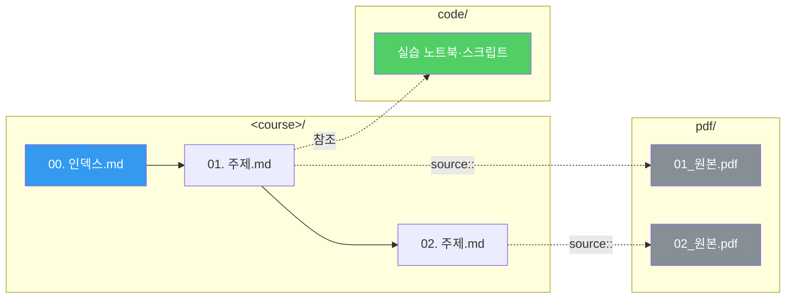

---
aliases:
  - 과목 폴더 표준
  - course-layout
course: uncategorized
created: '2026-08-28'
date: '2026-08-28'
semester: extracurricular
source: ''
status: stable
tags:
  - type/index
  - meta
title: 과목 폴더 표준 — 모든 수업 폴더의 동일한 배치
type: index
updated: '2026-08-28'
---

schema:: [지식 스키마](<knowledge-schema.md>)

[지식 스키마](<knowledge-schema.md>)가 **파일의 규격**을 정한다면,
이 문서는 **파일이 놓이는 자리**를 정한다. 모든 과목 폴더는 예외 없이 같은 배치를 따른다.

## 표준 배치

```text
ComputerScience/<분야>/<과목>/
├── 00. <과목명> 인덱스.md      MOC — 학습 경로와 정리문서 목록
├── 01. <주제>.md               정리문서 (루트 평면 배치, 번호 = 학습 순서)
├── 02. <주제>.md
├── …
├── pdf/                        원본 강의자료 — 변하지 않는 근거
│   ├── 01_<원본이름>.pdf
│   └── 02_<원본이름>.pdf
├── code/                       실습 코드 (.ipynb · .py · .sql · .java …)
├── assets/                     기타 첨부 (.docx · .xlsx · .csv · 이미지 …)
└── .ok/frontmatter.yml         폴더 가이드 (에이전트용, 스크립트 생성)
```

## 왜 이 배치인가

| 규칙 | 이유 |
| :-- | :-- |
| **정리문서는 루트에 평면** | Obsidian 위키링크가 ``01. 주제.md`` 로 단순해지고, 폴더를 파고들 필요가 없다 |
| **번호 접두 `NN.`** | 파일 정렬이 곧 학습 순서. 인덱스와 사이드바가 같은 순서로 보인다 |
| **PDF는 `pdf/` 한 곳** | `.okignore` 의 `*.pdf` 와 맞물려 OpenKnowledge 인덱스에서 통째로 빠진다 |
| **코드는 `code/`** | 검색·grep 시 정리문서와 섞이지 않는다 |
| **기타는 `assets/`** | 루트를 정리문서 전용으로 유지 |
| **주차별 폴더 없음** | `3. 프로세스와 프로세스 관리/` 같은 중간 폴더는 링크를 길게 만들고 과목마다 이름이 달라 통일이 불가능하다 |

> [!important] 정리문서와 PDF의 대응
> `01. 주제.md` 의 프론트매터 `source:` 가 `pdf/01_원본이름.pdf` 를 가리킨다.
> **번호가 같으면 짝**이라는 규칙 하나로 사람과 LLM이 동시에 대응 관계를 읽는다.



## 마이그레이션 규칙

기존 과목을 이 표준으로 옮길 때 적용하는 결정 규칙이다.

| 원본 위치 | 대상 | 비고 |
| :-- | :-- | :-- |
| 아무 곳의 `*.pdf` | `pdf/` | 이름 충돌 시 원래 상위 폴더명을 접두로 붙인다 |
| 아무 곳의 `*.ipynb` `*.py` `*.sql` `*.java` `*.c` `*.cpp` | `code/` | 하위 구조는 평탄화하되 충돌 시 폴더명 접두 |
| 아무 곳의 `*.docx` `*.xlsx` `*.csv` `*.png` `*.zip` | `assets/` | |
| 기존 `*.md` | **삭제** | 원본 PDF를 근거로 재작성한다 — [지식 스키마](<knowledge-schema.md>) 규격 적용 |
| 빈 폴더 | 제거 | |

> [!warning] `.omo` · `.planning` · `.codex` 등은 건드리지 않는다
> 에이전트 작업 흔적은 `.okignore` · `.gitignore` 관할이며 이 표준의 대상이 아니다.
>
> [!note] 예외 — 모듈형 과정
> `quantum-ml` 처럼 원본이 **모듈 계층**(`01.foundations/…`)으로 배포된 과정은
> PDF 원본 구조를 보존한다. 정리문서는 동일하게 루트에 평면 배치한다.
