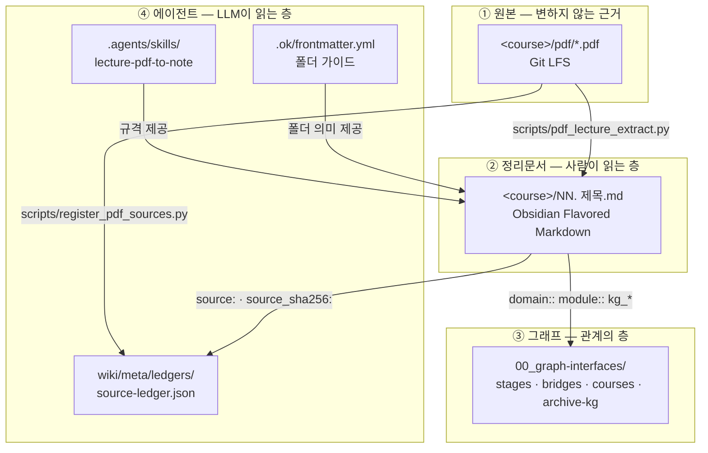

---
aliases:
  - 지식 스키마
  - knowledge-schema
course: uncategorized
created: '2026-08-28'
date: '2026-08-28'
semester: extracurricular
source: ''
status: evergreen
tags:
  - type/index
  - meta
title: 지식 스키마 — 사람과 LLM이 같이 읽는 아카이브 규격
type: index
updated: '2026-08-28'
---

# 지식 스키마

이 저장소는 **하나의 마크다운 집합을 두 종류의 독자**가 읽는다.

| 독자 | 무엇으로 읽는가 | 무엇에 의존하는가 |
|:--|:--|:--|
| **사람** | Obsidian | 위키링크, Graph View, 콜아웃, Mermaid, LaTeX, PDF 임베드 |
| **LLM / 에이전트** | OpenKnowledge MCP, Claude Code, Codex | 프론트매터, 폴더 가이드(`.ok/frontmatter.yml`), 출처 원장, 스킬 |

두 독자가 같은 파일을 보되 서로 다른 단서를 쓴다. 이 문서는 그 단서들의 규격이다.

## 레이어 구조



## 도구 세 가지가 어떻게 겹치는가

| 도구 | 이 저장소에서 맡는 역할 | 만든 것 |
|:--|:--|:--|
| **Obsidian** | 사람이 읽고 쓰는 1차 인터페이스 | 기존 vault 전체 |
| **[claude-obsidian](https://github.com/AgriciDaniel/claude-obsidian)** | 출처(provenance)와 검증 | `.claude-obsidian.json`, `wiki/`, `inbox/`, `.raw/`, source/claim 원장, `lint` |
| **[OpenKnowledge](https://github.com/inkeep/open-knowledge)** | 에이전트 탐색과 편집 | `.ok/config.yml`, 폴더별 `.ok/frontmatter.yml`, MCP 서버(`open-knowledge`), `lint`/`audit` |

> [!important] 충돌 회피 원칙
> 두 도구 모두 자기 폴더 규약(`wiki/sources/`, `external-sources/` 등)을 제안하지만
> **이 저장소는 기존 과목 폴더 구조를 유지한다.**
> claude-obsidian의 `wiki/` 는 **원장과 운영 로그 전용**으로만 쓰고,
> 강의 정리문서는 기존처럼 `ComputerScience/<field>/<course>/` 에 둔다.
> OpenKnowledge도 `content.dir: .` 로 저장소 전체를 그대로 읽는다.

## 프론트매터 스키마

기존 vault 어휘가 **우선**이고, 출처 필드를 **추가로** 얹는다.

### 공통 (모든 노트)

| 필드 | 값 | 비고 |
|:--|:--|:--|
| `title` | 노트 제목 | 필수. lint가 검사한다 |
| `type` | `lecture` \| `index` \| `moc` \| `note` \| `project` \| `concept` | |
| `status` | `seedling` \| `budding` \| `evergreen` | 디지털 가든 관례. claude-obsidian의 `seed/developing/mature/evergreen` 에 대응 |
| `course` | 수업 폴더명 | 과목 밖 문서는 `uncategorized` |
| `semester` | `1-2` ~ `4-2` \| `extracurricular` | 학년/학기는 폴더가 아니라 여기에 |
| `created` / `date` / `updated` | `'YYYY-MM-DD'` | 따옴표 포함 |
| `aliases` | 리스트 | 검색용 별칭 |
| `tags` | `type/*`, `cs/*`, `semester/*` | |

### 강의 정리문서 추가 필드 (출처)

| 필드 | 값 | 출처 규격 |
|:--|:--|:--|
| `source` | 노트 기준 상대경로 (`pdf/01_Foo.pdf`) | vault + OKF |
| `source_type` | `lecture-slides` \| `textbook` \| `handout` \| `paper` | claude-obsidian |
| `source_sha256` | 원본 PDF sha256 앞 16자 | claude-obsidian |
| `source_pages` | 원본 페이지 수 | claude-obsidian |
| `authority` | `primary` (교수 배포) \| `secondary` | claude-obsidian |
| `review_state` | `active` \| `superseded` \| `unreviewed` | claude-obsidian |

> [!tip] 왜 sha256을 노트에 박는가
> 강의자료가 개정되면 해시가 바뀐다. 그러면 `scripts/register_pdf_sources.py` 가
> 원장과 노트의 불일치를 잡아내므로 **"이 정리문서는 옛날 슬라이드 기준"** 이라는 사실이
> 사람 눈이 아니라 기계 검사로 드러난다.

### 인라인 그래프 필드

프론트매터 아래에 두는 Dataview 스타일 필드. Obsidian Graph View에 실제 엣지로 나타난다.

```
domain::        분야 인터페이스
stage::         학습 단계 인터페이스
module::        과목 인터페이스
bridge::        분야 간 브리지
source::        근거 원본
prerequisites:: 선수 노트
next::          후속 노트
related::       관련 노트 (최대 8개)
kg_*::          2026 GraphRAG 아카이브 레이어
```

> [!warning] `related::` 폭주 금지
> 과거 스크립트가 `related::` 에 수십 개를 자동 주입해 둔 노트가 있다.
> 이는 Graph View를 스파게티로 만들고 LLM 컨텍스트를 낭비한다.
> **새로 쓰는 노트는 실제 관계만 8개 이하로 적는다.**

## 시각화 규격

정리문서는 글 덩어리가 아니라 **읽는 문서**다. 한 노트에 최소 4종류를 섞는다.

| 표현 | 쓰는 상황 | Obsidian | OpenKnowledge |
|:--|:--|:--:|:--:|
| 마크다운 표 | 비교·분류·스펙·용어 | ✅ | ✅ |
| Mermaid | 흐름·구조·순서·타임라인·분포 | ✅ | ✅ |
| 콜아웃 `> [!type]` | 요약·정의·예시·주의·자문자답 | ✅ | ✅ |
| LaTeX `$$…$$` | 수식·복잡도·증명 | ✅ | ✅ |
| PDF 페이지 임베드 `![[x.pdf#page=N]]` | 원본 도해 | ✅ (PDF++) | ✅ |
| ` ```html preview ` 임베드 | 인터랙티브 차트 | ❌ 코드블록으로 보임 | ✅ |

> [!note] `html preview` 를 기본으로 쓰지 않는 이유
> OpenKnowledge에서는 테마 연동 인터랙티브 차트로 렌더되지만,
> Obsidian에서는 그냥 HTML 코드 덩어리로 보인다.
> **사람이 읽는 1차 인터페이스는 Obsidian이므로 Mermaid를 1순위로 쓴다.**

### Mermaid 종류별 용도

| 종류 | 쓰는 상황 |
|:--|:--|
| `flowchart` | 처리 흐름, 의사결정, 계층 구조 |
| `sequenceDiagram` | 프로토콜, 통신, 호출 순서 (MPI·네트워크에 특히 적합) |
| `mindmap` | 강의 전체 개념 지도 (각 노트 상단에 하나) |
| `timeline` | 발전사, 세대 구분 |
| `stateDiagram-v2` | 프로세스 상태, 생명주기 |
| `quadrantChart` | 2축 트레이드오프 |
| `xychart-beta` | 성능 곡선, 스케일링 |
| `block-beta` | 메모리 레이아웃, 하드웨어 블록도 |
| `gantt` | 스케줄링, 파이프라인 타이밍 |
| `classDiagram` | 타입 계층, 데이터 모델 |

Mermaid는 커밋 전에 반드시 파서로 검증한다.

```bash
node scripts/check_mermaid.mjs --dir "ComputerScience/04_systems-infrastructure/parallel-distributed-computing"
```

## 폴더 가이드 — LLM이 폴더를 이해하는 방법

각 폴더의 `.ok/frontmatter.yml` 은 에이전트가 `ls` / `cat` / `search` 를 호출할 때마다
함께 노출된다. **사람은 폴더 트리를 보고, LLM은 이 설명을 본다.**

```yaml
title: "병렬 · 분산처리"
description: "Stanford CS149 기반. ... 학기: 3-1. 원본 강의자료는 `pdf/` 에 있고 ..."
tags:
  - course
  - semester/3-1
```

생성/갱신은 스크립트로 한다 (멱등적).

```bash
python3 scripts/generate_folder_guides.py
```

## 스크립트

| 스크립트 | 하는 일 |
|:--|:--|
| `scripts/pdf_lecture_extract.py` | 강의 PDF → 추출 번들 (`text.md`, `meta.json`, 페이지 PNG) |
| `scripts/register_pdf_sources.py` | PDF를 출처 원장에 등록. LFS 포인터에서 sha256을 읽으므로 전체 다운로드 불필요 |
| `scripts/generate_folder_guides.py` | 폴더별 `.ok/frontmatter.yml` 생성 |
| `scripts/check_mermaid.mjs` | 노트 안 Mermaid 블록을 실제 파서로 검증 |

## 검증 파이프라인

```bash
# 1. Mermaid 문법
node scripts/check_mermaid.mjs --dir "ComputerScience"

# 2. OpenKnowledge 린트 (마크다운 + 내부 링크)
npx -y @inkeep/open-knowledge@latest lint "ComputerScience"

# 3. claude-obsidian 린트 (데드링크 · 고아노트 · 프론트매터 결함 · 원장 계약)
python3 <claude-obsidian 체크아웃>/scripts/claude-obsidian.py lint --vault . --format markdown

# 4. 출처 원장 동기화
python3 scripts/register_pdf_sources.py
```

## 관련

- [[.agents/skills/lecture-pdf-to-note/SKILL.md|lecture-pdf-to-note 스킬]]
- [[AGENTS|AGENTS.md]]
- [[README|아카이브 홈]]
