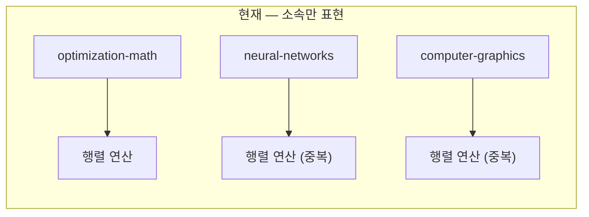
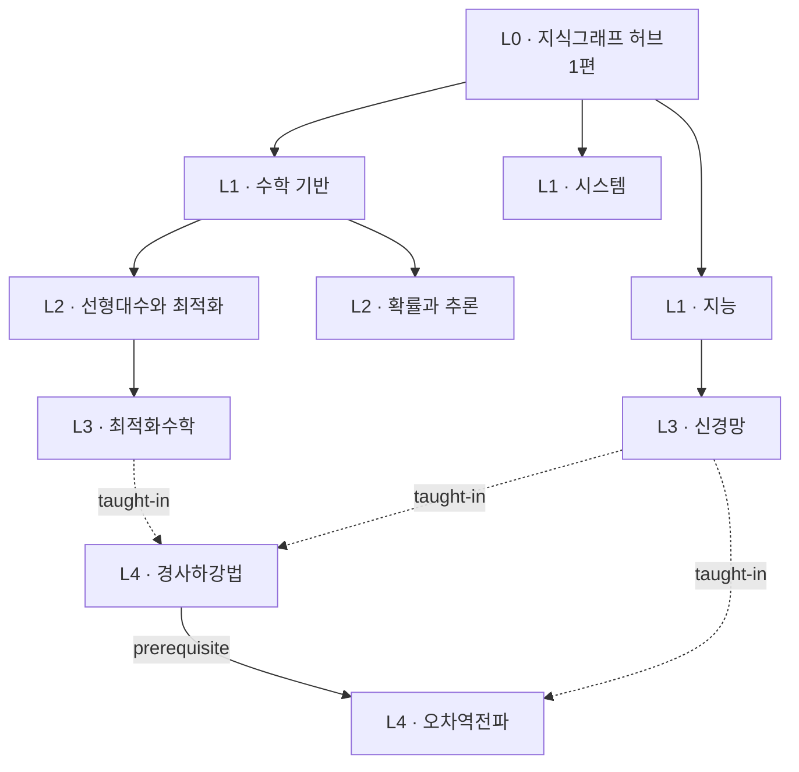

> [!abstract] 이 문서의 결론 세 줄
>
> 1. **Obsidian 의존 문법을 전부 걷어낸다** — Dataview 인라인 필드 1,125개 파일, Canvas 3종, `.obsidian/`.
> 2. **그래프를 T자에서 사다리로 바꾼다** — 관계 타입을 정의하고, 개념을 과목에서 해방시킨다.
> 3. **정리문서는 공식 부품으로 조립한 맞춤 템플릿을 쓴다** — 강의 정리문서용 공식 템플릿은 존재하지 않는다.

## 1. 진단 — 지금 무엇이 문제인가

### 1.1 규모

```html preview
<div style="font-family:system-ui,sans-serif;padding:20px">
  <div id="cards" style="display:flex;gap:14px;flex-wrap:wrap"></div>
  <script>
    var stats = [
      ['전체 문서', '1,376', '.md 파일', 'var(--chart-1)'],
      ['Obsidian 의존', '1,125', '전체의 82%', 'var(--chart-5)'],
      ['그래프 레이어', '654', 'archive-kg 600 포함', 'var(--chart-4)'],
      ['정리문서 대상', '407', '남은 과목 36개', 'var(--chart-3)'],
      ['PDF 추출 번들', '32', '재사용 가능', 'var(--chart-2)']
    ];
    document.getElementById('cards').innerHTML = stats.map(function (s) {
      return '<div style="flex:1;min-width:150px;padding:16px;background:var(--card);' +
        'color:var(--card-foreground);border:1px solid var(--border);' +
        'border-radius:var(--radius)">' +
        '<div style="font-size:13px;color:var(--muted-foreground)">' + s[0] + '</div>' +
        '<div style="font-size:26px;font-weight:700;margin-top:4px">' + s[1] + '</div>' +
        '<div style="font-size:12px;font-weight:600;margin-top:4px;color:' + s[3] + '">' +
        s[2] + '</div>' +
        '</div>';
    }).join('');
  </script>
</div>
```

### 1.2 그래프가 빈약해 보이는 진짜 이유

계층별 노드 수를 세어 보면 원인이 한눈에 드러납니다.

```html preview
<div style="font-family:system-ui,sans-serif;padding:20px;color:var(--foreground)">
  <h3 style="margin:0 0 4px;font-size:15px;font-weight:600">kg_level 분포 — 현재</h3>
  <p style="margin:0 0 16px;font-size:13px;color:var(--muted-foreground)">
    최하위(L4)가 전체의 74%. 중간 계층 L1·L2는 각 18편으로 사실상 비어 있다.
  </p>
  <div id="bars" style="display:flex;align-items:flex-end;gap:18px;height:190px"></div>
  <script>
    var data = [['L0 허브', 2], ['L1 단계', 18], ['L2 분야', 18], ['L3 과목', 129], ['L4 개념', 487]];
    var max = Math.max.apply(null, data.map(function (d) { return d[1]; }));
    document.getElementById('bars').innerHTML = data.map(function (d, i) {
      return '<div style="flex:1;display:flex;flex-direction:column;align-items:center;' +
        'gap:6px;height:100%;justify-content:flex-end">' +
        '<span style="font-size:13px;font-weight:700">' + d[1] + '</span>' +
        '<div style="width:100%;height:' + Math.max(d[1] / max * 100, 1.2) + '%;' +
        'background:var(--chart-' + (i + 1) + ');' +
        'border-radius:var(--radius) var(--radius) 0 0"></div>' +
        '<span style="font-size:12px;color:var(--muted-foreground);text-align:center">' + d[0] + '</span>' +
        '</div>';
    }).join('');
  </script>
</div>
```

> [!warning] 이것이 ==T자 구조==다
> 뿌리(L0) 2개에서 잎(L4) 487개로 곧장 떨어진다. 사람이 그래프를 볼 때 기대하는 **"큰 덩어리 → 중간 덩어리 → 개별 개념"** 의 사다리가 없다.
> 그래서 넓게 펼쳐져 있는데도 얕아 보인다.

### 1.3 개념이 과목에 갇혀 있다

`archive-kg/concepts/` 486편이 과목별 폴더로 나뉘어 있습니다. 이 배치가 표현할 수 있는 관계는 **소속 하나뿐**입니다.



같은 개념이 과목마다 **별개 노드로 중복**됩니다. 정작 알고 싶은 것 — *"경사하강법은 최적화수학에서 배우고 신경망에서 쓴다"* — 은 어디에도 기록되지 않습니다.

### 1.4 과목 계층이 이중화돼 있다

| 위치 | 편수 | `kg_role` | 문제 |
| :-- | --: | :-- | :-- |
| `courses/` | 39 | `course-interface` | 어느 쪽이 정본인지 불명확 |
| `archive-kg/courses/` | 41 | `course-profile` | 편수도 다름 (39 vs 41) |

## 2. 결정 사항

### 2.1 위키링크 — 되돌리지 않는다

인수인계에서 "되돌릴지 검토"를 요청받았으나, **실측 결과 되돌릴 이유가 없습니다.**

<details>
<summary>근거 — 마크다운 링크로 그래프 엣지가 이미 살아 있다</summary>

`10. Quantum Circuit과 QML.md` 를 MCP로 읽은 결과입니다.

```json
"backlinkCount": 3,
"forwardLinkCount": 4,
"forwardLinks": [
  { "kind": "doc", "docName": "...quantum-ml/09. Quantum Circuit" },
  { "kind": "doc", "docName": "...quantum-ml/05. QML에서 Quantum의 역할" }
]
```

본문의 `[09. Quantum Circuit](<09. Quantum Circuit.md>)` 가 **forward link로 정상 인식**되고 있습니다.
위키링크의 유일한 강점이던 그래프 연결이 표준 마크다운 링크로도 그대로 작동합니다.

그리고 공식 문서 `linking.md` 원문:

> the parser still handles it for legacy content, but it's **NO LONGER the recommended default**.

추가로 `quantum-ml` 폴더 `audit` 결과가 **12편 전부 위반 0건** 입니다. 되돌리면 325건의 경고가 되살아납니다.

</details>

> [!note] 다만 하나는 메워야 한다
> `![[file.pdf#page=3]]` 는 PDF 페이지를 **인라인으로** 보여줬는데, 마크다운 링크는 클릭 이동만 됩니다.
> 이 손실은 되돌리기가 아니라 **페이지 PNG 임베드**로 메웁니다 — `.ok/local/pdf-extract/` 에 32개 번들의 `pages/*.png` 가 이미 있습니다.

### 2.2 Obsidian 제거 목록

| 대상 | 규모 | 처리 |
| :-- | :-- | :-- |
| Dataview 인라인 필드 `domain::` `module::` `kg_parent::` 등 | **1,125 파일** | 관계 정보를 프론트매터로 이전 후 제거 |
| `.canvas` 3종 | 96 KB | 삭제 — Mermaid + `html preview` 로 대체 |
| `.obsidian/` | 16 KB | 삭제 |
| `status: seedling / budding / evergreen` | 전역 | `draft / stable / deprecated` 로 통일 |
| `_templates/` (Templater 문법 `<% tp.file.title %>`) | 5편 | 삭제 — `.ok/templates/` 로 대체 |

> [!caution] 삭제는 승인 후에만
> 위 항목 중 **어느 것도 아직 건드리지 않았습니다.** 승인 전까지 삭제는 없습니다.

## 3. 그래프 스키마 재설계

### 3.1 관계 타입을 정의한다

지금은 사실상 `related::` 나열뿐입니다. 의미 있는 엣지 타입을 정의합니다.

| 관계 | 방향 | 의미 | 예시 |
| :-- | :-- | :-- | :-- |
| `prerequisite` | A → B | A를 알아야 B를 이해한다 | 선형대수 → 주성분분석 |
| `uses` | A → B | A가 B를 도구로 쓴다 | 신경망 학습 → 경사하강법 |
| `generalizes` | A → B | A가 B의 일반형이다 | 최적화 → 최소제곱법 |
| `contrasts` | A ↔ B | 대비하면 이해가 는다 | 배치 경사하강법 ↔ 확률적 경사하강법 |
| `applies-to` | A → B | A가 B 영역에 적용된다 | 푸리에 변환 → 신호처리 |
| `taught-in` | 개념 → 과목 | 이 과목에서 다룬다 | 경사하강법 → 최적화수학, 신경망 |

> [!important] `related` 는 금지한다
> 타입 없는 `related` 는 "뭔가 관련 있음"이라는 정보 0에 가까운 엣지입니다.
> 위 6종 중 하나로 표현할 수 없다면, 그 연결은 아직 이해가 덜 된 것입니다.

### 3.2 계층을 채운다 — L1·L2 신설



핵심은 점선입니다. **`경사하강법` 은 하나의 노드**이고, 최적화수학과 신경망 **양쪽이 그것을 가리킵니다.** 소유가 아니라 참조입니다.

### 3.3 개념 노드를 과목에서 해방시킨다

<details>
<summary>이전 방식과 새 방식 비교</summary>

**이전** — 과목이 개념을 소유. 중복 노드 발생.

```text
concepts/optimization-math/경사하강법.md
concepts/neural-networks/경사하강법.md      ← 중복
concepts/machine-learning/경사하강법.md     ← 중복
```

**이후** — 개념은 하나. 과목이 개념을 가리킴.

```text
concepts/경사하강법.md
  frontmatter:
    taught_in: [optimization-math, neural-networks, machine-learning]
    uses: [편미분, 학습률]
    prerequisite_of: [오차역전파, Adam 옵티마이저]
```

</details>

> [!tip]- 중복 개념은 어떻게 찾는가
> `search` 툴의 semantic 검색이 이 프로젝트에서 활성화돼 있습니다 (`search.semantic.enabled: true`).
> 키워드가 달라도 의미가 같은 노드를 찾아낼 수 있으니, 병합 후보 탐지에 이걸 씁니다.

### 3.4 과목 계층 이중화 해소

`courses/`(39편, 인터페이스)를 **정본**으로 삼고, `archive-kg/courses/`(41편, 프로파일)의 고유 정보를 흡수한 뒤 통합합니다. 편수 차이 2편이 무엇인지 먼저 확인합니다.

## 4. 정리문서 템플릿

### 4.1 "공식 템플릿"의 정확한 의미

> [!important] 강의 정리문서용 공식 템플릿은 존재하지 않는다
> 공식 팩 8종은 전부 다른 용도입니다 — 연구 아티클, 코드베이스 위키, 개인 CRM, 세계관 등.
> 공식 문서 `starter-packs.md` 원문이 이를 명시합니다:
>
> *"proven layouts you can study to build a **similar** structure of your own — adapt the idea, don't clone the pack"*
> *"propose a **tailored variant**, not a verbatim copy"*

따라서 이 설계는 **공식 부품과 공식 절차로 조립한 맞춤 템플릿**입니다.

| 층위 | 공식성 | 근거 |
| :-- | :-- | :-- |
| 컴포넌트 문법 | **공식 그대로, 변형 없음** | `palette` 툴 반환값 |
| 저장 메커니즘 | **공식 그대로** | `write({ template })` → `<folder>/.ok/templates/` |
| 구조 아키타입 | 참고 후 변형 | `knowledge-base` 팩 (출처 기반 문서) |
| 도메인 골격 | 맞춤 설계 | 위 셋을 근거로 조립 |

### 4.2 프론트매터 — 16키에서 12키로

<details>
<summary>변경 내역 — 무엇을 왜 버리는가</summary>

| 키 | 처리 | 이유 |
| :-- | :-- | :-- |
| `type` | **유지** | OKF 유일 필수 키 |
| `title` `description` | **유지 · description 신규** | OK 필수. 기존 템플릿에 누락돼 있었음 |
| `tags` `course` `semester` | 유지 | 검색·분류에 실제로 쓰임 |
| `source` `source_pages` | 유지 | 근거 추적 |
| `status` | 유지 · **어휘 교체** | `seedling/evergreen` → `draft/stable/deprecated` |
| `aliases` `created` `updated` | 유지 | 표준 관례 |
| `date` | **폐기** | `created` 와 완전 중복 |
| `authority` | **폐기** | 자작 키. 소비하는 도구 없음 |
| `review_state` | **폐기** | `status` 와 의미 중복 |
| `source_sha256` | **폐기** | `.ok/local/pdf-extract/*/meta.json` 이 이미 보관 |

</details>

> [!bug] 발견된 버그 — 반드시 고쳐야 함
> 기존 템플릿은 `created: {{date}}` 를 **따옴표 없이** 씁니다. YAML은 `{` 를 flow mapping 시작으로 읽으므로 이렇게 파싱됩니다:
>
> ```json
> "created": { "{ date }": null }   // 문자열이 아니라 객체
> ```
>
> 새 템플릿은 `created: "{{date}}"` 로 감쌉니다.

### 4.3 컴포넌트 사용 규칙 — 어디에 무엇을 쓰는가

이전 세션이 "빈약하다"는 지적을 받은 지점입니다. 각 부품의 **쓸 자리를 못 박습니다.**

| 부품 | 쓸 자리 | 이전 세션 |
| :-- | :-- | --: |
| ` ```html preview ` | 분포·수렴곡선·비교·측정결과·진행률 | **0건** |
| `<details>` | 긴 수식 유도, 전체 코드, 곁가지 | **0건** |
| `<Tabs>` | 같은 개념의 수식 / 코드 / 직관 병치 | **0건** |
| `==하이라이트==` | 정의가 처음 등장하는 핵심 용어 | **0건** |
| 콜아웃 `+`/`-` 접이식 | 자가점검 문답, 심화 | **0건** |
| 콜아웃 15종 | 유형별로 구분해서 | 4~5종 |
| ` ```mermaid ` | 흐름·상태·의존 (**색 지정 금지**) | 색 하드코딩 |

> [!failure] 이전 세션의 실제 파손 사례
> `10. Quantum Circuit과 QML.md` 의 mermaid 에 `style FM fill:#339af0,color:#fff` 가 들어 있습니다.
> 다크 모드에서 **테마를 따라가지 않는 밝은 사각형**이 됩니다.
> 같은 문서의 측정 결과 `{'00': 583, '10': 279, '01': 115, '11': 23}` 은 분포 차트로 그려야 할 교과서적 사례인데 표로만 있습니다.

### 4.4 이렇게 달라진다 — 실물 비교

<Tabs>
  <Tab label="이전 (표만)">

측정 결과를 표로만 제시.

| 상태 | 관측 횟수 | 상대 빈도 |
| :--: | --: | --: |
| `00` | 583 | 58.3% |
| `10` | 279 | 27.9% |
| `01` | 115 | 11.5% |
| `11` | 23 | 2.3% |

  </Tab>
  <Tab label="이후 (차트 + 표)">

```html preview
<div style="font-family:system-ui,sans-serif;padding:20px;color:var(--foreground)">
  <h3 style="margin:0 0 4px;font-size:15px;font-weight:600">측정 결과 — 1,000 shots</h3>
  <p style="margin:0 0 16px;font-size:13px;color:var(--muted-foreground)">
    랜덤 파라미터 상태. 학습 전이므로 분포에 의미는 없다 — 학습이란 이 막대를 정답 쪽으로 미는 일이다.
  </p>
  <div id="q" style="display:flex;align-items:flex-end;gap:20px;height:170px"></div>
  <script>
    var d = [['|00⟩', 583], ['|10⟩', 279], ['|01⟩', 115], ['|11⟩', 23]];
    var mx = 583;
    document.getElementById('q').innerHTML = d.map(function (x, i) {
      return '<div style="flex:1;display:flex;flex-direction:column;align-items:center;' +
        'gap:6px;height:100%;justify-content:flex-end">' +
        '<span style="font-size:13px;font-weight:700">' + (x[1] / 10).toFixed(1) + '%</span>' +
        '<div style="width:100%;height:' + (x[1] / mx * 100) + '%;' +
        'background:var(--chart-' + (i + 1) + ');' +
        'border-radius:var(--radius) var(--radius) 0 0"></div>' +
        '<span style="font-size:13px;color:var(--muted-foreground);font-family:ui-monospace,monospace">' +
        x[0] + '</span></div>';
    }).join('');
  </script>
</div>
```

  </Tab>
</Tabs>

> [!question]- 왜 표를 없애지 않고 둘 다 두는가
> 차트는 **비율**을, 표는 **정확한 값**을 전달합니다. 정량 데이터에서 둘은 경쟁이 아니라 보완입니다.
> 다만 순서가 중요합니다 — 차트를 먼저 보여주고 표를 근거로 붙입니다.

## 5. 삭제 · 보존 목록

> [!danger] 승인이 필요한 삭제
>
> | 대상 | 편수 | 대체물 |
> | :-- | --: | :-- |
> | `quantum-ml/00.`~`10.` 정리문서 | 11 | 새 템플릿으로 재작성 |
> | `neural-networks/00.`~`05.` 정리문서 | 6 | 새 템플릿으로 재작성 |
> | `docs/knowledge-schema.md` | 1 | 이 문서 + 폴더 description |
> | `.canvas` 3종 | 3 | Mermaid + `html preview` |
> | `.obsidian/` `_templates/` | — | `.ok/templates/` |

삭제 목록 반대편에는 함께 지우면 손해가 큰 것들이 있습니다.

> [!success] 반드시 보존
>
> | 대상 | 규모 | 이유 |
> | :-- | --: | :-- |
> | `.ok/local/pdf-extract/` | **32 번들** | `text.md` + `meta.json` + `pages/*.png`. 재작성의 1차 근거 |
> | `양자 ML 과정.md` | 1 | 31개 문서가 참조하는 그래프 허브 |
> | `00_graph-interfaces/` | 654 | 그래프 본체. 구조만 바꾸고 내용 보존 |
> | `archive-kg/evidence/` | 41 | 근거 인덱스 |
> | `scripts/*.py` | 2 | 남은 36과목에 재사용 |
> | `docs/course-layout.md` | 1 | 폴더 표준은 도구 중립적 |

## 6. 실행 순서


> [!note] 왜 그래프가 템플릿보다 먼저인가
> 정리문서의 프론트매터(`taught_in`, `prerequisite`, `uses`)가 **곧 그래프의 엣지**입니다.
> 스키마를 정하지 않고 템플릿을 확정하면, 나중에 407편의 프론트매터를 다시 고쳐야 합니다.

### 커밋 전략

`②~④` 를 **한 커밋**으로 묶습니다. 삭제와 재작성을 나누면 diff에서 "무엇이 무엇으로 대체됐는지"가 보이지 않기 때문입니다. 이 저장소는 sparse-checkout 이므로 `git add --sparse` / `git rm --sparse` 를 씁니다.
