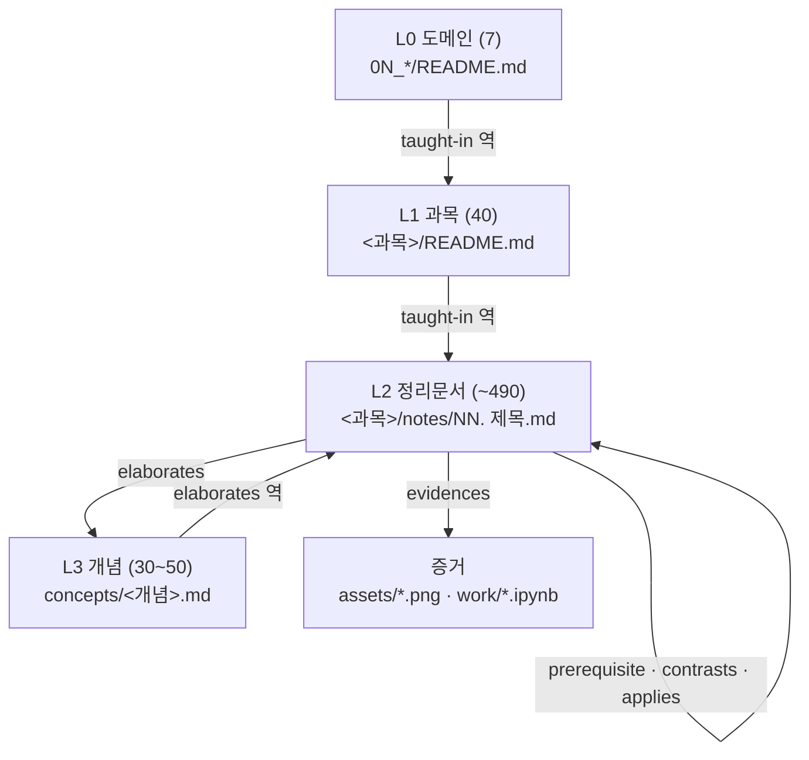

> [!abstract] 한 줄 요약
> 그래프가 빈약했던 것은 노드가 적어서가 아니다 — 600개나 있었다.
> **간선에 의미가 없었고, 그 노드들이 정리문서를 가리키지 않았기 때문**이다.

---

## 1. 진단 — 무엇이 잘못되었는가

### 1.1 삭제 전 상태 (실측)

| 지표 | 값 | 문제 |
| :-- | --: | :-- |
| 전체 문서 | 1,376 | — |
| `archive-kg` | 600 | 전체의 44%가 GraphRAG 실험 산출물 |
| 최상위 허브 | 602 backlinks | `2026 GraphRAG 아카이브 스켈레톤` — 학습 내용이 아님 |
| 2·3위 허브 | 423 / 417 | `Fact Retrieval` / `Complex Reasoning` — 역시 메타 |
| 고아 | 133 | 다수가 `.omo/` 작업 산출물 |
| 끊긴 링크 | 26 | 전부 `archive-kg/concepts/` 가 소스 |

### 1.2 근본 원인 세 가지

첫째, **간선에 의미가 없었다**. 모든 링크가 무명이라 $A \to B$ 가 선행관계인지 반례인지 응용인지 구분되지 않았다. 그래프가 아니라 ==링크 더미== 였다.

둘째, **개념 노드가 자기끼리만 링크했다**. `concepts/machine-learning/svm` 같은 노드가 600개 있었지만 실제 정리문서로 돌아가는 간선이 없어서, 노드 수만 늘고 탐색은 불가능했다.

셋째, **메타가 내용을 압도했다**. 그래프를 설명하는 문서가 그래프의 중심이 되면, "이걸 배우려면 뭐를 먼저 보나"에 답할 수 없다.

### 1.3 삭제 후 현재 상태

654개를 제거해 `00_graph-interfaces` 를 비웠다. 복구 경로는 커밋 `0d842fb9` 에 확보되어 있다.

| 지표 | 값 |
| :-- | --: |
| 전체 문서 | 738 |
| 문제 있는 문서 | 487 (66%) |
| 위키링크 잔존 | 저장소 전반 |
| 규격을 지키는 문서 | 17편 (quantum-ml · neural-networks) |

---

## 2. 설계 원칙

> [!important] 세 가지 약속
> **간선은 의미를 가진다.** 모든 링크가 6종 타입 중 하나를 명시한다.
> **모든 주장은 증거에 닿는다.** 슬라이드 페이지나 실행된 노트북 셀로 건너간다.
> **정보는 한 곳에만 있다.** 폴더·프론트매터·본문이 같은 것을 중복 저장하지 않는다.

세 번째가 가장 쉽게 깨진다. 순서를 폴더명과 프론트매터와 본문에 모두 적으면 세 곳이 서서히 어긋난다. 역할을 나눈다.

| 무엇을 | 어디가 담는가 |
| :-- | :-- |
| 가공 단계 (받았나·만들었나·썼나) | 폴더 (`sources/` · `work/` · `notes/`) |
| 파일 종류 | 확장자 |
| 학습 순서·선행관계 | **지식그래프** (정본) |
| 목록 가독성 | 파일명 번호 (표시용, 그래프에 종속) |

---

## 3. 4계층 구조



### 계층별 역할

| 계층 | 수 | 파일 | 책임 |
| :--: | --: | :-- | :-- |
| L0 | 7 | `ComputerScience/0N_*/README.md` | 분야 개관·소속 과목 목록 |
| L1 | 40 | `<과목>/README.md` | 과목 개요·학습 경로·노트 목록 |
| L2 | ~490 | `<과목>/notes/NN. 제목.md` | 강의 단위 정리 (이론 + 실습) |
| L3 | 30–50 | `ComputerScience/concepts/<개념>.md` | 과목을 가로지르는 개념 |

> [!warning] L3 는 엄격히 제한한다
> `archive-kg` 가 600개로 불어난 것은 기준이 없었기 때문이다. 개념 노드는 다음을 **모두** 만족할 때만 만든다.
>
> 1. 서로 다른 **두 과목 이상**에서 실제로 다뤄진다
> 2. 그 개념을 **정의하는 문서**가 존재한다 (정의처로 되돌아가는 간선을 걸 수 있다)
> 3. 단순 약어가 아니다 (`api` · `cpu` 같은 노드는 만들지 않는다)

예를 들면 ==경사하강법== 은 `neural-networks` · `quantum-ml` · `machine-learning` · `optimization-math` 네 과목에 걸치므로 개념 노드가 된다. 반면 `svm` 은 `machine-learning` 안에만 있으면 만들지 않는다.

---

## 4. 관계 타입 — 6종

간선에 의미를 실는 것이 이 설계의 핵심이다.

| 타입 | 의미 | 방향 | 예 |
| :-- | :-- | :--: | :-- |
| `prerequisite` | A를 이해하려면 B를 먼저 봐야 한다 | A→B | 07 상태변화 → 06 Hadamard Gate |
| `elaborates` | A가 B를 더 깊게 다룬다 | A→B | 08 Gate 개념 → 개념:유니터리 연산 |
| `contrasts` | A와 B가 서로 대조된다 | 양방향 | 03 Bit와 Qubit ↔ 08 Quantum Gate |
| `applies` | A가 B를 사용·응용한다 | A→B | 10 QML 회로 → 04 Feature Space |
| `evidences` | A의 근거가 B다 | A→B | 07 상태변화 → `day05_04-p013.png` |
| `taught-in` | A가 B 과목·분야에 속한다 | A→B | 07 상태변화 → 양자 ML |

### 기존 라벨에서의 이행

이미 쓰고 있는 17편에는 다른 라벨이 있다. 다음으로 통합한다.

| 기존 | → | 새 | 이유 |
| :-- | :--: | :-- | :-- |
| `uses` | → | `applies` | 같은 관계를 두 이름으로 부를 이유가 없다 |
| `applies-to` | → | `applies` | 하이픈 표기 통일 |
| `generalizes` | → | `elaborates` (역) | "A가 B를 일반화" = "B가 A를 상세화" — 방향만 바꾸면 된다 |

> [!note] 반대 방향을 따로 적지 않는다
> A가 B를 `prerequisite` 로 가리키면 B쪽에는 아무것도 쓰지 않는다. OK 가 backlink 를 자동으로 계산하므로 양쪽에 적으면 중복이고, 반드시 한쪽이 말라 죽는다. `contrasts` 만 예외로 양쪽에 적는다 (대조는 양쪽 문서에서 모두 읽혀야 의미가 생긴다).

---

## 5. 관계를 어떻게 적는가

위키링크를 쓰지 않기로 했으므로 **표준 마크다운 링크 + 타입 라벨**로 표현한다. 각 문서의 `## 관련 개념` 섹션에 고정 형식으로 적는다.

```markdown
## 관련 개념

- **prerequisite** — [06. Hadamard Gate](<./06. Hadamard Gate.md>) : H 게이트의 동작을 먼저 알아야 한다
- **contrasts** — [08. Quantum Gate 개념](<./08. Quantum Gate 개념.md>) : 개별 게이트와 순서 효과를 대조한다
- **applies** — [04. Quantum Feature Space](<./04. Quantum Feature Space.md>) : 여기서 본 상태 변화를 인코딩에 쓴다
```

형식이 고정이므로 정규식 하나로 전체 그래프를 추출할 수 있다.

```text
^- \*\*([a-z-]+)\*\* — \[([^\]]+)\]\(<([^>]+)>\)\s*:\s*(.*)$
```

### 프론트매터에는 관계를 중복 저장하지 않는다

현재 17편은 프론트매터에 `prerequisite: [...]` 를 따로 두고 본문에도 같은 관계를 적고 있다. 둘이 어긋나면 어느 쪽이 맞는지 판단할 근거가 없으므로 **프론트매터에서 제거**하고 본문을 단일 정본으로 삼는다.

프론트매터에 남기는 것은 문서 자체의 속성뿐이다 — `title` `description` `type` `tags` `course` `semester` `source` `status` `aliases` `created` `updated`.

---

## 6. 증거 연결 — 이 저장소의 강점

대부분의 지식그래프가 못 하는 일을 여기서는 할 수 있다. 주장이 추측이 아니라 **실측된 자료**에 닿아 있기 때문이다.

| 증거 종류 | 수량 | 연결 방식 |
| :-- | --: | :-- |
| 슬라이드 페이지 PNG | 239장 | 본문 인라인 `` |
| 실행된 노트북 | 174개 | `- **evidences** — [노트북](<../work/....ipynb>) : 무엇을 보이는가` |
| 원본 PDF | 21편 | `> [!quote] 슬라이드 근거` + 페이지 번호 |

슬라이드 임베드는 그 자체로 증거 간선이다. OK 가 파일 링크로 인식하므로 별도 표기가 필요 없고, 경로가 깨지면 `audit` 이 `no-such-file` 로 잡아낸다.

> [!tip] 학습 경로를 손으로 지어내지 않는다
> `prerequisite` 간선은 이미 데이터에 있다 — 노트북 폴더의 번호가 강의 진도 순이고, 정리문서 01~16도 순서를 가진다. 이 순서에서 유도하면 정합성이 보장된다.

---

## 7. 검증 규칙

설계가 지켜지는지 기계적으로 확인할 수 있어야 한다. 다음을 검사한다.

1. **라벨 유효성** — 모든 관계 라벨이 6종 중 하나인가
2. **사이클 없음** — `prerequisite` 그래프가 비순환(DAG)인가
3. **고아 없음** — 모든 L2 문서가 최소 1개의 인바운드 간선을 가지는가
4. **증거 보유** — 모든 L2 문서가 최소 1개의 `evidences` 를 가지는가
5. **개념 왕복** — 모든 L3 노드가 정의처 문서로 되돌아가는 간선을 가지는가
6. **링크 무결성** — `audit` 이 `dead-link` · `no-wiki-links` 0건인가

5번이 `archive-kg` 가 실패한 지점이므로 특히 중요하다.

---

## 8. 구축 순서


| 단계 | 내용 | 규모 |
| :--: | :-- | :-- |
| 1 | 위키링크·Dataview·계층태그 제거 | 487개 문서 |
| 2 | `notes/` `sources/` `work/` 로 재배치 | 40개 과목 |
| 3 | 과목 `README.md` 작성 | 40편 (현재 3편) |
| 4 | 관계 타입 부여·정리 | ~490문서 |
| 5 | 과목 교차 개념 추출 | 30–50개 |
| 6 | 검증 스크립트 작성 | `scripts/graph_check.py` |

단계 1과 2는 기계적이라 일괄 처리가 가능하고, 4와 5는 내용 판단이 필요해 과목별로 진행한다.

---

## 9. 이 설계가 답할 수 있게 되는 질문

그래프가 잘 동작하는지는 질문으로 판단한다.

| 질문 | 어떻게 답하는가 |
| :-- | :-- |
| "QSVM을 보려면 뭐를 먼저 알아야 하나" | `prerequisite` 간선을 역추적 |
| "경사하강법을 다룬 수업이 어디어디인가" | 개념 노드의 backlink |
| "이 주장의 근거가 뭐냐" | `evidences` 간선 → 슬라이드 페이지·노트북 셀 |
| "선형모델 한계와 대조되는 내용이 어디 있나" | `contrasts` 간선 |
| "이 과목에서 안 배우고 넘어간 것이 있나" | 개념 노드 중 backlink가 한 과목뿐인 것 |

현재 그래프는 이 다섯 개 중 어느 것도 답하지 못한다.

## 출처

- 삭제 전 그래프 실측: `links({ kind: ["hubs","orphans","dead"] })` (2026-08-28)
- 삭제 후 상태: `audit()` — 문서 738개 · 문제 문서 487개
- 복구 기준점: 커밋 `0d842fb9`
