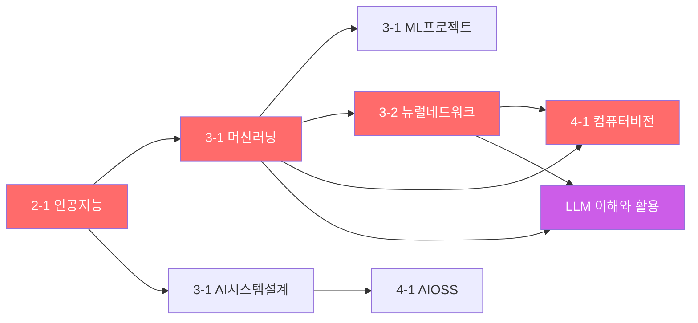
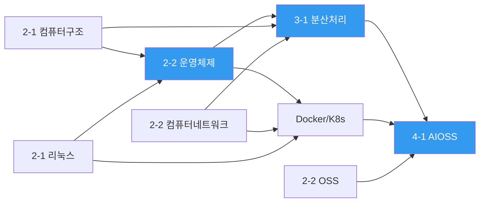
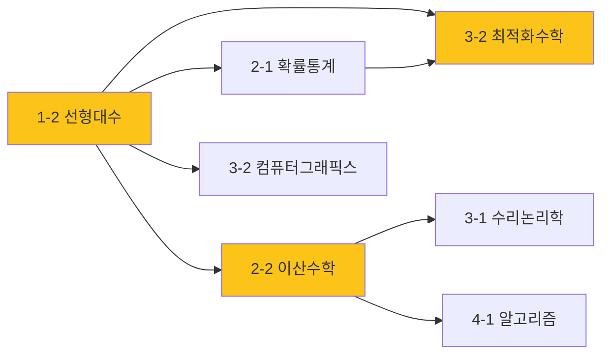
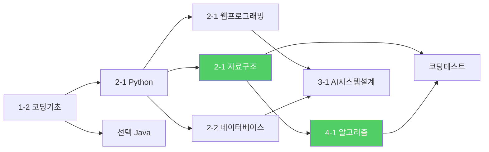

# 커리큘럼 관계 정리

> [!tip] Canvas 그래프 보기
> ![[커리큘럼 관계 그래프.canvas]] 에서 시각적 관계 그래프를 확인할 수 있습니다.

---

## 도메인별 트랙 분류

### 🔴 AI/ML 트랙



| 학기 | 과목 | 핵심 주제 | 선수 관계 |
|------|------|-----------|-----------|
| 2-1 | 인공지능 | Perceptron, MLP, CNN | ← 선형대수, Python |
| 3-1 | 머신러닝 | SVM, RNN, Transformer | ← 인공지능, 확률통계 |
| 3-1 | AI시스템설계 | 서비스 설계/구현 | ← 인공지능, DB, 웹 |
| 3-1 | ML프로젝트 | 실전 프로젝트 | ← 머신러닝 |
| 3-2 | 뉴럴네트워크 | 고급 DL 아키텍처 | ← 머신러닝, 최적화수학 |
| 3-2 | 빅데이터분석 | 데이터 분석 기법 | ← 머신러닝, DB, 확률통계 |
| 4-1 | 컴퓨터비전 | 영상처리, 특징추출 | ← 뉴럴네트워크, 그래픽스 |

---

### 🔵 시스템/인프라 트랙



| 학기 | 과목 | 핵심 주제 | 선수 관계 |
|------|------|-----------|-----------|
| 2-1 | 컴퓨터구조 | CPU, 메모리, 논리회로 | ← 코딩기초 |
| 2-1 | 리눅스 | Shell, Flask, Docker입문 | ← Python |
| 2-2 | 운영체제 | 프로세스, 스레드, 메모리관리 | ← 컴퓨터구조, 리눅스 |
| 2-2 | 컴퓨터네트워크 | TCP/IP, 라우팅, 소켓 | ← 컴퓨터구조 |
| 3-1 | 분산처리 | CUDA, 병렬 컴퓨팅 | ← OS, 네트워크, 구조 |
| 선택 | Docker/K8s | 컨테이너, 오케스트레이션 | ← OS, 리눅스, 네트워크 |
| 4-1 | AIOSS | CI/CD, GitHub Actions | ← 분산처리, OSS, Docker |

---

### 🟡 수학 트랙



| 학기 | 과목 | 핵심 주제 | 지원하는 과목 |
|------|------|-----------|---------------|
| 1-2 | 선형대수 | 벡터, 행렬, 고유값 | → ML, 그래픽스, 최적화, CV |
| 2-1 | 확률통계 | 확률분포, 회귀분석 | → ML, 빅데이터 |
| 2-2 | 이산수학 | 논리, 집합, 그래프이론 | → 알고리즘, 수리논리, PL |
| 3-1 | 수리논리학 | 명제/술어논리, 증명 | → 형식 검증, PL 이론 |
| 3-2 | 최적화수학 | 행렬이론, 최적화기법 | → DL 학습, CV |

---

### 🟢 개발/SW 트랙



| 학기 | 과목 | 핵심 주제 | 선수 관계 |
|------|------|-----------|-----------|
| 1-2 | 코딩기초 | 컴퓨팅사고, 알고리즘 입문 | 출발점 |
| 2-1 | Python | 변수~OOP, 파일I/O | ← 코딩기초 |
| 2-1 | 자료구조 | 리스트, 트리, 정렬 | ← Python |
| 2-1 | 웹프로그래밍 | HTML/CSS/JS, 풀스택 | ← Python |
| 2-2 | 데이터베이스 | SQL, 정규화, 트랜잭션 | ← Python, 리눅스 |
| 3-1 | 프로그래밍언어론 | 구문론, 타입시스템 | ← 이산수학 |
| 4-1 | 알고리즘 | DP, 탐욕, NP-완전 | ← 자료구조, 이산수학 |

---

## 크로스 도메인 연결

> [!important] 핵심 교차점
> 아래 과목들은 여러 트랙이 교차하는 **허브 역할**을 합니다.

| 허브 과목 | 연결 트랙 | 설명 |
|-----------|-----------|------|
| **머신러닝** | AI + 수학 + 개발 | 선형대수·확률통계 수학 기반 위에 Python으로 구현 |
| **컴퓨터비전** | AI + 수학 + 그래픽스 | DL + 최적화 + 영상처리가 융합 |
| **AI시스템설계** | AI + 시스템 + 개발 | ML 모델을 웹/DB/인프라 위에 서비스화 |
| **AIOSS** | AI + 시스템 + 개발 | AI 프로젝트의 DevOps/CI/CD 통합 |
| **알고리즘** | 수학 + 개발 | 이산수학 이론 + 자료구조 실전 |

---

## 선수과목 의존성 깊이 (최장 경로)

```
코딩기초 → Python → 인공지능 → 머신러닝 → 뉴럴네트워크 → 컴퓨터비전
   (1-2)    (2-1)     (2-1)       (3-1)        (3-2)         (4-1)
                                                               ↑
선형대수 → 확률통계 ──────────→ 최적화수학 ──────────────────────┘
   (1-2)    (2-1)                  (3-2)
```

> [!note] 가장 긴 선수 체인
> **코딩기초 → Python → AI → ML → 뉴럴네트워크 → 컴퓨터비전** (6단계)으로, AI/ML 트랙이 가장 깊은 의존성 체인을 형성합니다.

---

## 자격증·비교과 연결

| 항목 | 관련 과목 |
|------|-----------|
| 정보처리기사 | 운영체제, 데이터베이스, 네트워크, 알고리즘, 자료구조 |
| LG Aimers | 머신러닝, 뉴럴네트워크, 빅데이터분석 |
| 코딩테스트 | 자료구조, 알고리즘, Python |
| LLM 활용 | 머신러닝(Transformer), 뉴럴네트워크 |
| ComfyUI | LLM/생성AI, 뉴럴네트워크 |
| Docker/K8s | 리눅스, 운영체제, 네트워크 |
